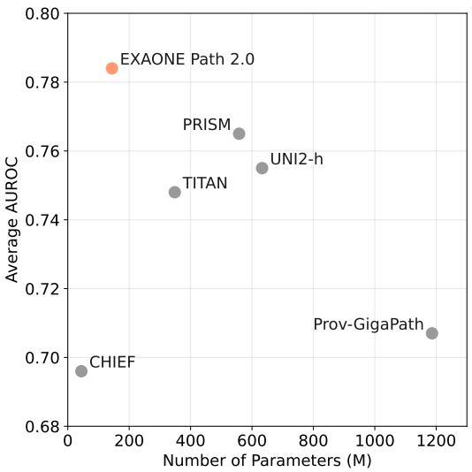
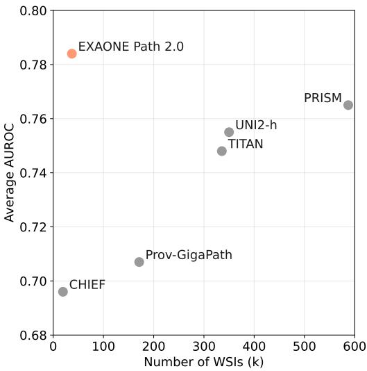
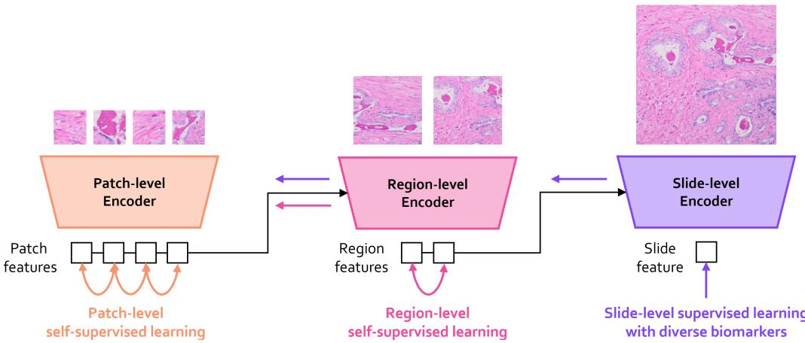

# EXAONE Path 2.0: Pathology Foundation Model with End-to-End Supervision

LG AI Research∗

## Abstract

In digital pathology, whole-slide images (WSIs) are often difficult to handle due to their gigapixel scale, so most approaches train patch encoders via self-supervised learning (SSL) and then aggregate the patch-level embeddings via multiple instance learning (MIL) or slide encoders for downstream tasks. However, patch-level SSL may overlook complex domain-specific features that are essential for biomarker prediction, such as mutation status and molecular characteristics, as SSL methods rely only on basic augmentations selected for natural image domains on small patchlevel area. Moreover, SSL methods remain less data efficient than fully supervised approaches, requiring extensive computational resources and datasets to achieve competitive performance. To address these limitations, we present EXAONE Path 2.0, a pathology foundation model that learns patch-level representations under direct slide-level supervision. Using only 37k WSIs for training, EXAONE Path 2.0 achieves state-of-the-art average performance across 10 biomarker prediction tasks, demonstrating remarkable data efficiency.

  
(a) Model Size vs. Average AUROC

  
(b) Training Data Size vs. Average AUROC

Figure 1: Performance comparison of models based on the number of parameters and the number of WSIs used for training. The average AUROC is obtained by averaging AUROC scores on 10 biomarker prediction tasks. Notably, EXAONE Path 2.0 achieves high performance despite having fewer parameters and using fewer WSIs compared to other models, demonstrating its efficiency.

  
Figure 2: End-to-end hierarchical learning in EXAONE Path 2.0. Slide-level supervised signals propagate through all three hierarchical ViT stages, enabling end-to-end learning of clinically relevant representations from patch to slide level. Self-supervised learning at patch and region levels enhances feature robustness and leverages unlabeled data.

## 1 Introduction

Digital pathology has emerged as a critical domain for AI-driven healthcare applications, with whole-slide images (WSIs) presenting unique computational challenges due to their gigapixel scale [2, 13, 16]. Current approaches typically follow a two-stage paradigm: training patch-level encoders through self-supervised learning methods such as DINO [1] and DINOv2 [12], then aggregating patchlevel embeddings using multiple-instance learning (MIL) or slide-level encoders for downstream prediction tasks [4, 8, 13, 16].

Although this paradigm has shown promise, it has fundamental limitations in the digital pathology field. Self-supervised patch-level pretraining does not guarantee to capture complex domain-specific features that are essential for biomarker prediction, such as mutation status or other molecular characteristics, as self-supervised learning (SSL) methods rely only on basic augmentations selected for natural image domains on small patch-level area. Moreover, these approaches demonstrate inferior data efficiency compared to fully supervised methods, requiring extensive computational resources and large datasets to achieve competitive performance [7, 14].

To address these limitations, we introduce EXAONE Path 2.0, a pathology foundation model that learns patch-level representations under direct slide-level supervision. Our approach fundamentally differs from existing methods by incorporating multiple slide-level labels during patch encoder training, enabling the model to learn clinically relevant features more effectively.

Our results demonstrate that EXAONE Path 2.0 achieves superior average performance across all evaluated tasks while requiring substantially fewer training samples than competing methods, marking a significant advancement in computational pathology.

## 2 Modeling

## 2.1 Overcoming the Prohibitive Computational Costs of Gigapixel Image Training

Training on gigapixel whole-slide images presents significant computational challenges due to memory constraints and processing requirements. To address these limitations, we employ a combination of hierarchical architecture design, curriculum learning, and efficient memory management techniques.

Architecture Design. We adopt a three-stage Hierarchical Image Pyramid Transformer (HIPT) [2] architecture. This hierarchical design reduces computational complexity by processing patches at progressively higher levels of abstraction rather than directly processing gigapixel images at full resolution, enabling more efficient handling of large-scale WSIs. The first-stage ViT processes individual patches, the second-stage ViT aggregates patch-level features into region-level representations, and the third-stage ViT processes the entire slide by integrating all region-level features.

Curriculum Learning. To manage the computational burden of end-to-end training across all stages simultaneously, we implement a two-stage curriculum learning approach with progressive resolution scaling. In the first curriculum stage, we apply 256×256 DINO loss to the first-stage ViT and 1024×1024 DINO loss to the second-stage ViT, establishing hierarchical visual representations without requiring full three-stage end-to-end computation. In the next curriculum stage, we continue applying 256×256 DINO loss to the first-stage ViT while scaling up to 4096×4096 regions for the second-stage ViT, and introduce slide-level supervised cross-entropy loss to propagate gradients into the entire three-stage model processing the full slide. This curriculum approach significantly reduces computational overhead by avoiding the need to process all stages at maximum resolution during every training iteration.

Memory Management. To further manage the computational demands of processing entire WSIs, we employ activation checkpointing and CPU offloading strategies. Rather than loading all patch embeddings into GPU memory at once, we dynamically compute and transfer activations as needed during supervised loss calculation. This approach significantly reduces memory requirements while maintaining training efficiency, enabling us to process gigapixel images with limited computational resources.

## 2.2 Learning Generalizable Representations across Multiple Biomarker Prediction Tasks

To learn representations that generalize across diverse biomarker prediction tasks while maintaining computational efficiency, we employ a multi-task learning framework combined with an early exit strategy for downstream task adaptation.

Multi-Task Learning Framework. We implement a multi-task learning approach that jointly optimizes across multiple complementary objectives. Our training encompasses three primary categories of tasks: (1) cancer subtyping across 33 cancer types, (2) tissue type classification across 12 organ systems, and (3) molecular biomarker prediction including pan-cancer and cancer-specific mutation status, microsatellite instability, and hormone receptor subtyping. This multi-task learning strategy jointly optimizes for these diverse prediction objectives, encouraging the model to learn shared representations that capture fundamental pathological patterns across different scales of biological organization. The joint optimization helps prevent overfitting to individual tasks while improving generalization across the entire spectrum of downstream applications.

Early Exit Strategy for Downstream Adaptation. To further mitigate overfitting in the small data and deep network regime, we adopt a shallow network approach that leverages early representations rather than the full hierarchical model [6]. Specifically, we leverage the first-stage model in combination with Clustering-constrained Attention Multiple Instance Learning (CLAM) [8] for downstream task adaptation. Rather than fine-tuning the entire hierarchical network, this early exit approach uses the robust patch-level features from the first-stage model, while CLAM efficiently aggregates these features for slide-level predictions. This strategy significantly reduces computational overhead during downstream task adaptation while avoiding the pitfalls of overfitting commonly observed in pathology applications with limited data.

## 3 Experiments

## 3.1 Training Data

EXAONE Path 2.0 is trained on 37,195 Formalin-Fixed, Paraffin-Embedded (FFPE) Hematoxylin and Eosin (H&E) stained WSIs. These WSIs generate 144,450 image-label pairs across 16 training tasks, with each WSI contributing multiple labels corresponding to different prediction objectives including cancer subtyping, tissue classification, and biomarker prediction.

## 3.2 Baselines

We selected a diverse set of foundation models as baselines to cover both slide-level and patch-level approaches to slide-level classification. For slide-level models, we included TITAN [4], PRISM [13], CHIEF [15], and Prov-GigaPath [16], which generate slide-level representations that can be directly used for downstream tasks. In addition, we incorporated EXAONE Path 1.0 [17] and UNI2-h [3] as patch-level foundation model baselines. Although these models operate on localized regions of the slide, their design and prior applications align naturally with slide-level prediction tasks when combined with an appropriate aggregation strategy. In our experiments, we employed a CLAM-based aggregator [8] to their patch-level features to produce slide-level predictions.

Table 1: AUROC scores on 10 slide-level tasks
<table><tr><td>Benchmarks</td><td>TITAN</td><td>PRISM</td><td>CHIEF</td><td>Prov-GigaPath</td><td>UNI2-h</td><td>EXAONE Path 1.0</td><td>EXAONE Path 2.0</td></tr><tr><td>LUAD-TMB-USA1</td><td>0.690</td><td>0.645</td><td>0.650</td><td>0.674</td><td>0.669</td><td>0.692</td><td>0.664</td></tr><tr><td>LUAD-EGFR-USA1</td><td>0.754</td><td>0.815</td><td>0.784</td><td>0.709</td><td>0.827</td><td>0.784</td><td>0.853</td></tr><tr><td>LUAD-KRAS-USA2</td><td>0.541</td><td>0.623</td><td>0.468</td><td>0.511</td><td>0.469</td><td>0.527</td><td>0.645</td></tr><tr><td>CRC-MSI-KOR</td><td>0.937</td><td>0.943</td><td>0.927</td><td>0.954</td><td>0.981</td><td>0.972</td><td>0.938</td></tr><tr><td>BRCA-TP53-CPTAC</td><td>0.788</td><td>0.842</td><td>0.788</td><td>0.739</td><td>0.808</td><td>0.766</td><td>0.757</td></tr><tr><td>BRCA-PIK3CA-CPTAC</td><td>0.758</td><td>0.893</td><td>0.702</td><td>0.735</td><td>0.857</td><td>0.735</td><td>0.804</td></tr><tr><td>RCC-PBRM1-CPTAC</td><td>0.638</td><td>0.557</td><td>0.513</td><td>0.527</td><td>0.501</td><td>0.526</td><td>0.583</td></tr><tr><td>RCC-BAP1-CPTAC</td><td>0.719</td><td>0.769</td><td>0.731</td><td>0.697</td><td>0.716</td><td>0.719</td><td>0.807</td></tr><tr><td>COAD-KRAS-CPTAC</td><td>0.764</td><td>0.744</td><td>0.699</td><td>0.815</td><td>0.943</td><td>0.767</td><td>0.912</td></tr><tr><td>COAD-TP53-CPTAC</td><td>0.889</td><td>0.816</td><td>0.701</td><td>0.712</td><td>0.783</td><td>0.819</td><td>0.875</td></tr><tr><td>Average</td><td>0.748</td><td>0.765</td><td>0.696</td><td>0.707</td><td>0.755</td><td>0.731</td><td>0.784</td></tr></table>

## 3.3 Evaluation Protocols

Each model was fine-tuned for slide-level classification according to its architectural design, while keeping the pretrained foundation model parameters fixed. For slide-level foundation models, we trained a linear classification layer on top of the slide-level representations generated by the frozen backbone. For patch-level foundation models, we adopted the approach proposed in UNI, applying a CLAM aggregator to the patch-level features to generate slide-level predictions. Our proposed model similarly utilizes patch-level features extracted from the first-stage model, which are then aggregated via CLAM for slide-level inference. Each benchmark task was evaluated on a predefined training/test split, and we report the average performance over four independent training runs with different random seeds.

## 3.4 Slide-Level Benchmarks

To compare model performance, we construct a total of 10 slide-level benchmark tasks derived from diverse cancer lesions including lung adenocarcinoma, breast cancer, colorectal cancer, and renal cancer. These benchmarks consist of 4 tasks from private datasets and 6 tasks from public datasets, carefully selected to evaluate both task diversity and model generalization across different data sources and institutions.

## 3.4.1 Benchmarks from Private Datasets

These benchmarks are based on internal datasets collected in collaboration with one general hospital from Korea (KOR) and two general hospitals from USA (USA1, USA2). All data usage has been approved by the respective Institutional Review Boards (IRBs) for research purposes. All data are de-identified and locked only for internal use, and were used strictly for internal performance evaluation.

LUAD-TMB. This task predicts tumor mutation burden (TMB) status (high vs. low) from lung adenocarcinoma WSIs. TMB is defined as the number of mutations per megabase in DNA sequencing, with a threshold of 10 used to distinguish between high and low. Models were trained on KOR-LUAD (low:high = 1063:287), and tested on USA1-LUAD (137:117) datasets.

LUAD-EGFR. This task detects the presence of EGFR mutations in lung adenocarcinoma. Clinically, mutations of second tier or higher are labeled as "mutated", and all others as "wild type". Training used KOR-LUAD (wild:mut = 1145:205), with testing on USA1-LUAD (242:12).

LUAD-KRAS. This task identifies KRAS mutations in lung adenocarcinoma WSIs using the same clinical mutation criteria as EGFR. Training used KOR1-LUAD (wild:mut = 1217:133), with testing on USA2-LUAD (347:168).

  
Figure 3: Comparison of AUROC scores across 10 slide-level benchmarks and their averages. EXAONE Path 2.0 (red) shows the most balanced and high-performing profile.

CRC-MSI. This task classifies microsatellite instability (MSI) status in colorectal adenocarcinoma. Models were trained on KOR-CRC (stable:instable = 2630:831) and tested on a held-out portion of the same dataset (658:209).

## 3.4.2 Benchmarks from Public Datasets

These benchmarks are constructed using publicly available dataset, CPTAC [5], which is widely used in computational pathology research.

BRCA-TP53, PIK3CA. These tasks predict TP53 and PIK3CA mutation status from breast cancer WSIs. Both tasks use the CPTAC-BRCA [10] dataset with TP53 having train (wild:mut = 53:37), test (14:8) and PIK3CA having train (58:33), test (14:7).

RCC-PBRM1, BAP1. These tasks focus on detecting PBRM1 and BAP1 mutations in clear cell renal cell carcinoma (CCRCC). Both benchmarks use the CPTAC-CCRCC [9] dataset with PBRM1 having train (wild:mut = 97:96), test (26:26) and BAP1 having train (156:39), test (46:4).

COAD-KRAS, TP53. These tasks classify KRAS and TP53 mutation status in colon adenocarcinoma. Both use the CPTAC-COAD [11] dataset with KRAS having train (wild:mut = 50:29), test (11:8) and TP53 having train (53:27), test (12:6)

## 3.5 Evaluation Results

Table 1 presents the comparative performance of seven models across 10 slide-level benchmark tasks. Among all evaluated models, EXAONE Path 2.0 achieved the highest overall average performance, demonstrating both robust accuracy and consistent generalization across diverse tissue types, institutions, and prediction targets.

In lung adenocarcinoma-related tasks, EXAONE Path 2.0 showed outstanding performance in EGFR mutation prediction, achieving the highest accuracy (0.853) on the USA1-LUAD dataset. In the KRAS mutation task, the model recorded the best performance (0.645) on the USA2-LUAD dataset, surpassing all other baselines. For TMB classification, EXAONE Path 2.0 performed comparably to the top-performing models, although slightly behind EXAONE Path 1.0 and TITAN.

In colorectal cancer MSI classification, EXAONE Path 2.0 maintained high accuracy (0.938), on par with other foundation models, and showed stable generalization across test sets.

In breast cancer tasks, the model consistently produced strong results across all mutation (TP53, PIK3CA) benchmarks. While it did not always achieve the highest score, it demonstrated reliable performance even in challenging classification scenarios with limited training samples.

In the RCC benchmarks, EXAONE Path 2.0 showed clear superiority in the BAP1 mutation task, achieving the highest score (0.807), and performed competitively in the PBRM1 benchmark as well. In the colon adenocarcinoma benchmarks, the model reached top-tier results, including a near-optimal score of 0.912 in KRAS prediction and 0.875 in TP53 mutation classification.

Overall, EXAONE Path 2.0 achieved the best average AUROC score and remained within the top three across nearly all tasks. These results empirically validate the benefits of our unified hierarchical framework and end-to-end optimization strategy, showing that EXAONE Path 2.0 can serve as a strong and generalizable foundation model for a wide range of slide-level pathology tasks.

To provide a holistic comparison across all benchmarks, we visualize model performance using radar and bar charts (Figure 3). The charts illustrate the AUROC of each model across 10 validation datasets, enabling an intuitive understanding of performance consistency. As shown, EXAONE Path 2.0 demonstrates consistently strong coverage across all benchmarks. This indicates its superior generalization capability and robustness compared to other foundation models, many of which exhibit performance dips on specific tasks. The visually dominant profile of EXAONE Path 2.0 reinforces its leading average performance and highlights its suitability as a universal slide-level foundation model.

## 4 Conclusion

We presented EXAONE Path 2.0, a pathology foundation model that learns patch-level representations under direct slide-level supervision. Our approach enables slide-level supervised signals to propagate through all hierarchical stages, allowing end-to-end learning of clinically relevant representations.

Our method addresses computational challenges through hierarchical architecture design, curriculum learning, and memory management techniques including activation checkpointing and CPU offloading. We employ multi-task learning across diverse biomarker prediction tasks and use early exit strategies to mitigate overfitting in small data regimes.

Experimental results show that EXAONE Path 2.0 achieves competitive average performance across 10 biomarker prediction tasks using only 37k WSIs for training, demonstrating improved data efficiency compared to existing foundation models. The model performs consistently across diverse cancer types and prediction targets.

These results demonstrate that direct slide-level supervision can effectively learn clinically relevant features, and our proposed methods successfully address the computational challenges of gigapixel image training, providing a practical approach for pathology foundation models.

## References

[1] Mathilde Caron, Hugo Touvron, Ishan Misra, Hervé Jégou, Julien Mairal, Piotr Bojanowski, and Armand Joulin. Emerging properties in self-supervised vision transformers. In Proceedings ofthe IEEE/CVF international conference on computer vision, pages 9650–9660, 2021.

[2] Richard J Chen, Chengkuan Chen, Yicong Li, Tiffany Y Chen, Andrew D Trister, Rahul G Krishnan, and Faisal Mahmood. Scaling vision transformers to gigapixel images via hierarchical self-supervised learning. In Proceedings of the IEEE/CVF Conference on Computer Vision and Pattern Recognition, pages 16144–16155, 2022.

[3] Richard J Chen, Tong Ding, Ming Y Lu, Drew FK Williamson, Guillaume Jaume, Bowen Chen, Andrew Zhang, Daniel Shao, Andrew H Song, Muhammad Shaban, et al. Towards a general-purpose foundation model for computational pathology. Nature Medicine, 2024.

[4] Tong Ding, Sophia J Wagner, Andrew H Song, Richard J Chen, Ming Y Lu, Andrew Zhang, Anurag J Vaidya, Guillaume Jaume, Muhammad Shaban, Ahrong Kim, et al. Multimodal whole slide foundation model for pathology. arXiv preprint arXiv:2411.19666, 2024.

[5] Nathan J Edwards, Mauricio Oberti, Ratna R Thangudu, Shuang Cai, Peter B McGarvey, Shine Jacob, Subha Madhavan, and Karen A Ketchum. The cptac data portal: a resource for cancer proteomics research. Journal of proteome research, 14(6):2707–2713, 2015.

[6] Yigitcan Kaya, Sanghyun Hong, and Tudor Dumitras. Shallow-deep networks: Understanding and mitigating network overthinking. In International conference on machine learning, pages 3301–3310. PMLR, 2019.

[7] Skanda Koppula, Yazhe Li, Evan Shelhamer, Andrew Jaegle, Nikhil Parthasarathy, Relja Arand jelovic, João Carreira, and Olivier Hénaff. Where should i spend my flops? efficiency evaluations of visual pre-training methods. arXiv preprint arXiv:2209.15589, 2022.

[8] Ming Y Lu, Drew FK Williamson, Tiffany Y Chen, Richard J Chen, Matteo Barbieri, and Faisal Mahmood. Data-efficient and weakly supervised computational pathology on whole-slide images. Nature biomedical engineering, 5(6):555–570, 2021.

[9] National Cancer Institute Clinical Proteomic Tumor Analysis Consortium (CPTAC). The clinical proteomic tumor analysis consortium clear cell renal cell carcinoma collection (cptac-ccrcc) (version 13) [data set]. https://doi.org/10.7937/k9/tcia.2018.oblamn27, 2018.

[10] National Cancer Institute Clinical Proteomic Tumor Analysis Consortium (CPTAC). The clinical proteomic tumor analysis consortium breast invasive carcinoma collection (cptac-brca) (version 1) [data set]. https://doi.org/10.7937/TCIA.CAEM-YS80, 2020.

[11] National Cancer Institute Clinical Proteomic Tumor Analysis Consortium (CPTAC). The clinical proteomic tumor analysis consortium colon adenocarcinoma collection (cptac-coad) (version 1) [data set]. https://doi.org/10.7937/TCIA.YZWQ-ZZ63, 2020.

[12] Maxime Oquab, Timothée Darcet, Théo Moutakanni, Huy Vo, Marc Szafraniec, Vasil Khalidov, Pierre Fernandez, Daniel Haziza, Francisco Massa, Alaaeldin El-Nouby, et al. Dinov2: Learning robust visual features without supervision. arXiv preprint arXiv:2304.07193, 2023.

[13] George Shaikovski, Adam Casson, Kristen Severson, Eric Zimmermann, Yi Kan Wang, Jeremy D Kunz, Juan A Retamero, Gerard Oakley, David Klimstra, Christopher Kanan, et al. Prism: A multi-modal generative foundation model for slide-level histopathology. arXiv preprint arXiv:2405.10254, 2024.

[14] Guangrun Wang, Keze Wang, Guangcong Wang, Philip HS Torr, and Liang Lin. Solving inefficiency of self-supervised representation learning. In Proceedings of the IEEE/CVF International Conference on Computer Vision, pages 9505–9515, 2021.

[15] Xiyue Wang, Junhan Zhao, Eliana Marostica, Wei Yuan, Jietian Jin, Jiayu Zhang, Ruijiang Li, Hongping Tang, Kanran Wang, Yu Li, et al. A pathology foundation model for cancer diagnosis and prognosis prediction. Nature, 634(8035):970–978, 2024.

[16] Hanwen Xu, Naoto Usuyama, Jaspreet Bagga, Sheng Zhang, Rajesh Rao, Tristan Naumann, Cliff Wong, Zelalem Gero, Javier González, Yu Gu, Yanbo Xu, Mu Wei, Wenhui Wang, Shuming Ma, Furu Wei, Jianwei Yang, Chunyuan Li, Jianfeng Gao, Jaylen Rosemon, Tucker Bower, Soohee Lee, Roshanthi Weerasinghe, Bill J. Wright, Ari Robicsek, Brian Piening, Carlo Bifulco, Sheng Wang, and Hoifung Poon. A whole-slide foundation model for digital pathology from real-world data. Nature, 2024.

[17] Juseung Yun, Yi Hu, Jinhyung Kim, Jongseong Jang, and Soonyoung Lee. Exaonepath 1.0 patch-level foundation model for pathology. arXiv preprint arXiv:2408.00380, 2024.

# EXAONEPath AI Model License Agreement 1.0 - NC

This License Agreement (“Agreement”) is entered into between you (“Licensee”) and LG Management Development Institute Co., Ltd. (“Licensor”), governing the use of the EXAONEPath AI Model (“Model”). By downloading, installing, copying, or using the Model, you agree to comply with and be bound by the terms of this Agreement. If you do not agree to all the terms, you must not download, install, copy, or use the Model. This Agreement constitutes a binding legal agreement between the Licensee and Licensor.

## 1. Definitions

## 1.1 Model

The artificial intelligence model provided by Licensor, which includes any software, algorithms, machine learning models, or related components supplied by Licensor. This definition extends to encompass all updates, enhancements, improvements, bug fixes, patches, or other modifications that may be provided by Licensor from time to time, whether automatically or manually implemented.

## 1.2 Derivatives

Any modifications, alterations, enhancements, improvements, adaptations, or derivative works of the Model created by Licensee or any third party. This includes changes made to the Model’s architecture, parameters, data processing methods, or any other aspect of the Model that results in a modification of its functionality or output.

## 1.3 Output

Any data, results, content, predictions, analyses, insights, or other materials generated by the Model or Derivatives, regardless of whether they are in their original form or have been further processed or modified by the Licensee. This includes, but is not limited to, textual or numerical produced directly or indirectly through the use of the Model.

## 1.4 Licensor

LG Management Development Institute Co., Ltd., the owner, developer, and provider of the EXAONEPath AI Model. The Licensor holds all rights, title, and interest in the Model and is responsible for granting licenses to use the Model under the terms specified in this Agreement.

## 1.5 Licensee

The individual, organization, corporation, academic institution, government agency, or other entity using or intending to use the Model under the terms and conditions of this Agreement. The Licensee is responsible for ensuring compliance with the Agreement by all authorized users who access or utilize the Model on behalf of the Licensee.

## 2. License Grant

## 2.1 Grant of License

Subject to the terms and conditions outlined in this Agreement, the Licensor hereby grants the Licensee a limited, non-exclusive, non-transferable, worldwide, and revocable license to:

a. Access, download, install, and use the Model solely for research purposes. This includes evaluation, testing, academic research and experimentation.

b. Publicly disclose research results and findings derived from the use of the Model or Derivatives, including publishing papers or presentations.

c. Modify the Model and create Derivatives based on the Model, provided that such modifications and Derivatives are used exclusively for research purposes. The Licensee may conduct experiments, perform analyses, and apply custom modifications to the Model to explore its capabilities and performance under various scenarios. If the Model is modified, the modified Model must include "EXAONEPath" at the beginning of its name.

d. Distribute the Model and Derivatives in each case with a copy of this Agreement.

## 2.2 Scope of License

The license granted herein does not authorize the Licensee to use the Model for any purpose not explicitly permitted under this Agreement. Any use beyond the scope of this license, including any commercial application or external distribution, is strictly prohibited unless explicitly agreed upon in writing by the Licensor.

## 3. Restrictions

## 3.1 Commercial Use

The Licensee is expressly prohibited from using the Model, Derivatives, or Output for any commercial purposes, including but not limited to, developing or deploying products, services, or applications that generate revenue, whether directly or indirectly. Any commercial exploitation of the Model or its derivatives requires a separate commercial license agreement with the Licensor. Furthermore, the Licensee shall not use the Model, Derivatives or Output to develop or improve other models, except for research purposes, which is explicitly permitted.

## 3.2 Reverse Engineering

The Licensee shall not decompile, disassemble, reverse engineer, or attempt to derive the source code, underlying ideas, algorithms, or structure of the Model, except to the extent that such activities are expressly permitted by applicable law. Any attempt to bypass or circumvent technological protection measures applied to the Model is strictly prohibited.

## 3.3 Unlawful Use

The Licensee shall not use the Model and Derivatives for any illegal, fraudulent, or unauthorized activities, nor for any purpose that violates applicable laws or regulations. This includes but is not limited to the creation, distribution, or dissemination of malicious, deceptive, or unlawful content.

## 3.4 Ethical Use

The Licensee shall ensure that the Model or Derivatives is used in an ethical and responsible manner, adhering to the following guidelines:

a. The Model and Derivatives shall not be used to generate, propagate, or amplify false, misleading, or harmful information, including fake news, misinformation, or disinformation.

b. The Model and Derivatives shall not be employed to create, distribute, or promote content that is discriminatory, harassing, defamatory, abusive, or otherwise offensive to individuals or groups based on race, gender, sexual orientation, religion, nationality, or other protected characteristics.

c. The Model and Derivatives shall not infringe on the rights of others, including intellectual property rights, privacy rights, or any other rights recognized by law. The Licensee shall obtain all necessary permissions and consents before using the Model and Derivatives in a manner that may impact the rights of third parties.

d. The Model and Derivatives shall not be used in a way that causes harm, whether physical, mental, emotional, or financial, to individuals, organizations, or communities. The Licensee shall take all reasonable measures to prevent misuse or abuse of the Model and Derivatives that could result in harm or injury.

## 4. Ownership

## 4.1 Intellectual Property

All rights, title, and interest in and to the Model, including any modifications, Derivatives, and associated documentation, are and shall remain the exclusive property of the Licensor. The Licensee acknowledges that this Agreement does not transfer any ownership rights to the Licensee. All trademarks, service marks, and logos associated with the Model are the property of the Licensor.

## 4.2 Output

All output generated by the Model from Licensee Data ("Output") shall be the sole property of the Licensee. Licensor hereby waives any claim of ownership or intellectual property rights to the Output. Licensee is solely responsible for the legality, accuracy, quality, integrity, and use of the Output.

## 4.3 Attribution

In any publication or presentation of results obtained using the Model, the Licensee shall provide appropriate attribution to the Licensor, citing the Model’s name and version, along with any relevant documentation or references specified by the Licensor.

## 5. No Warranty

## 5.1 “As-Is” Basis

The Model, Derivatives, and Output are provided on an “as-is” and “as-available” basis, without any warranties or representations of any kind, whether express, implied, or statutory. The Licensor disclaims all warranties, including but not limited to, implied warranties of merchantability, fitness for a particular purpose, accuracy, reliability, non-infringement, or any warranty arising from the course of dealing or usage of trade.

## 5.2 Performance and Reliability

The Licensor does not warrant or guarantee that the Model, Derivatives or Output will meet the Licensee’s requirements, that the operation of the Model, Derivatives or Output will be uninterrupted or error-free, or that defects in the Model will be corrected. The Licensee acknowledges that the use of the Model, Derivatives or Output is at its own risk and that the Model, Derivatives or Output may contain bugs, errors, or other limitations.

## 5.3 No Endorsement

The Licensor does not endorse, approve, or certify any results, conclusions, or recommendations derived from the use of the Model. The Licensee is solely responsible for evaluating the accuracy, reliability, and suitability of the Model for its intended purposes.

## 6. Limitation of Liability

## 6.1 No Liability for Damages

To the fullest extent permitted by applicable law, in no event shall the Licensor be liable for any special, incidental, indirect, consequential, exemplary, or punitive damages, including but not limited to, damages for loss of business profits, business interruption, loss of business information, loss of data, or any other pecuniary or non-pecuniary loss arising out of or in connection with the use or inability to use the Model, Derivatives or any Output, even if the Licensor has been advised of the possibility of such damages.

## 6.2 Indemnification

The Licensee agrees to indemnify, defend, and hold harmless the Licensor, its affiliates, officers, directors, employees, and agents from and against any claims, liabilities, damages, losses, costs, or expenses (including reasonable attorneys’ fees) arising out of or related to the Licensee’s use of the Model, any Derivatives, or any Output, including any violation of this Agreement or applicable laws. This includes, but is not limited to, ensuring compliance with copyright laws, privacy regulations, defamation laws, and any other applicable legal or regulatory requirements.

## 7. Termination

## 7.1 Termination by Licensor

The Licensor reserves the right to terminate this Agreement and revoke the Licensee’s rights to use the Model at any time, with or without cause, and without prior notice if the Licensee breaches any of the terms or conditions of this Agreement. Termination shall be effective immediately upon notice.

## 7.2 Effect of Termination

Upon termination of this Agreement, the Licensee must immediately cease all use of the Model, Derivatives, and Output and destroy all copies of the Model, Derivatives, and Output in its possession or control, including any backup or archival copies. The Licensee shall certify in writing to the Licensor that such destruction has been completed.

## 7.3 Survival

The provisions of this Agreement that by their nature should survive termination, including but not limited to, Sections 4 (Ownership), 5 (No Warranty), 6 (Limitation of Liability), and this Section 7 (Termination), shall continue to apply after termination.

## 8. Governing Law

## 8.1 Governing Law

This Agreement shall be governed by and construed in accordance with the laws of the Republic of Korea, without regard to its conflict of laws principles.

## 8.2 Arbitration

Any disputes, controversies, or claims arising out of or relating to this Agreement, including its existence, validity, interpretation, performance, breach, or termination, shall be referred to and finally resolved by arbitration administered by the Korean Commercial Arbitration Board (KCAB) in accordance with the International Arbitration Rules of the Korean Commercial Arbitration Board in force at the time of the commencement of the arbitration. The seat of arbitration shall be Seoul, Republic of Korea. The tribunal shall consist of one arbitrator. The language of the arbitration shall be English.

## 9. Alterations

## 9.1 Modifications

The Licensor reserves the right to modify or amend this Agreement at any time, in its sole discretion. Any modifications will be effective upon posting the updated Agreement on the Licensor’s website or through other means of communication. The Licensee is responsible for reviewing the Agreement periodically for changes. Continued use of the Model after any modifications have been made constitutes acceptance of the revised Agreement.

## 9.2 Entire Agreement

This Agreement constitutes the entire agreement between the Licensee and Licensor concerning the subject matter hereof and supersedes all prior or contemporaneous oral or written agreements, representations, or understandings. Any terms or conditions of any purchase order or other document submitted by the Licensee in connection with the Model that are in addition to, different from, or inconsistent with the terms and conditions of this Agreement are not binding on the Licensor and are void.

By downloading, installing, or using the EXAONEPath AI Model, the Licensee acknowledges that it has read, understood, and agrees to be bound by the terms and conditions of this Agreement.