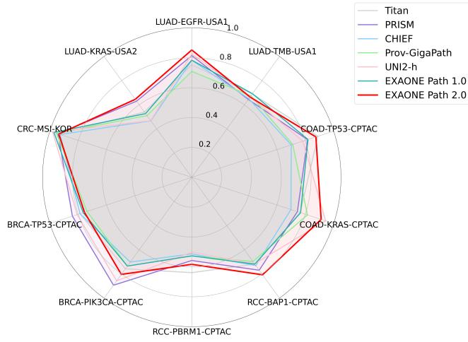
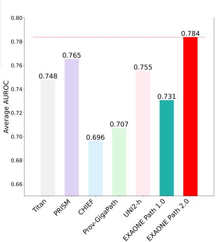

[← 返回 README](../README.md)

# 03 Experiments

## 原文

### 3.1 Training Data

EXAONE Path 2.0 is trained on 37,195 Formalin-Fixed, Paraffin-Embedded (FFPE) Hematoxylin and Eosin (H&E) stained WSIs. These WSIs generate 144,450 image-label pairs across 16 training tasks, with each WSI contributing multiple labels corresponding to different prediction objectives including cancer subtyping, tissue classification, and biomarker prediction.

### 3.2 Baselines

We selected a diverse set of foundation models as baselines to cover both slide-level and patch-level approaches to slide-level classification. For slide-level models, we included TITAN [4], PRISM [13], CHIEF [15], and Prov-GigaPath [16], which generate slide-level representations that can be directly used for downstream tasks. In addition, we incorporated EXAONE Path 1.0 [17] and UNI2-h [3] as patch-level foundation model baselines. Although these models operate on localized regions of the slide, their design and prior applications align naturally with slide-level prediction tasks when combined with an appropriate aggregation strategy. In our experiments, we employed a CLAM-based aggregator [8] to their patch-level features to produce slide-level predictions.

### 3.3 Evaluation Protocols

Each model was fine-tuned for slide-level classification according to its architectural design, while keeping the pretrained foundation model parameters fixed. For slide-level foundation models, we trained a linear classification layer on top of the slide-level representations generated by the frozen backbone. For patch-level foundation models, we adopted the approach proposed in UNI, applying a CLAM aggregator to the patch-level features to generate slide-level predictions. Our proposed model similarly utilizes patch-level features extracted from the first-stage model, which are then aggregated via CLAM for slide-level inference. Each benchmark task was evaluated on a predefined training/test split, and we report the average performance over four independent training runs with different random seeds.

### 3.4 Slide-Level Benchmarks

**Table 1: AUROC scores on 10 slide-level tasks**

*(Full table from paper — see below for data summary)*

### 3.4.1 Benchmarks from Private Datasets

**LUAD-TMB.** Predicts tumor mutation burden (TMB) status (high vs. low) from lung adenocarcinoma. Threshold: 10 mutations/megabase. Train: KOR-LUAD (low:high = 1063:287), Test: USA1-LUAD (137:117).

**LUAD-EGFR.** Detects EGFR mutations in lung adenocarcinoma. Clinically, mutations of second tier or higher labeled as "mutated." Train: KOR-LUAD (wild:mut = 1145:205), Test: USA1-LUAD (242:12).

**LUAD-KRAS.** Identifies KRAS mutations in lung adenocarcinoma. Train: KOR1-LUAD (wild:mut = 1217:133), Test: USA2-LUAD (347:168).

**CRC-MSI.** Classifies microsatellite instability (MSI) status in colorectal adenocarcinoma. Train: KOR-CRC (stable:instable = 2630:831), Test: held-out KOR-CRC (658:209).

### 3.4.2 Benchmarks from Public Datasets

**BRCA-TP53, PIK3CA.** Predict TP53 and PIK3CA mutation from breast cancer WSIs. CPTAC-BRCA: TP53 train (53:37), test (14:8); PIK3CA train (58:33), test (14:7).

**RCC-PBRM1, BAP1.** Detect PBRM1/BAP1 mutations in clear cell RCC. CPTAC-CCRCC: PBRM1 train (97:96), test (26:26); BAP1 train (156:39), test (46:4).

**COAD-KRAS, TP53.** Classify KRAS/TP53 mutation in colon adenocarcinoma. CPTAC-COAD: KRAS train (50:29), test (11:8); TP53 train (53:27), test (12:6).

### 3.5 Evaluation Results

**Table 1: AUROC scores on 10 slide-level tasks:**

| Benchmarks | TITAN | PRISM | CHIEF | Prov-GigaPath | UNI2-h | EXAONE Path 1.0 | EXAONE Path 2.0 |
|------------|-------|-------|-------|---------------|--------|-----------------|-----------------|
| LUAD-TMB-USA1 | 0.690 | 0.645 | 0.650 | 0.674 | 0.669 | 0.692 | 0.664 |
| LUAD-EGFR-USA1 | 0.754 | 0.815 | 0.784 | 0.709 | 0.827 | 0.784 | **0.853** |
| LUAD-KRAS-USA2 | 0.541 | 0.623 | 0.468 | 0.511 | 0.469 | 0.527 | **0.645** |
| CRC-MSI-KOR | 0.937 | 0.943 | 0.927 | 0.954 | **0.981** | 0.972 | 0.938 |
| BRCA-TP53-CPTAC | 0.788 | **0.842** | 0.788 | 0.739 | 0.808 | 0.766 | 0.757 |
| BRCA-PIK3CA-CPTAC | 0.758 | **0.893** | 0.702 | 0.735 | 0.857 | 0.735 | 0.804 |
| RCC-PBRM1-CPTAC | **0.638** | 0.557 | 0.513 | 0.527 | 0.501 | 0.526 | 0.583 |
| RCC-BAP1-CPTAC | 0.719 | 0.769 | 0.731 | 0.697 | 0.716 | 0.719 | **0.807** |
| COAD-KRAS-CPTAC | 0.764 | 0.744 | 0.699 | 0.815 | **0.943** | 0.767 | 0.912 |
| COAD-TP53-CPTAC | **0.889** | 0.816 | 0.701 | 0.712 | 0.783 | 0.819 | 0.875 |
| **Average** | 0.748 | 0.765 | 0.696 | 0.707 | 0.755 | 0.731 | **0.784** |

Figure 3: Comparison of AUROC scores across 10 slide-level benchmarks and their averages. EXAONE Path 2.0 (red) shows the most balanced and high-performing profile.

In lung adenocarcinoma-related tasks, EXAONE Path 2.0 showed outstanding performance in EGFR mutation prediction, achieving the highest accuracy (0.853) on the USA1-LUAD dataset. In the KRAS mutation task, the model recorded the best performance (0.645) on the USA2-LUAD dataset, surpassing all other baselines. For TMB classification, EXAONE Path 2.0 performed comparably to the top-performing models, although slightly behind EXAONE Path 1.0 and TITAN.

In colorectal cancer MSI classification, EXAONE Path 2.0 maintained high accuracy (0.938), on par with other foundation models, and showed stable generalization across test sets.

In breast cancer tasks, the model consistently produced strong results across all mutation (TP53, PIK3CA) benchmarks. While it did not always achieve the highest score, it demonstrated reliable performance even in challenging classification scenarios with limited training samples.

In the RCC benchmarks, EXAONE Path 2.0 showed clear superiority in the BAP1 mutation task, achieving the highest score (0.807), and performed competitively in the PBRM1 benchmark as well. In the colon adenocarcinoma benchmarks, the model reached top-tier results, including a near-optimal score of 0.912 in KRAS prediction and 0.875 in TP53 mutation classification.

Overall, EXAONE Path 2.0 achieved the best average AUROC score and remained within the top three across nearly all tasks. These results empirically validate the benefits of our unified hierarchical framework and end-to-end optimization strategy, showing that EXAONE Path 2.0 can serve as a strong and generalizable foundation model for a wide range of slide-level pathology tasks.

To provide a holistic comparison across all benchmarks, we visualize model performance using radar and bar charts (Figure 3). The charts illustrate the AUROC of each model across 10 validation datasets, enabling an intuitive understanding of performance consistency. As shown, EXAONE Path 2.0 demonstrates consistently strong coverage across all benchmarks. This indicates its superior generalization capability and robustness compared to other foundation models, many of which exhibit performance dips on specific tasks. The visually dominant profile of EXAONE Path 2.0 reinforces its leading average performance and highlights its suitability as a universal slide-level foundation model.

---

> 💡 **Hao 批注：实验结果的深度分析**
>
> **1. 平均最优但不总是最优——"无短板"策略**
>
> EXAONE Path 2.0 在 10 个任务中拿到 3 个第一（EGFR, KRAS, BAP1），但在大多数任务上是第二/第三。平均第一靠的是"没有特别差的任务"（最低 0.583 RCC-PBRM1 仍然合理），而其他模型有显著短板（如 CHIEF 在多个 CPTAC 任务上 ~0.7）。
>
> 这个"无短板"特征与其多任务联合训练策略一致——多任务共享表示迫使模型学习通用特征，避免了在某个任务上过拟合。
>
> **2. 为什么不是全面领先？**
>
> - **MSI**: UNI2-h (0.981) >> EXAONE P2 (0.938) —— MSI 可能从更大规模的 SSL 预训练中获益更多
> - **BRCA-TP53**: PRISM (0.842) >> EXAONE P2 (0.757) —— 乳腺癌任务上 PRISM 更强，可能与 PRISM 的多模态设计有关
> - **COAD-KRAS**: UNI2-h (0.943) > EXAONE P2 (0.912) —— UNI2-h 作为 UNI 的升级版，依然在某些任务上有优势
>
> 这表明：不同任务对"通用性 vs 特异性"的需求不同。E2E 多任务训练偏向通用性，但可能在特定任务上不如专门优化的模型。
>
> **3. 小样本任务上的表现**
>
> CPTAC benchmark 训练样本极少（如 BRCA-TP53 仅 53:37，COAD-KRAS 仅 50:29）。Early exit 策略（只用 Stage-1 + CLAM）在这些任务上的表现说明 Stage-1 特征已经足够好。但文章没有对比"用全三层 HIPT 会怎样"——可能是过拟合更严重。
>
> **4. 缺少的消融实验**
>
> 文章最大的实验缺陷是几乎没有消融实验：
> - 没有 "只用单任务训练 vs 多任务训练" 的对比
> - 没有 "curriculum vs 直接 E2E" 的对比
> - 没有 "early exit vs 全模型" 的对比
> - 没有 "DINO loss 留存 vs 移除" 的对比
>
> 这使得很难判断每个设计选择的独立贡献。这在工业界论文中常见（更关注最终结果而非方法分解），但从学术角度看是明显缺陷。

---

> 💡 **Hao 批注：baseline 选择与公平性**
>
> | 模型 | Type | 训练数据 | 参数量 | 推理方式 |
> |------|------|----------|--------|----------|
> | TITAN | Slide-level | ~437K WSIs | — | Slide repr → linear |
> | PRISM | Slide-level | 587K WSIs | — | Slide repr → linear |
> | CHIEF | Slide-level | 60K WSIs | 27M | Slide repr → linear |
> | Prov-GigaPath | Slide-level | 170K WSIs | 1.1B | Slide repr → linear |
> | UNI2-h | Patch-level | 100K+ WSIs | 307M | Patch feat → CLAM |
> | EXAONE P1.0 | Patch-level | ~37K WSIs | — | Patch feat → CLAM |
> | EXAONE P2.0 | Patch-level (E2E) | 37K WSIs | — | Stage-1 feat → CLAM |
>
> 注意到 slide-level 模型直接输出 slide-level 表示 + linear probe，而 patch-level 模型需要额外 CLAM 聚合。两者的推理成本不同（patch-level 模式需要先提取所有 patch 特征再聚合）。但文章统一使用各自原生推理方式，没有做"公平比较"（如都在 CLAM 下比较）。

---

> 💡 **Hao 批注：对 ReadySlide 的启示**
>
> 1. **多任务预训练的价值**: 如果 ReadySlide 的压缩目标是对多个任务/多个 FM 保持通用性，多任务训练信号（而不是单一分类 loss）可能帮助学到更鲁棒的压缩表示。
> 2. **Curricum learning 可用于压缩**: 类似地从低压缩率到高压缩率的 curriculum 可能帮助 allocator 和编码器逐步适应压缩。
> 3. **数据量需求**: 37K WSIs 相对于公开数据集（TCGA ~1K）差距巨大，ReadySlide 如果要做 E2E 训练，数据量可能是一个限制因素。
