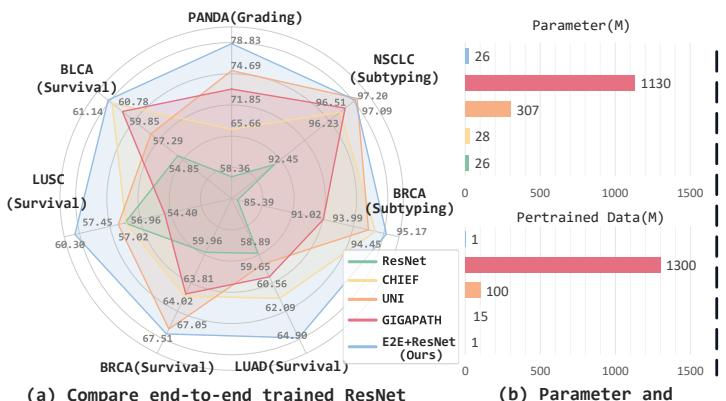
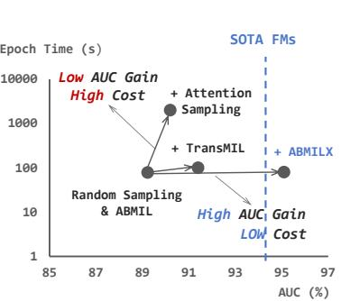
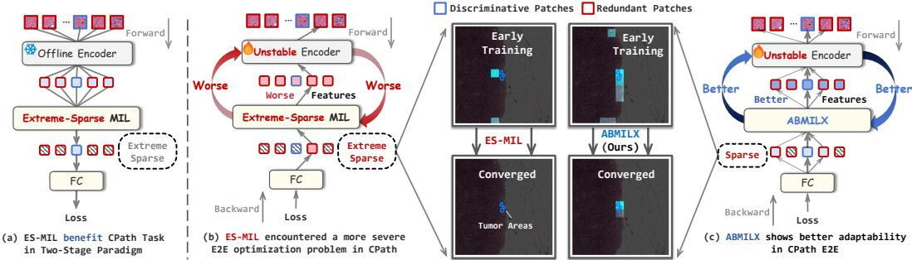

[← 返回 README](../README.md)

# 01 Introduction

## 原文

Computational pathology [15, 53, 14] (CPath) is an interdisciplinary field that combines pathology, gigapixel image analysis, and computer science to develop computational methods for analyzing and interpreting pathological images (whole slide images, WSIs or slides). This field leverages advanced algorithms, machine learning, and artificial intelligence techniques to assist pathologists in tasks such as cancer sub-typing [25, 66], grading [6], and prognosis [63, 65]. Due to clinical demands and the challenge of pixel-level annotation in gigapixel pathological images, CPath typically focuses on slide-level learning. However, analyzing such gigapixel images in slide-level presents significant challenges in terms of efficiency and performance.

To address these challenges, Campanella et al. [7] proposed a two-stage paradigm based on multiple instance learning (MIL) [41], allowing efficient WSI analysis without fine-grained annotations. This approach first divides each WSI (a bag) into thousands of image patches (instances). Pretrained encoders extract offline instance features, which are then aggregated into bag features by a sparse-attention MIL model, ultimately leading to slide prediction. By operating in the latent space rather than images, this paradigm enables slide-level supervised training within reasonable memory constraints. However, its performance heavily depends on the quality of offline features [10]. To improve offline feature quality, a series of pathology foundation models [11, 62, 24, 64] (FMs) like UNI [11] and GigaPath [64] have been developed. As shown in Figure 1, despite scaling data volume to 170K WSIs (>200TB) and model size over 1B, these approaches still perform unsatisfactorily on specific tasks. We attribute this to the lack of unified optimization in the two-stage paradigm, resulting in encoders with insufficient adaptation of downstream task and disjoint optimization with MIL models.


(a) Compare end-to-end trained ResNet with various foundation models
(b) Parameter and Pretrained Data


(c) Performance of different strategies in CPath E2E

Figure 1: (a,b) We compare E2E trained ResNet with various foundation models using two-stage paradigm in terms of performance, model size, and pretraining data. This demonstrates the performance potential of E2E learning for computational pathology under low computational budget. (c) Compared to sampling strategies, different MILs have a more significant impact and lower cost on E2E learning.

End-to-end supervised learning with joint encoder and MIL at the slide level (E2E learning) offers a fundamental solution, enabling efficient downstream data utilization and task-specific encoder learning. However, due to prohibitive computational costs and suboptimal performance, this area remains underexplored. Existing works [50, 9, 61] typically employ patch sampling to maintain a reasonable computational budget, focusing on improving sampling quality to enhance performance. However, previous work overlooked the optimization challenges introduced by MIL in E2E learning resulting in limited performance improvements. The results in Figure 1(c) show that complex sampling strategies incur significant time costs with minimal performance gains. And different MILs significantly impact E2E training. Specifically, E2E learning with sparse-attention MIL performs poorly, falling below SOTA MIL methods using offline features extracted by ResNet-50 (R50) and significantly underperforming SOTA FMs. As shown in Figure 2, sparse attention is crucial for CPath, enabling models to focus on key regions from thousands of patches and performs increasingly well with superior features. However, we suggest that it can also disrupt the encoder in E2E learning due to its insufficient consideration of discriminative regions and potential extreme focus on redundant ones. Poor features further affect the accuracy of attention in the next iteration, leading to deteriorating iterations and compromising the entire optimization process.


Figure 2: In E2E learning, MIL can be viewed as a soft instance selector that iteratively optimizes with the encoder. The encoder outputs instance features to MIL for attention-based aggregation and receives the instance gradients for optimization. The attention from MIL affects the gradients of different instance features, leading to selective learning of patches by the encoder. In contrast to two-stage learning approaches, the commonly used excessively sparse attention makes the encoder optimization overfitted on limited discriminative regions and vulnerable to redundant ones. Worse features further affect the accuracy of selection, compromising the optimization loop.

To retain the benefits of sparse attention while mitigating its induced optimization challenges in E2E learning, we propose ABMILX, a novel MIL model based on the widely used ABMIL [25]. ABMILX incorporates multi-head attention mechanism to capture diverse local attention from different feature subspaces, and introduces a global attention plus module that leverages patch correlations to refine local attention. Both modules help the encoder learn more discriminative regions and avoid excessive focus on redundant areas. Furthermore, we adopt simple but effective multi-scale random patch sampling to incorporate multi-scale information while reducing E2E learning computational costs. Our E2E learning framework achieves significant performance improvements (e.g., +20% accuracy on PANDA) while maintaining computationally efficient (< 10 RTX3090 GPU hours on TCGA-BRCA). The main contributions can be summarized as follows:

- We revisit slide-level supervised E2E learning for CPath and pioneer the identification of optimization challenges. We show that E2E learning with slide-level supervision and its optimization collapse risks from the sparse attention of MIL deserve more attention.

- To address E2E learning optimization challenges while maintaining sparse attention, we propose the ABMILX model. By incorporating multi-head attention mechanisms and global correlation based attention plus modules, it significantly improves performance.

- We propose a slide-level supervised E2E learning pipeline based on multi-scale random patch sampling. It keeps a reasonable computational budget and introduces multi-scale information. Within this pipeline, an E2E trained ResNet with ABMILX surpasses the SOTA FMs under two-stage frameworks across multiple challenging benchmarks. This pioneerly demonstrates the potential of E2E learning in CPath.

---

> 💡 **Hao 批注：问题的层次结构**
>
> 文章建立了三层问题论证，逻辑链清晰：
>
> **第一层（现象）**: FM 越来越大（GigaPath 1134M params, 170K WSIs），但在特定任务上性能不增长甚至倒退（PANDA 上 GigaPath 71.85% < UNI 74.69%）。说明单纯 scale-up 有瓶颈。
>
> **第二层（根因）**: 两阶段范式中，"编码器未适配下游任务"和"MIL 与编码器分离优化"是两大核心限制。FM 预训练的目标（图像重建/对比学习）与下游任务目标（癌类型分类/预后预测）不完全对齐。
>
> **第三层（E2E 为何之前做不好）**: 前人大都关注如何更好地采样 patch，但忽略了 MIL 在 E2E 中的优化问题。证据：图 1(c) 显示换 MIL（ABMIL→TransMIL→ABMILX）的增益远大于换采样策略。这是本文的核心洞察。
>
> | 策略 | 收益 | 时间成本 |
> |------|------|----------|
> | 注意力采样换随机采样 | ~0.5pp | +59h |
> | ABMIL 换 TransMIL | ~2pp | +1h |
> | ABMIL 换 ABMILX | ~4.7pp | +0h |

---

> 💡 **Hao 批注：图 2 的优化循环机制解读**
>
> 图 2 描述的循环是本文最核心的机制性贡献：
>
> ```mermaid
> flowchart LR
>     FEATS[劣质实例特征] --> ATTN[稀疏注意力<br>过度聚焦冗余区域]
>     ATTN --> GRAD[梯度仅流向<br>少数冗余实例]
>     GRAD --> ENC[编码器仅学习<br>冗余区域特征]
>     ENC --> FEATS
> ```
>
> 这个恶性循环的关键触发条件有两个：(1) 稀疏注意力过度聚焦；(2) 被聚焦的区域是冗余/噪声而不是判别性的。一旦进入循环，即使后期注意力变得准确，编码器已经学偏了。
>
> ABMILX 的双重机制对应打破循环的两个环节：
> - MHLA（多头部注意力）→ 打破"过度聚焦" → 多个头从不同特征子空间独立投票
> - A+（全局注意力增强）→ 纠正"聚焦错误区域" → 利用 patch 间特征相关性将注意力从判别性实例传播到相似实例

---

> 💡 **Hao 批注：与两阶段方法的本质差异**
>
> 一个关键的区分点是：在两阶段方法中，编码器是冻结的，只优化 MIL。所以稀疏注意力带来的梯度不稳定性只影响 MIL 的参数，不会破坏特征表示。但在 E2E 中，稀疏注意力的梯度会回传到编码器，直接影响特征学习——这就是为什么同样的 ABMIL，在两阶段中是 SOTA，在 E2E 中却表现很差。
>
> 这也解释了为什么 Transformer 式 MIL（TransMIL/DSMIL）在 E2E 中比 ABMIL 好一些（全局注意力不会过度聚焦单个区域），但仍然不够好（全局注意力被大量冗余 patch 分散，无法有效引导编码器学习判别性特征）。
