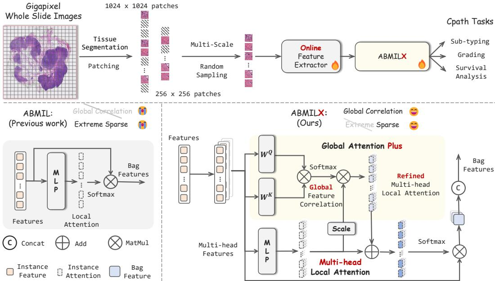
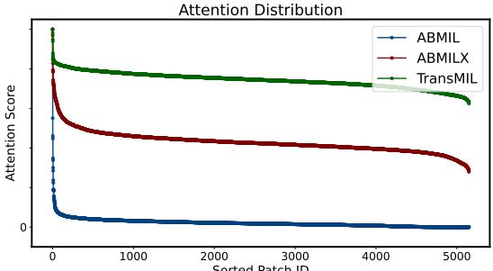
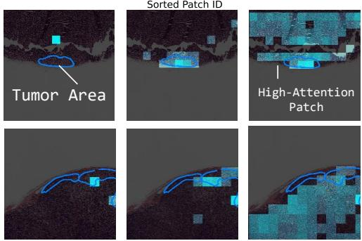

[← 返回 README](../README.md)

# 02 Method

## 原文

### 3.1 Slide-level Supervised End-to-End Learning

The lack of encoder adaptation in the two-stage paradigm limits the feature specificity on CPath tasks, thereby calling for slide-level supervised E2E training to jointly optimize the MIL model and the encoder. The upper of Figure 3 shows the overall E2E learning pipeline of our method, which consists of multi-scale random instance sampling, instance feature encoder, ABMILX, and task head. Specifically, given the target number of sampled instance s and a slide X, an instance subset L could be collected through our multi-scale random instance sampling strategy V(.) as encoder input to avoid massive training cost, L = V(s, X). The i-th instance l_i is embedded into an instance feature e_i in R^D by an encoder, e_i = F_θ(l_i). F(.) denotes the mapping functions of any encoder and the θ denotes the corresponding learnable parameters. After that, the features of all sampled instances E = {e_1, ..., e_i, ..., e_s} will be aggregated through our proposed ABMILX, Z = Γ_φ(E). The Γ(.) denotes the mapping functions of ABMILX and the φ denotes the corresponding learnable parameters. Then slide features Z are inputted into a task head H_η for the slide-level prediction ŷ, ŷ = H_η(Z). Finally, we only utilize the slide-level ground truth y and the ŷ to joint optimize the aforementioned modules through task loss function L:

{θ̂, φ̂, η̂} = arg min_{θ,φ,η} Σ_{i=1}^{n} L(y_i, ŷ_i),   (1)

where n denotes the number of slides in train set, while θ̂, φ̂, and η̂ are the final parameters of encoder, MIL, and task head, respectively. Considering that E2E learning allows the attention from MIL to affect the instance gradients backpropagated to encoder, the key insight of our method is to guide the encoder to learn task-specific discriminative regions through our proposed ABMILX.

**Multi-scale Random Instance Sampling.** The sampling stage aims to take a subset from massive instances for training, thereby reducing the cost of E2E learning. The sampling methods generally fall into random and selective sampling [50, 9, 61, 27]. The latter focuses on traversing the slide to obtain high-value instance samples, which significantly increases training time and heavily relies on the evaluation model [49, 30, 12]. In this paper, we introduce a multi-scale random instance sampling (MRIS) method to maintain low training cost while leveraging multi-scale instances to capture information at different granularities. Specifically, given a multi-scale set {I_1, ..., I_j, ..., I_t}, we adopt a sampling ratio set {σ_1, ..., σ_j, ..., σ_t} to obtain the number ŝ_j of Î_j for sampling:

L̂_j = V_S(I_j, ŝ_j, X), ŝ_j = ⌈s × σ_j⌉,   (2)

where V_S(.) denotes the function of vanilla random sampling. It is notable that we set Σ_{j=1}^{t}(σ_j) = 1 to ensure that Σ_{j=1}^{t}(ŝ_j) = s. We resize the sampled instances of different scales and context extents {L̂_1, ..., L̂_j, ..., L̂_t} to a unified resolution and merge them as the final sampling set L. On the one hand, multi-scale sampling simulates the multi-scale perspective of pathologists during diagnosis and improves the CPath performance of our method. On the other hand, the unified resolution for different context avoids the additional cost and maintains parallel training, while remaining the different scale perspectives of original instance. Appendix C.4 give more details about sampling.


Figure 3: Overview of the proposed E2E training pipeline and ABMILX. ABMILX introduces multi-head local attention to address the extreme sparsity issue in ABMIL [25], which hinders E2E optimization. Furthermore, ABMILX refines the local attention using global feature correlations via the attention plus. This encourages the model to focus on task-specific regions during E2E learning.

### 3.2 ABMILX for Effective End-to-End Learning

Sparse-attention MIL that relies on local instance features, such as the most representative ABMIL [25], could avoid key regions being overwhelmed by redundant instances and performs increasingly well with superior features. However, we demonstrate that the sparse attention will introduce interference risks in E2E learning and bring suboptimal performance. The risks primarily stem from the insufficient consideration of discriminative instances and excessive focus on redundant ones. In this paper, we propose ABMILX, which consists of a multi-head local attention and a global attention plus module to mitigate the optimization risks from both local and global perspectives. It also maintains the sparse characteristic to effectively collaborate with the fine-tuned encoder.

**Multi-head Local Attention.** Considering that the false attention from under-converged MIL usually exhibit a random distribution, we propose a multi-head local attention module (MHLA) to directly suppress the excessive focus on redundant instances while improving the attention for the discriminative ones. Specifically, we divide the features of all sampled instances E into m head features {H^1, ..., H^j, ..., H^m}, where H^j in R^{s × ⌈D/m⌉}. Within each head, the head features are input into a shared MLP to compute the corresponding attention, A^j = MLP(H^j). The A^j in R^{s×1} denotes the local attention vector of the j-th head, which possesses sparse characteristic important in CPath tasks. In the E2E learning, the separate voting from multiple heads allows to reduce the excessive focus on redundant instances, while the attention from different feature subspaces helps to provide a more comprehensive view on discriminative instances. Finally, we aggregate the features within each head through A^j to obtain the head-level slide features (Z^1, ..., Z^j, ..., Z^m), which are then concatenated as the final slide feature:

Z in R^{1×D} = Concat(Z^1, ..., Z^j, ..., Z^m), Z^j = Softmax(G(A^j))^T H^j,   (3)

where G(.) denotes the mapping function of our global attention plus module. It aims at further refining A^j through propagating sparse attentions from discriminative instances to their similar instances for better feature aggregation and optimization. Compared to directly averaging the head attention and aggregating the whole instance features, head-level aggregation enables MIL to obtain more diverse representations from different feature subspaces.

**Global Attention Plus Module.** Tissues with similar pathological characteristics typically exhibit highly similar morphology, leading to a higher correlation among corresponding instance features. Therefore, besides directly enhancing attention from the local instance perspective, we propose a global attention plus module (A+) to leverage the global correlations for attention refinement, which could indirectly improve the focus for the discriminative instances while suppressing the redundant ones. It propagates A^j between similar instances to obtain a global sparse attention and then combines it with A^j, thereby correcting the local sparse attention from MHLA. When integrating the MHLA with the A+ module, we first share A+ module across different heads to obtain the refined head-attention by computing a similarity matrix U^j, respectively, and then perform feature aggregation within each head for the refined head-level slide features as mentioned in Eq 3:

G(A^j) = A^j + α · U^j A^j = A^j + α · Softmax(Q^j K^{jT} / √⌈D'/m⌉) A^j,   (4)

where Q^j = H^j W^q, K^j = H^j W^k. The W^q in R^{⌈D/m⌉ × ⌈D'/m⌉} and W^k in R^{⌈D/m⌉ × ⌈D'/m⌉} are both the linear transforms. To preserve the sparsity, we introduce a shortcut branch with a learnable scaling factor α that adaptively combines global sparse attention U^j A^j and the original local one.

The propagation weight of the i-th instance, denoted as P(i), is defined as the sum of its influence on all instances. In classic transformer-based methods, the propagation weights P_trans is determined by only the similarity matrix U^j. However, for the global sparse attention introduced in ABMILX, the weights P_abx is also significantly affected by the original sparse head attention value A^j:

P_trans(i) = Σ_{k=1}^{s} U_{k,i}^j,   P_abx(i) = A_k^j Σ_{k=1}^{s} U_{k,i}^j.   (5)

Therefore, ABMILX utilizes the A^j as prior distribution to grant sparse discriminative instances with higher propagation weights to find more potential instances while suppressing the normal ones. More theoretical analysis about ABMILX is available in Appendix A.

### 3.3 Sparse Attention Analysis in E2E Learning

To intuitively analyze the effect of sparse attention on E2E training, we quantitativethe sparsity of different MILs by the proportion of activated patches. Sparsity is statistically derived from the CAMELYON dataset [3]. Moreover, the right figure visualizes attention scores (bottom) and corresponding distribution (middle) of MILs during training. We demonstrate the following: (1) In E2E optimization, extreme sparsity causes ABMIL to overlook discriminative regions while over-focusing on redundant ones, leading to worst performance. (2) Although the global attention of TransMIL eliminates this extreme sparsity and covers some discriminative regions, it is also largely distracted by the redundant ones, which also brings limited accuracy gains. (3) In contrast, both MHLA and A+ make ABMILX maintains reasonably sparse attention, which considers most of the discriminative regions while maintaining low attention to normal patches. Benefited from them, ABMILX achieves the best performance in different CPath tasks. Besides, learnable α also helps adaptively adjusting the sparsity and brings more accuracy gains. More experiments and analysis about the affect of different MILs in E2E learning are available in Sec. 4.3 and Appendix C.2.

| Different MILs in E2E   | Sparsity | Sub.(AUC) | Surv.(C-index) |
|-------------------------|----------|-----------|----------------|
| ABMIL                   | 80       | 89.23     | 62.70          |
| TransMIL                | 13       | 91.44     | 63.42          |
| MHLA (α = 0)            | 61       | 91.58     | 63.80          |
| MHLA & A+ (α = 1)       | 29       | 92.84     | 65.49          |
| MHLA & A+ (learnable α) | 36       | 93.97     | 67.78          |




---

> 💡 **Hao 批注：ABMILX 的核心设计思想**
>
> ABMILX 的设计可以概括为"稀疏但不要太稀疏"——这也是其核心命名中 "X"（cross/扩展）的含义。具体设计思路如下：
>
> **1. MHLA（多头部注意力）的核心机制**
>
> 将特征沿通道维度等分为 m 组（每组 ⌈D/m⌉ 维），每组内独立计算注意力。关键细节：
> - 共享 MLP 在所有头之间，不是每个头独立 MLP
> - 每个头内仍然使用 sparse attention（softmax），所以整体输出保持稀疏
> - 但多个头的稀疏注意力分布在不同的特征子空间 → 某个头过度聚焦冗余区域时，其他头可能聚焦在其他判别区域
>
> 理论上（Appendix A.2）：多头的优化风险 R_MHLA < R_ABMIL，因为每个头仅影响 1/m 维度的 bag feature。
>
> **2. A+（全局注意力增强）的核心机制**
>
> 计算 patch 间特征相似度矩阵 U（通过 QK^T 得到），然后将注意力 scores A^j 在相似 patch 间传播：
> ```
> refined_A = A + α · U · A
> ```
> 直观理解：如果 patch i 和 patch j 特征相似，且 patch i 的注意力很高，则 patch j 也应当获得一定注意力（即使它原始注意力低）。
>
> 关键设计点：
> - 传播权重由 A_j 加权：P_abx(i) = A_k^j Σ U_{k,i}^j（而 transformer 中是 P_trans(i) = Σ U_{k,i}^j，与 attention 无关）
> - 这意味着**高注意力的判别实例有更高的传播权重** → 它们可以更好地"找到"与之相似的其他判别实例
> - 而噪声/冗余实例的注意力低，传播权重也低 → 不会错误地传播噪声
> - 可学习的 α 控制全局传播和局部注意力的平衡
>
> **3. 为什么不是标准的 Transformer Attention？**
>
> 关键区别在于：ABMILX 的 A+ 是在已经稀疏的局部注意力之上做传播，而 Transformer 的 self-attention 是全局的（每个 query 对所有 key）。前者保留了稀疏性（因为传播权重被 A^j 调幅），后者没有。
>
> **4. 设计消融的关键发现**
>
> | 配置 | Sparsity | 性能 | 分析 |
> |------|----------|------|------|
> | ABMIL (单头，无 A+) | 80 | 最差 | 过度稀疏，优化崩溃 |
> | TransMIL (Transformer) | 13 | 中等 | 完全不稀疏，被冗余分散 |
> | MHLA only (α=0) | 61 | 较好 | 多头降低风险，但仍偏稀疏 |
> | MHLA + A+ (α=1) | 29 | 好 | A+ 过度传播，接近 TransMIL |
> | MHLA + A+ (learnable α) | 36 | 最优 | 自适应平衡，合理稀疏 |

---

> 💡 **Hao 批注：数据流与前向/反向传播**
>
> ```mermaid
> flowchart TD
>     subgraph Forward
>         IMG[Multi-scale Patches<br>s × 3 × 224 × 224] --> ENC[ResNet Encoder<br>θ - 可训练]
>         ENC --> E[Instance Features<br>E ∈ R^{s×D}]
>         E --> SPLIT[Split into m heads<br>H^1...H^m, each R^{s×⌈D/m⌉}]
>         SPLIT --> MHLA[Per-head MLP<br>→ A^1...A^m]
>         SPLIT --> SIM[Compute Q^j K^{jT}<br>→ U^1...U^m]
>         MHLA --> APLUS[A+: A^j + α·U^j·A^j]
>         SIM --> APLUS
>         APLUS --> SOFTMAX[Softmax → attention weights]
>         SOFTMAX --> AGGREGATE[Head-level aggregation<br>Z^j = Attn^T·H^j]
>         AGGREGATE --> CONCAT[Concat Z^1...Z^m = Z]
>         CONCAT --> HEAD[Task Head → ŷ]
>     end
>     
>     subgraph Backward
>         LOSS[Slide-level Loss L(y, ŷ)] --> HEAD
>         LOSS --> CONCAT
>         LOSS --> AGGREGATE
>         LOSS --> SOFTMAX
>         LOSS --> APLUS
>         LOSS --> MHLA
>         LOSS --> ENC
>     end
>     
>     HEAD --> LOSS
> ```

---

> 💡 **Hao 批注：与标准 ABMIL 的关键差异总结**
>
> | 维度 | ABMIL | ABMILX |
> |------|-------|--------|
> | 注意力维度 | 全通道 (D) | m 组 (D/m) |
> | 注意力头数 | 1 | m (典型值 8) |
> | 全局信息利用 | 无 | A+: 相似度矩阵传播 |
> | 特征聚合 | 直接加权求和 | 头内聚合 + concat |
> | 可学习参数 | MLP | MLP + W_q, W_k + α |
> | 稀疏性 | 极端 (80%) | 自适应 (learnable α) |
> | E2E 优化风险 | 高 | 低 |
