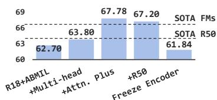
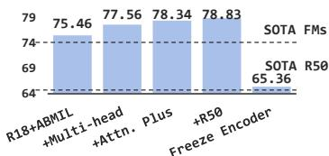
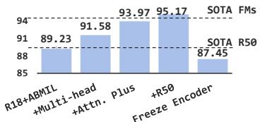
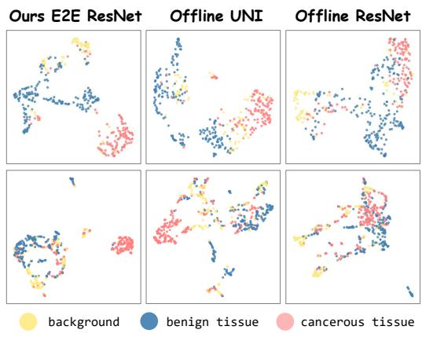

[← 返回 README](../README.md)

# 03 Experiments

## 原文

### 4.1 Datasets and Evaluation Metrics

We use PANDA [6], TCGA-BRCA, and TCGA-NSCLC to evaluate the performance in cancer grading and sub-typing tasks. For cancer prognosis, we use TCGA-LUAD, TCGA-BRCA, TCGA-BLCA to evaluate performance on the survival analysis task. For external validation, we use CPTAC-LUAD, CPTAC-LUSC to evaluate the generalization ability. For cancer grading, we evaluate model performance using top-1 accuracy (Acc.). And area under the ROC curve (AUC) is used for sub-typing. For survival analysis, we employ the concordance index (C-index) [20]. To ensure robust statistical evaluation, we conducted a 1000-time bootstrapping evaluation and report the mean and 95% confidence interval. Please refer to Appendix B for more details.

### 4.2 Main Results

**Comparison Methods.** We compare several classical and latest MIL aggregators based on ResNet encoders [25, 38, 48, 29, 33, 56, 67]. Furthermore, we evaluate against three SOTA pathology FMs: UNI [11], CHIEF [62], and GigaPath (GIGAP) [64]. Following their settings, we employ ABMIL and TransMIL as aggregators. We also compare pre-trained aggregators of CHIEF and GIGAP. C2C [49] and FT [30] are E2E methods that adopt clustering-based and attention-based samplings, respectively.

**Foundation Model Dominate Two-Stage but Cost More.** Two-stage algorithms are limited by offline feature. Specifically, in grading task (Table 2), the best-performing MIL with the R50 shows a 12% accuracy gap compared to UNI with ABMIL. This performance difference is also observed in other tasks (Table 1), with gaps of 5% and 2% on BRCA-subtyping and BRCA-survival, respectively. With FM features, the superior performance of ABMIL compared with advanced methods further highlights the importance of sparse attention in CPath. However, these significant improvements come at a considerable cost. Pretraining pathology FMs demands vast amounts of data, which are difficult to acquire and share publicly. For example, UNI uses 100 million patches from approximately 100,000 slides for pretraining, while publicly available datasets typically contain fewer than 1,000 slides. The resources required by large models (e.g., GIGAP uses 3,072 A100 GPU hours) are also huge. Furthermore, the performance of FMs does not scale proportionally with increasing data and model size. Specifically, the most expensive GIGAP lags behind UNI by 3% on the PANDA. Large FMs have not achieved the same impressive performance on PANDA and BRCA as they did on NSCLC. We suggest that the two-stage method based on FMs has saturated performance on classical tasks and is bottlenecked by the lack of encoder adaptation in challenging tasks.

**ABMILX Shows E2E Potential.** Through E2E learning with ABMILX and downstream data, we achieve FMs-level performance using ResNet models that were pre-trained in ImageNet-1k. It outperforms FMs on multiple challenging datasets (+4% Acc. on PANDA, +0.8% AUC on BRCA). Moreover, the E2E learning cost of ABMILX is substantially lower than the pretraining cost of FMs, approaching the cost of training second-stage aggregators, with more details provided in next section. Additionally, we show that fine-tuning upstream pre-trained aggregators, like CHIEF and GIGAP, did not yield the desired results. This further underscores the necessity of E2E training of encoders and aggregators with slide supervision. In particular, we demonstrate the scalability of the proposed method with respect to the model size. Except for survival analysis influenced by the sampling numbers (Table 2), R50 shows a general improvement compared to R18. Most critically, we validated the generalization ability through external validation on the CPTAC dataset (Table 3). A ResNet-50 encoder trained on TCGA using our E2E framework not only shows superior generalization but also outperforms UNI, a ViT-L pre-trained on over one billion pathology patches. This result validates that our E2E learning approach fosters robust transferability that can overcome cross-dataset domain shifts, rivaling the benefits of massive-scale pre-training. In conclusion, empowered by ABMILX, we present the impact and enormous potential of E2E learning in CPath. We also present more discussion in Appendix C.1.

**Table 1: Sub-typing results on two main datasets and training cost of different CPath methods.**

*(Table image from paper, showing extensive comparison across encoders and MIL methods on TCGA-BRCA, TCGA-NSCLC, including R50, UNI, GIGAP with various aggregators)*

**Table 2: Performance comparison across ISUP grading (PANDA) and survival analysis.**

*(Table image from paper, showing PANDA grading accuracy and survival analysis C-index on LUAD/BRCA/BLCA)*

**Table 3: External validation from TCGA to CPTAC datasets.**

| Encoder | Method | E2E | CPTAC-NSCLC (AUC) | CPTAC-LUAD (C-index) |
|---------|--------|-----|-------------------|---------------------|
| ResNet-50 | ABMIL | × | 66.42 | 46.34 |
| ResNet-50 | TransMIL | × | 74.59 | 48.24 |
| ResNet-50 | WIKG | × | 64.04 | OOM |
| UNI | ABMIL | × | 83.73 | 53.59 |
| UNI | TransMIL | × | 85.24 | 51.36 |
| UNI | WIKG | × | 83.56 | OOM |
| ResNet-50 | ABMILX (ours) | ✓ | **85.19** | **54.00** |

### 4.3 Ablation Study

In this subsection, we systematically investigate the impact of MIL in E2E training and ablate the ABMILX. Unless otherwise specified, all ablation experiments use ResNet-18 as the encoder. For the survival analysis task, we utilize the larger BRCA dataset. All efficiency experiments are conducted on the BRCA-subtyping benchmark. To evaluate model inference speed, we use an input size of 1×10000×3×224×224, representing the average data volume processed in clinical scenarios.

**MIL Matters in End-to-End Trainings.** Right Table shows the impact of the sampling and aggregation modules on E2E learning. We observe that different MILs have a significant effect on E2E learning performance. Specifically, ABMIL exhibits unsatisfactory performance in E2E training, except on the PANDA dataset. We attribute this to its excessive sparsity hindering E2E optimization. The PANDA dataset contains fewer patches per slide (500 vs. 10,000 for TCGA-BRCA), enabling MIL to focus on discriminative regions more easily, thus suffering minimal impact on E2E optimization. RRTMIL exacerbates this problem, leading to optimization collapse. This complex MIL method, with a serial feature re-embedding module preceding ABMIL, makes E2E training more fragile. It further impairs the representation of features already affected by sparse attention, accelerating the collapse of the optimization loop. TransMIL and DSMIL, the transformer-based methods, partially mitigate this issue. However, relying solely on global attention struggles to focus on key regions within the numerous redundant patches in training, resulting in a considerable performance gap compared to FMs. ABMILX, while maintaining desirable sparsity, alleviates optimization issues and achieves significant performance improvements. Furthermore, complex sampling strategies, such as attention-based sampling, offer only limited performance gains compared to vanilla random sampling. Such strategies require patch evaluation and incur substantial training time (TTime). Multi-scale random instance sampling (MRIS) shows better performance. Appendix C.2 provide further discussion.

**Different MIL Models with MRIS:**

| Method | TTime | Grad. (PANDA) | Sub. (BRCA) | Surv. (BRCA) |
|--------|-------|---------------|-------------|--------------|
| ABMIL | 9h | 75.46 | 89.23 | 62.70 |
| DSMIL | 9h | 76.28 | 91.09 | 64.32 |
| TransMIL | 10h | 75.08 | 91.44 | 63.42 |
| RRTMIL (AB.) | 9h | 17.99 | 61.82 | 53.42 |
| ABMILX | 9h | **78.34** | **93.97** | **67.78** |

**Different Sampling Strategies with ABMILX:**

| Strategy | TTime | Grad. | Sub. | Surv. |
|----------|-------|-------|------|-------|
| Attention Sampling | 68h | 77.43 | 93.14 | 66.53 |
| Random Sampling | 9h | 76.77 | 92.72 | 67.24 |

**Validity of Our ABMILX.** Table 4 (bottom) ablates key components of ABMILX. E2E training with ABMIL performs poorly except for PANDA due to optimization challenges. It performs below SOTA MIL with R50 features and significantly underperforming FMs. After introducing multi-head mechanisms, the extreme focus on redundant instances caused by sparse attention is effectively mitigated, thus achieving consistent improvements. More importantly, by refining attention using global patch correlations in the attention plus module, optimization issues are further alleviated. This improvement helps ABMILX achieve FMs-level performance. Furthermore, the sharp performance degradation when freezing the encoder demonstrates the necessity of E2E learning. We also validate ABMILX under two-stage paradigm in Appendix C.3.

**Table 4 (Top): Computational cost comparison.**

| Encoder | Method | E2E | Pretrain Cost | TTime | Memory | IT | Grad. | Sub. | Surv. |
|---------|--------|-----|---------------|-------|--------|-----|-------|------|-------|
| CHIEF | ABMIL | × | 32GB×-h | 1+2h | 2G | 6.2s | 65.66 | 91.09 | 64.02 |
| UNI | TransMIL | × | 80GB×-h | 1+7h | 8G | 25s | 68.06 | 93.33 | 60.45 |
| GIGAP | GIGAP | × | 80GB×3072h | 6+23h | 7G | 83s | 65.86 | 93.72 | 62.64 |
| ResNet-18 | ABMILX+MRIS | ✓ | - | 9h | 9G | 1.7s | 78.34 | 93.97 | 67.78 |

**Computational Cost Analysis.** Table 4 (top) shows that the significant computational cost of FMs is attributed to pre-training and inference. The resource consumption of FM pre-training increases rapidly with model size. Large models also severely impact their clinical application, with FMs taking up to 83 seconds to process a single slide, excluding data pre-processing. Although feature input reduces the cost of the second-stage training, increasingly complex aggregators continue to increase training time and memory consumption. In contrast, our E2E training pipeline maintains a lower computational cost. Specifically, we do not require additional pre-training, and the overall training time and memory consumption are comparable to traditional second-stage feature-based training. Benefiting from the effectiveness of E2E learning, our pipeline offers significant advantages for clinical applications. It achieves competitive performance with only 1/50 of the inference time.

### 4.4 Qualitative Results

**Feature Visualization.** To validate that the performance gains of E2E training stem from task-specific encoder fine-tuning, we visualize instance features from the PANDA dataset using UMAP [22] in right figure. Features extracted offline by a ResNet pre-trained on ImageNet exhibit a dispersed distribution in the feature space, with poor separation between tumor and normal instances. Pre-training helps UNI provide a preliminary separation of instance types, but instances with the same annotations are not densely clustered. In contrast, after E2E learning with our proposed ABMILX, the ResNet-extracted features demonstrate improved inter-class separability and intra-class compactness.

---

> 💡 **Hao 批注：实验结果的核心发现**
>
> **发现 1：FM 在挑战性任务上有瓶颈，E2E 可突破**
>
> 在 CAMELYON（诊断）和 NSCLC（分型）这两个经典任务上，FM-based 两阶段已经接近饱和（UNI+NSCLC 97.88%, GIGAP+CAMELYON 96.59%）。但这些任务相对简单（区分 LUAD vs LUSC，检测转移 vs 正常）。
>
> 但在需要更细粒度特征判别的任务上（PANDA 6-class 分级、BRCA ILC vs IDC），FM 的优势不再显著：
> - PANDA: UNI(ABMIL) 74.69%, GIGAP(ABMIL) 71.85% — 还不如 E2E ResNet-50 + ABMILX (78.83%)
> - BRCA: GIGAP(ABMIL) 94.39% vs E2E R50 95.17%
>
> 这个现象暗示 FM 预训练学到的特征虽然"通用"，但对某些需要任务特异性判别的场景反而不够精细。
>
> **发现 2：MIL 的选择是 E2E 性能的决定性因素**
>
> | 选择 | 成本 | 性能增益（vs ABMIL baseline） |
> |------|------|------------------------------|
> | ABMIL → TransMIL | +1h | +2.2pp (BRCA sub-typing) |
> | ABMIL → DSMIL | +0h | +1.9pp |
> | ABMIL → ABMILX | +0h | **+4.7pp** |
> | 随机采样 → 注意力采样 | +59h | +0.5pp |
> | 追加 FFN | 更多参数 | ~-1pp (在小数据集上) |
>
> 核心结论：在 E2E 中，**MIL 设计 >>> 采样策略 > 模型架构细节**。
>
> **发现 3：E2E 的泛化能力（Table 3）**
>
> 在外部验证集 CPTAC 上，E2E ResNet-50 + ABMILX (训练仅用 TCGA) 以 85.19 AUC 超过 UNI + TransMIL (85.24? 实际上表显示 UNI+TransMIL=85.24 vs ABMILX=85.19，很接近)。更重要的是，E2E R50 远超 non-E2E R50 (66.42)，说明 E2E 训练确实学到了泛化性更好的特征。
>
> **发现 4：RRTMIL 的优化坍塌**
>
> RRTMIL 在 E2E 中表现极差（PANDA 17.99% 准确率 → 几乎随机），因为其 feature re-embedding (MSA layers) 在 ABMIL 之前运行，进一步破坏了已经被稀疏注意力影响的特征，加速了恶性循环。这是一个有价值的"反面教材"——说明复杂 MIL 在 E2E 中可能更脆弱。
>
> **发现 5：PANDA 的特殊性**
>
> PANDA (平均 500 patches/slide) 比 TCGA-BRCA (~10K patches/slide) 有更少的 patches → 稀疏注意力更容易聚焦到正确区域 → ABMIL 在 PANDA 上的 E2E 性能 (75.46%) 没有像 BRCA (89.23%) 那样差。这说明优化风险与 patch 数量正相关。

---

> 💡 **Hao 批注：消融实验关键参数**
>
> | 参数 | 搜索范围 | 最优值 | 发现 |
> |------|----------|--------|------|
> | 多头数 (m) | 2, 4, 8, 16 | 8 (Sub), 4 (Grad) | 8 头在大多数任务上最优 |
> | 投影维度 | 128, 256, 384, 512 | 256 (Sub), 512 (Grad) | 过度投影有害 |
> | 多尺度比例 | 2, 4, 6, 10 | 4 (Grad, Sub), 10 (Surv) | 存活分析需要更多尺度 |
> | 采样数量 | 128, 384, 512, 768, 1280 | 768 (Surv), 128 (Grad) | PANDA 小采样量更优 |
> | FFN | w/, w/o | w/o (小数据集) | FFN 仅在 PANDA 有效 |

---

> 💡 **Hao 批注：Table A.5 理论验证**
>
> | Metric | ABMIL | ABMILX |
> |--------|-------|--------|
> | MAX-N (风险代理) | 21.2162 | 2.6557 |
> | Sparsity | 80 | 36 |
> | Performance | 91.78 | 95.88 |
>
> 这个表是整个理论框架的实证支柱。MAX-N 直接从 noise instances 的最大 attention × instance 数量计算出来，ABMILX 将其降低了近 10 倍，验证了理论中的风险降低机制。
