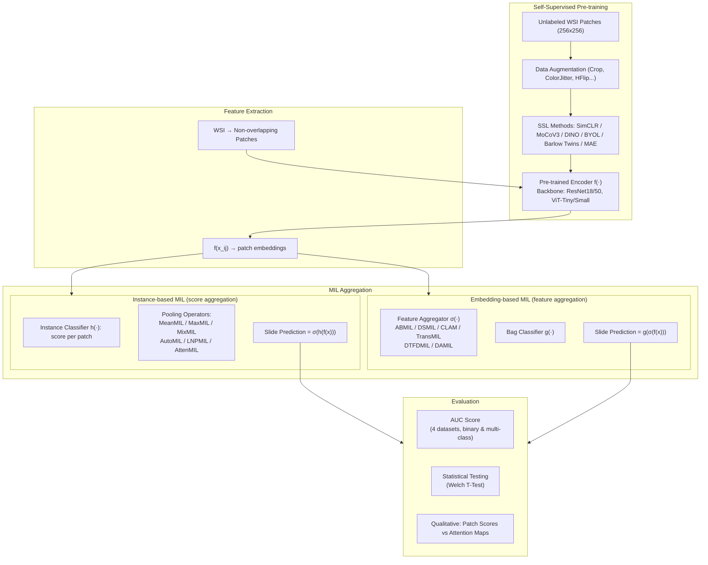

# [Arxiv 2025] Self-Supervision Enhances Instance-based Multiple Instance Learning Methods in Digital Pathology: A Benchmark Study

> **arXiv**: 2505.01109 | **作者**: Ali Mammadov, Loic Le Folgoc, Julien Adam, Anne Buronfosse, Gilles Hayem, Guillaume Hocquet, Pietro Gori (Telecom Paris & Groupe Hospitalier Paris Saint-Joseph)
> **Semantic Scholar**: 获取失败 (API rate-limited)，引用数据待补充

---

## 一句话总结

一项大规模基准研究(710次实验)，系统比较了实例级(instance-based)和嵌入级(embedding-based)MIL方法在WSI分类中的表现。核心发现：配合好的自监督学习(SSL)特征提取器后，简单、参数极少、天然可解释的实例级MIL方法可以达到甚至超越复杂、参数多的嵌入级SOTA方法，并在BRACS(89.4 AUC)和Camelyon16(99.1 AUC)上刷新SOTA。

---

## 核心贡献

1. **710次实验的大规模基准研究**：4个数据集 x 6种SSL方法 x 4种backbone x 4种基础模型 x 10种MIL方法，覆盖二分类/多分类/不同临床复杂度。
2. **4种新的实例级MIL池化算子**：从声音事件检测领域引入MixMIL、AutoMIL、LNPMIL、AttenMIL，首次用于病理WSI分类。
3. **简单实例级方法匹配或超越复杂嵌入级方法**：无论backbone类型(CNN/ViT)，实例级MIL在各项指标上与嵌入级SOTA持平或更好，且参数量少2-3个数量级。
4. **新SOTA结果**：BRACS 89.4 AUC (AttenMIL+DINO+ResNet18)，Camelyon16 99.1 AUC (MixMIL+DINO+ResNet50@20x)。
5. **关键洞察**：SSL特征提取器的质量远比MIL聚合器的复杂度重要；ImageNet初始化影响可忽略(200 epochs SSL足够)；病理适应增强有帮助但有限(+1-3 AUC)。

---

## 📖 批读导航

| Section | 文件 | 要点 |
|---------|------|------|
| Abstract | [sections/00-abstract.md](sections/00-abstract.md) | 核心主张：SSL缩小实例级与嵌入级MIL差距 |
| Introduction | [sections/01-introduction.md](sections/01-introduction.md) | 问题背景、现有局限性、贡献列表 |
| Method | [sections/02-method.md](sections/02-method.md) | 实例级/嵌入级MIL形式化 + 6种SSL + 4种新池化算子 |
| Experiments | [sections/03-experiments.md](sections/03-experiments.md) | 710次实验 + 4数据集结果 + 消融(epoch/patchesize/ImageNet init) + 定性分析 |
| Discussion | [sections/04-discussion.md](sections/04-discussion.md) | 7个关键问题的回答 + 局限性(多倍率/样本量/SSL方法) |

---

## 关键数字

| 指标 | 数值 |
|------|------|
| 总实验次数 | 710 |
| 数据集 | 4 (Camelyon16, TCGA-NSCLC, BRACS, VisioMel) |
| SSL方法 | 6 (SimCLR, MoCoV3, MAE, DINO, BYOL, Barlow Twins) |
| Backbone | 4 (ResNet18, ResNet50, ViT-Tiny, ViT-Small) |
| Foundation Models | 4 (DINOv2, PathAugFM, CTransPath, UNI) |
| MIL方法 | 10 (6 instance-based + 4 embedding-based: ABMIL/DSMIL/CLAM/TransMIL + DTFDMIL/DAMIL) |
| Camelyon16 SOTA | 99.1 AUC (MixMIL + DINO + ResNet50 @20x) |
| BRACS SOTA | 89.4 AUC (AttenMIL + DINO + ResNet18) |
| 实例级参数 | ~193-4098 (vs 嵌入级 ~0.02M-4.46M) |
| SSL训练epochs | 200 |
| Patch size | 256x256 (x10/x20 magnification) |
| 最大batch size | 1024 (4x256 or 8x128 across GPUs) |

---

## 数据流 Mermaid

---

## 优缺点与还能做什么

### 优点
- **实验规模空前**：710次实验覆盖了SSL x Backbone x MIL x Foundation Model的几乎所有组合，为领域提供了宝贵基准
- **核心结论清晰且反直觉**：简单实例级方法（几十到几百参数）匹配甚至超越复杂嵌入级方法（百万参数），挑战了"MIL聚合器越复杂越好"的主流假设
- **实用价值高**：实例级方法天然可解释（patch scores直接对应肿瘤区域），对临床部署友好
- **开源完整**：代码、预训练模型、特征、超参数全部公开
- **比较公平**：所有方法使用相同的数据分割、预处理、评估协议

### 缺点
- **嵌入级方法覆盖不全**：只包含4种嵌入级MIL，缺少基于Graph的方法（如PatchGCN）、层次化方法（如HIPT）、以及更新的方法
- **缺乏空间信息的讨论**：实例级方法天然忽略patch之间的空间关系——这在某些任务中可能是劣势，但论文未深入讨论
- **多倍率未测试**：由于计算限制未使用多倍率，而已知多倍率可提升性能
- **样本量影响未量化**：实例级方法（尤其是MaxMIL）理论上需要更多WSI，但论文未系统研究样本量的影响
- **SSL方法本身非原创**：都是现有方法，创新主要在实验设计和实例级MIL算子的引入
- **VisioMel只有验证集结果**：测试集未公开，无法评估泛化

### 还能做什么 (与 topic "ckmil-re-attn-mil" 的关联)
- **Paper 1 vs Paper 2 的互补视角**：Paper 1 批判嵌入级MIL的"空间盲"——即使有空间建模能力也不一定被使用；Paper 2 则论证实例级MIL配合SSL已经足够好，暗示嵌入级MIL的额外复杂度可能白费。两篇论文从不同角度质疑了复杂MIL聚合器的价值。
- **实例级MIL + 空间感知的融合**：如果实例级MIL + SSL已经足够强，那么加入轻量空间模块（如ResTopoMIL的拓扑残差）能否进一步提升？二者的结合可能既保持可解释性又补足空间盲。
- **关键实例筛选 (CK-MIL)**：实例级MIL的MaxMIL/MixMIL本质上在做关键实例筛选——这篇论文提供了大量基准数据来评估不同池化策略的效果。
- **重注意力视角**：实例级MIL的AttenMIL学习patch级注意力权重，可以作为一种轻量"重注意力"机制。
- **与ReadySlide的关联**：如果压缩改变了patch的分布（而非仅降低质量），实例级MIL预测可能因为patch scores的改变而偏移——这比嵌入级MIL更容易被检测到。
