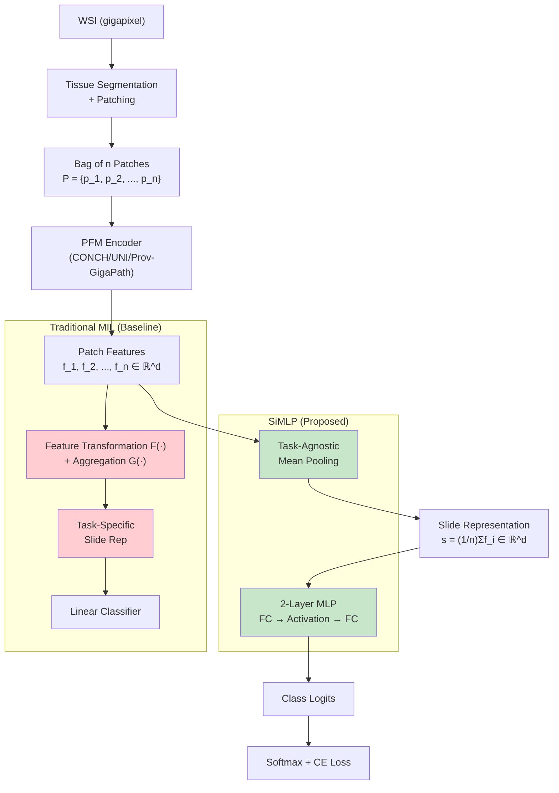

# SiMLP: 简化病理基础模型的 slide-level 微调——均值池化 + MLP 能否替代复杂 MIL 聚合？

> **论文信息**: Jiawen Li, Jiali Hu et al. (Tsinghua SIGS + Oxford + SYSU + UW), arXiv: 2502.20823, Feb 2025.
> **一句话总结**: 提出 SiMLP（Mean Pooling + 2-layer MLP），在三个 PFM（CONCH / UNI / Prov-GigaPath）和六个 WSI 分类任务上系统性证明：**任务无关的均值池化 + 非线性分类头**可以全面超越基于 MIL 的弱监督微调方法（ABMIL / DTFD-MIL / ACMIL / RRTMIL / DiffMIL），挑战了"WSI 微调必须用复杂 MIL 聚合"的主流假设。

## 核心贡献

1. **颠覆性实验发现**: 在 PFM 时代，简单的 task-agnostic mean pooling + MLP（SiMLP）在绝大多数任务上超越复杂的 MIL-based fine-tuning，说明 PFM 的强特征使复杂聚合策略的优势有限。
2. **系统性基准测试**: 覆盖 3 个 PFM x 6 个数据集 x 7 种 fine-tuning 方法，包括大规模泛癌分类（30/22/12 类）、脑肿瘤亚型（27 类）、HER2 预测等。
3. **Few-shot 鲁棒性**: SiMLP 在 few-shot 设置（1/5/10/20/50 shots per class）下一致优于 MIL 方法，标准差 < 0.01。
4. **与 slide-level foundation model 对比**: SiMLP 在 BRACS 上与 CHIEF（预训练数万张 WSI）表现接近，且在 fine-grained 分类上 weighted F1 更高。
5. **跨队列迁移稳定性**: 在 NSCLC 亚型分类的跨队列迁移实验中，SiMLP 外部测试标准差最小。

## 📖 批读导航

| 章节 | 文件 | 要点 |
|------|------|------|
| Abstract | [sections/00-abstract.md](sections/00-abstract.md) | 核心发现、方法概述 |
| Introduction | [sections/01-introduction.md](sections/01-introduction.md) | MIL 微调范式回顾、简化动机 |
| Methodology | [sections/02-method.md](sections/02-method.md) | SiMLP 设计：task-agnostic pooling + MLP |
| Experiments | [sections/03-experiments.md](sections/03-experiments.md) | 6 任务 × 3 PFM 结果、few-shot、迁移、消融 |
| Discussion | [sections/04-discussion.md](sections/04-discussion.md) | 四个关键洞察、局限性 |

## 关键数字

| 指标 | 数值 |
|------|------|
| 最佳方法 | SiMLP (Mean Pooling + GeLU + 2-layer MLP) |
| 3 PFM 平均性能 (Fig.1c) | 81.32% (CONCH), 81.52% (UNI), 80.96% (GigaPath) |
| TCGA OncoTree (30-class) 最佳 | SiMLP + UNI: 0.8488 Bal ACC, 超 ABMIL +3.52% |
| TCGA Pan Cancer (22-class) 最佳 | SiMLP + UNI: 0.8846 Bal ACC |
| CPTAC Pan Cancer (12-class) 最佳 | SiMLP + CONCH: 0.9251 Bal ACC |
| Few-shot (50 shots/class) | SiMLP 在所有 shot 设置上一致优于 ABMIL/ACMIL |
| 训练硬件 | 单张 NVIDIA 4090 24GB |
| 随机种子 | 5 fixed seeds |
| 消融（pooling） | Mean >> Max（0.8488 vs 0.7456 Bal ACC） |
| 消融（activation） | GeLU ≥ ReLU >> SwigLU（0.8509 vs 0.8488 vs 0.8054） |

## 数据流

## 优缺点

### 优点
- **实验规模震撼**: 3 PFM × 6 任务 × 7 方法的 full factorial design，提供了强证据
- **反直觉且有洞察力**: 挑战了"WSI 微调必须用 MIL"的主流认知，与 [28]（MIL benchmark finding: 无单一方法一致最优）形成呼应
- **实用性强**: 单张 4090 可跑，代码即将开源，超参简单（仅 pooling 类型 + activation 函数）
- **Few-shot 性能优异**: 低方差特性使其适合罕见病筛查场景
- **跨队列迁移稳定性好**: 外部测试标准差小——对临床部署很有价值

### 缺点
- **缺乏理论解释**: 只演示了"SiMLP 更好"但未解释"为什么更好"——是 MIL 过拟合？是 MIL 的 task-specific 特征损害了泛化？是 mean pooling 提供了更好的正则化？
- **非线性 MLP 的必要性论证不足**: 线性 probe（mean pooling + linear）在多个任务上已经接近 SiMLP（如 TCGA OncoTree: 0.8295 vs 0.8488 with UNI），MLP 的增量有限
- **仅与 MIL 对比，未与其他简化方法对比**: 缺少与 Morphological Prototyping [22]、slide-level self-supervised 方法的对比
- **任务偏向分类**: 所有评估都是分类任务，未涉及生存分析、回归等
- **BRACS 对比不公平**: GigaPath 的 full tuning 性能极差（0.3333 Bal ACC），作者归因于"高计算复杂度和大参数量导致收敛困难"——但这可能反映了调参不足而非方法本身的问题
- **HER2 预测上 SiMLP 不如线性 probe**: 在 HEROHE 任务上 SiMLP 0.6778 低于线性 probe 0.7092 (GigaPath)，说明在特定任务上 MLP 的非线性反而有害
- **无统计检验**: 未提供跨 seed 或跨方法的统计显著性检验

## 阅读 Q&A

**Q1: SiMLP 为什么有效？这不是"返祖"到最简单的 mean pooling 吗？**

是的，这正是本文的反直觉之处。PFM 预训练已经捕获了丰富的 patch 级语义，使得复杂的 task-specific feature transformation（如 ABMIL 的 gated attention、TransMIL 的 self-attention）带来的边际收益可能小于其引入的过拟合风险。Mean pooling 的"粗糙"反而是一种隐式正则化——强制模型学习对多数 patches 都有区分度的表示，而非依赖少数高注意力 patches。这与我们 ReadySlide 中"importance-retention 已经接近 Top-k optimal"的发现一致：简单的全局信号往往足够。

**Q2: SiMLP 和线性 probe 的差距有多大？值得这额外的 MLP 吗？**

在大多数任务上差距不大（如 TCGA OncoTree UNI: 0.8295 → 0.8488, +1.93pp；TCGA Pan Cancer UNI: 0.8816 → 0.8846, +0.30pp）。主要增益来自 CONCH 模型（从 0.8090 到 0.8273, +1.83pp），说明 MLP 的额外非线性对较弱的基础 encoder（CONCH ViT-Base）帮助更大——强 encoder（UNI ViT-H）的特征已经足够线性可分。

**Q3: SiMLP 在 HER2 预测上为什么表现差？**

HER2 预测是一个更"局部化"的任务——HER2 过表达通常表现为膜染色的特定模式，可能只在少数区域体现。Mean pooling 会对所有 patches 等权平均，稀释了关键区域的信号；而 attention-based MIL 可以聚焦于关键 patches。这说明：当诊断信息集中在少数区域时，等权聚合是次优的——这正是我们 retention allocator 需要解决的"什么 patches 重要"问题。

**Q4: 这篇论文对我们 ReadySlide 有什么启发？**

极强的启发。(1) **Mean pooling as a strong baseline**：我们在设计 allocator 时，最简单的"等权保留"策略（≈ random retention + mean pooling）可能已经是强 baseline，需要作为 ablation 之一。(2) **Task-agnostic representation 的价值**：如果 task-agnostic 表示已经足够好，那我们的 compression 方案也应该追求 task-agnostic——"压缩一次，任何下游任务都能用"，这正是我们的 analysis-ready 目标。(3) **PFM 越强，简单方法越好**：随着 PFM 质量的持续提升（从 CONCH ViT-B → UNI ViT-H → Virchow2），简单 aggregation 的优势可能会进一步增大。(4) **局限性互补**：SiMLP 在诊断信息局部化的任务上表现差——这正是我们的 oracle allocator 应该能胜出的场景（分配更多 budget 给信息密集区域）。

**Q5: 本文的结论是否过于绝对？"Simple pooling beats MIL" 是普遍规律吗？**

不是。作者在 conclusion 中明确指出"tailored weakly supervised learning remains necessary for slide-level tasks"——在 biomarker prediction、hierarchical classification of rare diseases、long-tailed data analysis 等场景中，MIL 仍有优势。HER2 预测的失败就是反例。更准确的表述是：**在 PFM 特征足够强 + 任务信息在 WSI 中分布相对均匀的场景下，简单的 task-agnostic pooling 是更好的 baseline**——它不容易 overfit 且泛化更好。
