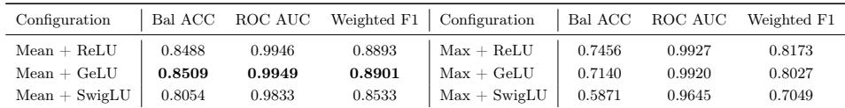
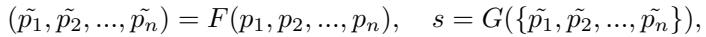
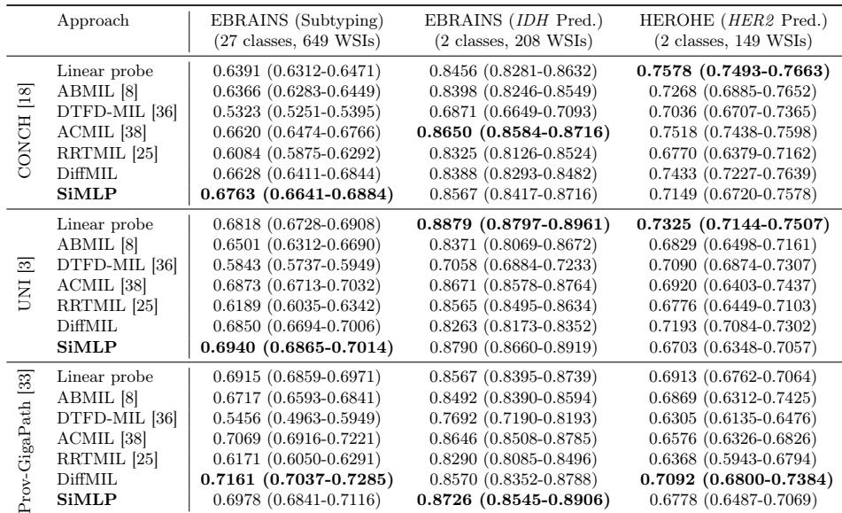
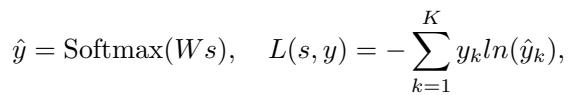

[← 返回 README](../README.md)

# 03 — Experiments

## 3.1 Datasets and experimental settings

> **原文**:

We conducted extensive experiments on seven large-scale datasets, including TCGA (OncoTree, 30 classes), TCGA (Pan Cancer, 22 classes), CPTAC (Pan Cancer, 12 classes), EBRAINS (Subtyping, 27 classes), EBRAINS (IDH Prediction, 2 classes), HEROHE (HER2 Prediction, 2 classes) and BRACS (Coarse-grained, 3 classes; Fine-grained 7 classes). We trained all the fine-tuning approaches with AdamW optimizer (learning rate: 10^-4, betas=[0.9, 0.98], weight decay: 10^-4) and a batch size of 1 for 20 epochs. All approaches were trained on 1 x 24GB NVIDIA 4090 with 5 fixed random seeds. Additional details of implementation, datasets, and baselines will be available in the Github codebase.

> 💡 **单卡 4090 24GB**: Hao 批注 — 与 TAPFM 的 H100 80GB 形成对比——SiMLP 的硬件需求更低（消费级显卡即可），使其更易于广泛复现和部署。这也反映了方法简洁性的实际价值：不需要存储大量中间激活（MIL 的复杂变换通常需要更多显存）。

> 💡 **实验设置的公平性**: Hao 批注 — 所有方法使用相同的优化器、学习率、batch size、epochs、seeds。这确保了公平对比。但有一个潜在问题：不同 MIL 方法的最优超参可能不同——例如 ABMIL 可能需要更小的学习率或更多的 epochs。使用统一的训练配置可能对某些 MIL 方法不公平（但这也反映了 SiMLP 的另一个优势：超参鲁棒性更好）。

## 3.2 SiMLP outperforms in diverse slide-level classification

> **原文**:

To evaluate SiMLP across slide-level tasks, we selected three representative pathology foundation models: CONCH [18], UNI [3], and Prov-GigaPath [33]. We conducted experiments on six tasks across four cohorts and performed a fair comparison against linear probe, four popular MIL-based methods (ABMIL [8], DTFD-MIL [36], ACMIL [38], and RRT-MIL [25]), and a differential attention-based MIL method (DiffMIL) that we specifically designed (Table 1-2). Overall, SiMLP achieved superior performance across all three foundation models (81.32%, 81.52%, 80.96% in Fig.1c), demonstrating stronger adaptability than task-specific weakly supervised learning. Notably, SiMLP achieved the best results in three pan-cancer tasks, improving upon ABMIL by 3.52% and ACMIL by 1.83% in TCGA OncoTree classification. While SiMLP underperformed in HER2 prediction, the linear probe, which also uses mean pooling, performed well, suggesting that task-agnostic simplified aggregation can still produce effective representations.

> 💡 **三个 PFM 的横向对比**: Hao 批注 — 有趣的是，三个 PFM 各自在不同任务上表现最好：CONCH 在 CPTAC pan-cancer 上达到 0.9251（最佳），UNI 在 TCGA OncoTree 上达到 0.8488（最佳），GigaPath 在 EBRAINS subtyping 上达到 0.7161（最佳）。这说明 PFM 的架构/预训练策略影响对不同任务的适应性——没有 universally best PFM。但 SiMLP 在每个 PFM 上都是该 PFM 的最佳 fine-tuning 方法，说明方法的通用性。

> 💡 **MIL 方法之间的排名不稳定**: Hao 批注 — 在 CONCH + TCGA OncoTree 上，最好的 MIL 是 RRTMIL (0.8342)，其次是 DiffMIL (0.8346 vs 0.8221 但 DiffMIL 在 CPTAC 上是 0.8790)。没有任何 MIL 方法在所有任务上都是第二好。这与 [28] (Chen et al.) 的发现一致：MIL 聚合器的性能高度任务依赖。SiMLP 在大多数任务上稳定第一，说明其 task-agnostic 特性在"跨任务泛化"上更有优势。

> 💡 **线性 probe 的惊人表现**: Hao 批注 — 线性 probe（mean pooling + linear classifier）在多个任务上已经接近或超过复杂 MIL 方法。例如 UNI + 线性 probe 在 TCGA Pan Cancer 上达到 0.8816，超过所有 MIL 方法（最好的 DiffMIL 0.8833 仅高 0.17pp）。这进一步支持了"PFM 特征足够好，复杂聚合收益有限"的论点。

> 💡 **HER2 预测的反例**: Hao 批注 — 在 EBRAINS IDH 预测和 HEROHE HER2 预测上，SiMLP 并非最优。尤其是 HEROHE：GigaPath + SiMLP 0.6778 远低于 GigaPath + Linear probe 0.7092——添加 MLP 非线性反而有害。作者解释为"线性 probe 也用了 mean pooling，说明 task-agnostic aggregation 仍然有效"——这个解释避重就轻。真正的问题是：为什么 MLP 在 HER2 上反而更差？可能原因是 HER2 训练样本少（149 WSIs），MLP 的额外参数导致过拟合。

## 3.3 SiMLP outperforms in few-shot learning classification

> **原文**:

To evaluate learning efficiency and generalization with limited data, we conducted few-shot classification on TCGA and CPTAC pan-cancer tasks using UNI (Fig.2). We trained SiMLP, ABMIL, and ACMIL with K ∈ {1, 5, 10, 20, 50} samples per class. The results show that SiMLP consistently outperformed other methods across nearly all shot settings while exhibiting lower variance across random seeds (std. < 0.01 per shot). These results highlight that SiMLP has potential for screening rare and underrepresented clinical conditions.

> 💡 **Few-shot 的优势来源**: Hao 批注 — SiMLP 在 few-shot 场景中优势最明显的原因是：(1) 参数少——2-layer MLP vs MIL 的复杂 F/G 函数，在小样本下不容易过拟合；(2) Mean pooling 无参数——不消耗自由度；(3) Task-agnostic——不需要从少量样本中学习 task-specific 特征变换。方差 < 0.01 尤其有说服力——MIL 方法在小样本下 variance 通常要大得多，因为复杂模型的初始化敏感。

> 💡 **对罕见病筛查的意义**: Hao 批注 — K=1（每类 1 张 WSI）时 SiMLP 仍然有效，这在实际临床场景中非常关键——罕见肿瘤亚型的可用标注病例可能只有个位数。但 K=1 的设置需要确保验证集和测试集充足，否则随机性太大——作者用了 5 seeds 来估计 variance，这是一个好的做法。

## 3.4 SiMLP is competitive with slide-level foundation models

> **原文**:

We compared SiMLP with two pretrained slide-level foundation models, CHIEF [30] and GigaPath [33] (Table 3), using the BRACS cohort, a challenging breast cancer subtype classification dataset with coarse-grained (3-class) and fine-grained (7-class) tasks. CHIEF employs CTransPath [29] as its patch feature extractor, while GigaPath uses Prov-GigaPath. For fair comparison, we evaluated SiMLP under the same patch-level foundation model, applying both linear probing and full parameter fine-tuning. Results show that while SiMLP underperforms CHIEF overall, it achieves higher weighted F1 scores in fine-grained classification. Compared to GigaPath, SiMLP outperforms across all metrics in both tasks, likely due to the high computational complexity and large parameter size of GigaPath, which may hinder convergence during downstream fine-tuning. Given that CHIEF and GigaPath were pretrained on tens of thousands of WSIs, the competitive performance of SiMLP is particularly noteworthy.

> 💡 **对比的公平性问题**: Hao 批注 — SiMLP vs CHIEF 并非公平对比：CHIEF 使用 CTransPath 做 patch encoder + 在数万张 WSI 上预训练 slide encoder；SiMLP 使用 CTransPath 做 patch encoder + mean pooling + MLP（无 slide 级预训练）。CHIEF 在 coarse-grained 上领先（0.5833 vs 0.5155），但 SiMLP 在 fine-grained weighted F1 上更高（0.2955 vs 0.2665）——这说明 CHIEF 的 slide 级预训练对 coarse classification 更有效，但 fine-grained 的额外收益有限。

> 💡 **GigaPath full tuning 的悲惨表现**: Hao 批注 — GigaPath full tuning 在 BRACS coarse-grained 上仅 0.3333 Bal ACC（≈ chance level for 3 classes），fine-grained 上 0.1429（远低于 chance 0.143）。作者归因于"高计算复杂度和参数量导致收敛困难"。但这更可能是一个工程问题（学习率过大导致梯度爆炸，或过小导致未收敛）而非方法问题——在一个数据集上 full tuning 完全失败不能作为"full tuning 不好"的证据。这个对比的可靠性值得怀疑。

> 💡 **SiMLP 的 competitive 意味着什么**: Hao 批注 — SiMLP 没有 slide 级预训练，仅在目标数据集上做简单微调，就能与 CHIEF（预训练数万张 WSI）接近。这说明：(1) CHIEF 的 slide 级预训练在 BRACS 上的增益有限；(2) PFM 的 patch 级特征质量才是性能的主要决定因素——slide 级聚合方式（pooling vs learned aggregation）的影响相对较小。这对我们的 compression 方向有启发：压缩应该放在 patch 级（选择保留哪些 patches），而非 slide 级（设计复杂的聚合方式）。

## 3.5 SiMLP has a good transfer capability

> **原文**:

We further evaluated the transferability across cohorts by constructing an NSCLC subtype classification task using LSCC and LUAD cases from CPTAC, TCGA, and an in-house (IH-LUNG) cohort. We used UNI to train ABMIL, DiffMIL, and SiMLP on CPTAC with 10 random seeds, followed by CPTAC internal testing and TCGA, IH-LUNG external testing (Fig.3). Results show that SiMLP outperforms other methods in internal testing and exhibits greater stability than both baselines in external test sets. This highlights that SiMLP provides better generalization and robustness in transfer learning scenarios.

> 💡 **外部测试稳定性的价值**: Hao 批注 — SiMLP 在外部测试集上不仅性能好，而且方差小（box plot 中箱子明显更窄）。在临床部署中，稳定性和可预测性往往比平均性能更重要——一个平均 AUC 高但方差大的模型是不可靠的；一个平均 AUC 略低但方差小的模型更容易获得监管批准。SiMLP 的低方差特性是其 task-agnostic 设计的自然结果——不依赖训练集的特定 bias。

> 💡 **DiffMIL 的不稳定性**: Hao 批注 — DiffMIL 是作者自己设计的 differential attention MIL 方法，在内部测试上可能与 SiMLP 接近，但在外部测试上变异性明显更大。这再次支持了"complex task-specific aggregation reduces generalization"的论点。但作者为什么只在 transfer 实验中包含 DiffMIL 而不在 main results 中报告？这可能暗示 DiffMIL 在其他任务上表现不够好。

## 3.6 Ablation study

> **原文**:

Finally, we conducted an ablation study on SiMLP. Specifically, we replaced mean pooling with max pooling and examined the effect of substituting the ReLU activation function with GeLU and SwigLU in different combinations. These modifications were evaluated on the TCGA-OncoTree task with UNI encoder (Table 4). The results show that slide representations generated using max pooling perform worse than those generated with mean pooling, indicating that capturing global features remains crucial for task-agnostic aggregation. Additionally, we observed that the combination of GeLU and mean pooling led to improved performance, suggesting that adjusting the non-linear classifier further enhances adaptation to downstream tasks.

> 💡 **Mean >> Max 的含义**: Hao 批注 — Max pooling (0.7456) 远差于 mean pooling (0.8488)，差距 10+pp。这是一个非常重要的发现：**等权聚合全局信息远优于只取最显著特征**。这挑战了 MIL 的基本假设——MIL 通常认为只有少数 patches（如肿瘤区域）对诊断重要，所以 attention-based 方法试图聚焦关键 patches。但 mean pooling 的优越性说明：(1) 大量"背景"patches 可能携带重要的上下文信息（如肿瘤微环境、免疫浸润）；(2) PFM 特征已经足够好，全局平均是一个强正则化器，防止 overfit 到 spurious correlations。

> 💡 **GeLU ≥ ReLU >> SwigLU**: Hao 批注 — SwigLU (0.8054) 明显差于 GeLU (0.8509) 和 ReLU (0.8488)。SwigLU 是一个 gated activation (x * sigmoid(x))，参数更多但在这里表现更差——可能因为额外的参数破坏了 mean pooling 的 regularization 效果。GeLU 的平滑性可能比 ReLU 的稀疏性更有利于下游任务调整。

> 💡 **Ablation 的范围局限**: Hao 批注 — 消融只在 TCGA-OncoTree + UNI 上进行，未验证结论是否跨任务/跨 PFM 成立。另外，缺少对 MLP 深度（1/2/3层）、隐层维度、dropout 等关键设计的消融——"2-layer MLP"的选择似乎没有经过系统优化。
