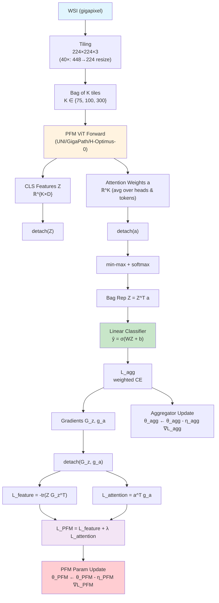

# TAPFM: ViT自注意力驱动的单GPU病理基础模型任务自适应框架

> **论文信息**: Neeraj Kumar et al. (MSKCC + Mount Sinai), arXiv: 2506.05184, June 2025.
> **一句话总结**: 提出 TAPFM，利用 ViT 内部 CLS token 自注意力作为 MIL 聚合器，通过**双计算图分离梯度**（detach feature & attention → 分别更新 aggregator 和 PFM）在单张 H100 GPU 上实现大规模病理基础模型（UNI / GigaPath / H-Optimus-0）的端到端任务自适应，在 BLCA FGFR3 和 LUAD EGFR 突变预测上全面超越 fixed-PFM 和传统 fine-tune 方法。

## 核心贡献

1. **ViT 自注意力作为 MIL 聚合器**: 不引入外部 ABMIL/DSMIL 等聚合模块，直接用 PFM 最后一层 CLS token 对各 patch token 的平均注意力权重做 tile 级重要性评分，经 min-max + softmax 归一化后加权求和得到 bag representation。
2. **双计算图分离优化**: Aggregator 更新时 detach PFM 输出（feature Z + attention a），PFM 更新时 detach aggregator 梯度（G_z, g_a），构造专门的 task adaptation loss L_PFM = L_feature + λ L_attention，打破联合优化中的循环依赖。
3. **单 GPU 可行**: 在单张 H100 80GB 上完成 UNI/GigaPath/H-Optimus-0 的端到端微调（per-PFM tile 采样上限: 300/100/75），训练时间 12h~4.25 天。
4. **多标签突变预测**: 将框架直接扩展到多标签分类（LUAD 四种可操作突变 EGFR/KRAS/MET/ALK），macro-average AUC 最高 0.8510。

## 📖 批读导航

| 章节 | 文件 | 要点 |
|------|------|------|
| Abstract | [sections/00-abstract.md](sections/00-abstract.md) | 问题、方法、结果概述 |
| Introduction + Related Work | [sections/01-introduction.md](sections/01-introduction.md) | MIL 范式、PFM 现状、现有 task adaptation 局限 |
| Methodology | [sections/02-method.md](sections/02-method.md) | 注意力聚合、双梯度分离、TAL loss、理论分析 |
| Experiments | [sections/03-experiments.md](sections/03-experiments.md) | BLCA/LUAD 二分类+多标签、ablation、收敛分析 |
| Discussion | [sections/04-discussion.md](sections/04-discussion.md) | 临床影响、局限性、未来方向 |

## 关键数字

| 指标 | 数值 |
|------|------|
| 最佳模型 | H-Optimus-0 (TAPFM) |
| BLCA FGFR3 AUC (institutional / TCGA) | 0.8647 / 0.9021 |
| LUAD EGFR AUC (institutional / TCGA) | 0.8491 / 0.8553 |
| LUAD 多标签 macro avg AUC | 0.8510 (institutional) |
| 训练硬件 | 单张 NVIDIA H100 80GB |
| 训练时间 (BLCA) | UNI 12h / GigaPath 21h / H-Optimus-0 24h |
| 训练时间 (LUAD) | UNI 2d4h / GigaPath 4d2h / H-Optimus-0 4d6h |
| Per-PFM tile 采样上限 | UNI 300 / GigaPath 100 / H-Optimus-0 75 |
| λ (attention loss weight) | 1.0 (最优) |
| 收敛速度 (BLCA) | 5-7 epoch |
| 对比方法 | Fixed-PFM + 4 MIL, FT-PFM + 4 MIL |

## 数据流

## 优缺点

### 优点
- **简洁优雅**: 直接用 ViT 自注意力替代外部 MIL 聚合器，不增加额外参数量（仅一个线性分类头 W,b）
- **优化稳定**: detach 双图机制从理论上消除了联合优化的循环依赖（Proposition 1），实验收敛快速（5-7 epoch）
- **通用性强**: 在 UNI / GigaPath / H-Optimus-0 三种架构上均有效，且同时支持二分类和多标签
- **实用导向**: 单 GPU 可运行，有明确的 tile 采样数量上限和训练时间统计

### 缺点
- **tile 采样瓶颈**: Per-PFM 仅能处理 75-300 tiles/WSI/epoch，远小于完整 WSI 的 tile 数量（通常数千），随机采样可能丢失关键区域
- **仅用最后一层注意力**: 只用 ViT 最后一层的 CLS 注意力，未探索多层注意力融合
- **消融有限**: 仅消融 λ 和 tile 数量，未消融 detach 机制本身的有无对比、不同层注意力、不同归一化策略
- **无梯度稳定性定量证据**: 声称稳定训练但未提供 loss landscape、gradient norm 等定量稳定性指标
- **任务范围局限**: 仅评估突变预测（二分类+多标签），未涉及生存分析、分级等其他临床任务
- **无统计显著性检验**: 表格中仅报告点估计 AUC，无置信区间或统计检验

## 阅读 Q&A

**Q1: TAPFM 与传统 fine-tune（FT-PFM+MIL）的核心区别是什么？**

传统 FT 在统一计算图中同时更新 PFM 和 MIL aggregator，梯度从 L_agg 直接流回 PFM，形成循环依赖（θ_PFM 影响 θ_agg，θ_agg 又影响下一轮 θ_PFM）。TAPFM 通过两次 detach 打破循环：更新 aggregator 时 PFM 参数被视为常数（detach Z, a）；更新 PFM 时用 detach 后的 aggregator 梯度构造独立的 L_PFM。这本质上是交替优化而非联合优化。

**Q2: L_feature 和 L_attention 的物理含义是什么？**

L_feature = -tr(Z G_z^T) 鼓励 feature vector 沿梯度下降方向移动（一阶近似），即让 PFM 输出的特征更有利于降低分类 loss。L_attention = a^T g_a 鼓励注意力权重向梯度方向调整——对于 g_a 为正的 tile（增加其权重有利于降低 loss），增大 a；反之减小。两者结合实现"学什么特征"和"关注哪些 tile"的联合优化。

**Q3: 为什么 ViT 自注意力可以作为 MIL 聚合器？**

CLS token 的注意力权重天然表示了不同 patch 对最终特征表示的贡献——这本身就是一种 importance scoring。作者将其扩展到 tile 级别：每个 tile 的 CLS 注意力 = 所有 head 对所有 token 的 CLS 注意力平均值，作为该 tile 对 WSI 级诊断的贡献权重。这与 ABMIL 学习 scalar attention weight 的思路一致，但无需额外参数。

**Q4: 为什么 TAPFM 需要 detach 而非直接端到端训练？**

如果直接端到端训练，梯度同时流经 aggregator 的参数和 PFM 的参数（见公式 8），会形成隐式反馈循环：PFM 参数通过影响 Z 和 a 来影响 L_agg，而 L_agg 又通过 aggregator 参数间接影响下一轮 PFM 的优化目标。这导致训练不稳定（两个参数集互为目标移动靶）。Detach 消除了循环依赖，使每次更新都有明确的优化目标。

**Q5: 这个方法对我们 ReadySlide 方向有参考价值吗？**

有限但可借鉴的方面：(1) detach 双图交替优化思路可用于我们的 allocator learning，尤其是当 compression policy 和 downstream task predictor 需要交替优化时；(2) ViT 内部注意力作为无参数 importance score 的自然来源——我们已用 importance_chief，但 attention-based 的变体值得对比。但核心差异在于 TAPFM 关注 PFM 微调（改变特征质量），而我们关注 retention 分配（在固定特征下选择保留哪些 patch），两者正交。
