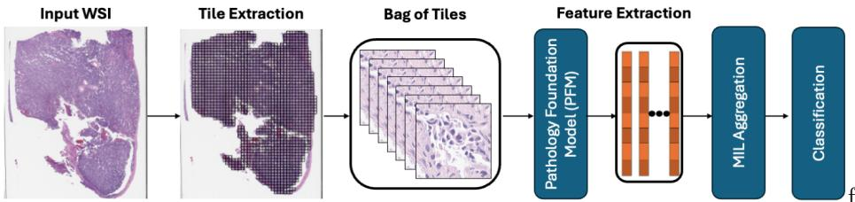

[← 返回 README](../README.md)

# 01 — Introduction & Related Work

## 1 Introduction

> **原文**:

Hematoxylin and Eosin (H&E) staining is the most common slide preparation method in pathology, used for visualizing tissue architecture and cellular details for cancer diagnosis. Whole slide images (WSIs) serve as high-resolution digital representations of these tissue slides, commonly scanned at either 20x or 40x optical magnification that captures 0.50u^2 or 0.25u^2 of tissue per pixel, respectively. WSIs form the basis of computational pathology that employs machine learning (ML) and computer vision techniques for digital cancer assessment [1]. Due to memory constraints preventing direct processing of gigapixel WSIs and the availability of only slide-level labels for clinical tasks, WSI processing adopts a multiple instance learning (MIL) approach. For MIL, a WSI is represented as a bag of smaller tiles (e.g., 224x224x3) that are processed through neural networks to extract features, then aggregated to generate predictions using only bag-level labels during training [2, 3] as shown in Figure 1.

Computational pathology has experienced a paradigm shift with the introduction of pathology foundation models (PFMs), which learn powerful representations from large collections of WSIs through self-supervised pre-training of vision transformers (ViTs) [4, 5, 6, 7, 8, 9]. For specific downstream applications such as gene mutation prediction, survival analysis, and treatment response estimation, existing methods typically use these PFMs as fixed feature extractors and train separate MIL aggregators to generate slide-level predictions [2, 10]. The fixed-feature approach fails to adapt PFM parameters to the specific downstream task, potentially limiting performance [11, 12, 13]. To address this limitation, we propose a novel Task Adaptation of Pathology Foundation Models (TAPFM) approach that: (1) leverages ViT's internal attention mechanism for MIL aggregation, (2) maintains separate computational graphs for PFM and MIL parameter updates with a dual-loss mechanism on a single GPU, and (3) seamlessly integrates with popular PFMs to improve their performance on clinically relevant tasks.

> 💡 **MIL 为何必要**: Hao 批注 — WSI 是 gigapixel 级别的图像，无法直接输入 GPU。MIL 把 WSI 拆成 bag of tiles，利用 slide-level label（如"该患者是否有 EGFR 突变"）训练 tile 级别的特征提取和聚合。核心挑战是：bag 内数千 tiles 中只有少数区域包含诊断信息，且没有 tile 级别的标注。

> 💡 **Fixed-feature 的局限**: Hao 批注 — 现有主流范式（fixed PFM + trainable MIL aggregator）的本质是"特征提取器和任务学习器脱钩"。PFM 在预训练时学的是通用组织形态学表示，但特定临床任务（如突变预测）可能需要不同的特征侧重。Fixed-feature 无法让 PFM 参数适应下游任务——这篇论文的核心论点是这个 gap 值得且有办法在不牺牲实用性的前提下弥合。

> 💡 **三个贡献的层次**: Hao 批注 — 贡献 1 是"用什么做聚合"（自注意力），贡献 2 是"怎么优化"（双图分离），贡献 3 是"适用范围"（多 PFM 兼容）。这是一个递进式设计：1 提供了无参数聚合器的基础，2 解决了联合优化的稳定性问题，3 确保方法的通用性。

## 2.1 Pathology Foundation Models (PFMs)

> **原文**:

CTransPath [14] established an early benchmark by training a hybrid convolutional-transformer architecture on 32,220 WSIs across 25 anatomic sites. HIPT [15] and REMEDIS [16] explored different architectural approaches with ViT-S (DINO [17]) and ResNet-50 (SimCLR) respectively. Phikon [18] demonstrated the efficacy of ViT-L trained with iBOT on TCGA slides, while UNI [5] significantly expanded scale with its ViT-H architecture trained via DINOv2 [19] on 100,000 slides across 20 tissue types. Subsequent models pushed boundaries further with Virchow [6] exploring a ViT-huge model trained on 1.5 million WSIs. This trend toward increased scale continued with Prov-GigaPath [8] processing 1.3 billion tiles from 171,189 WSIs spanning 31 tissue types and Virchow2 [7] scaling to 1.7 billion tiles from 3.1 million slides across multiple magnifications. H-optimus-0 [9] leveraged ViT-giant architecture trained on hundreds of millions of tiles from over 500,000 WSIs. Several approaches have explored multimodality, including vision-language models (CONCH [20], PRISM [21], MUSK [22]) and vision-genomics integration (Orpheus [23]), expanding PFMs beyond visual representation learning. Despite this architectural diversity, vision-only models including UNI [5], GigaPath [8], and H-optimus-0 [9] have demonstrated superior performance on clinically relevant tasks such as cancer diagnosis, mutation prediction, and treatment response estimation [13]. The dominant architecture across these PFMs remains ViTs [4] trained through self-supervised learning, predominantly using DINOv2 [19], on diverse WSI data. This paper specifically focuses on ViT based PFMs that utilize only pathology images as input.

> 💡 **PFM 规模趋势**: Hao 批注 — PFM 的发展遵循明确的 scaling law：从 CTransPath (32K slides) → UNI (100K) → Virchow (1.5M) → Virchow2 (3.1M) → H-Optimus-0 (500K+, ViT-giant)。本文选择 UNI / GigaPath / H-Optimus-0 三个代表性模型，覆盖了 ViT-H / ViT-giant 两个规模等级和 DINOv2 训练范式。

> 💡 **为何聚焦 ViT**: Hao 批注 — 本文方法的核心是"利用 ViT 自注意力做 MIL 聚合"，因此只能应用于 ViT 架构的 PFM。这也限制了其对 CONCH（vision-language）、PRISM 等多模态模型的适用性。作者对此有清醒认识，明确声明"specifically focuses on ViT based PFMs that utilize only pathology images as input"。

## 2.2 Multiple Instance Learning (MIL) in Computational Pathology

> **原文**:

MIL methods for WSI analysis have evolved from attention-based mechanisms to spatial-aware architectures. Early MIL approaches used simple aggregation operations such as mean or max pooling to combine tile-level features [3]. A significant advancement came with attention-based MIL (ABMIL) [2], which learns attention weights to selectively focus on diagnostically relevant tiles. CLAM [10] extended attention based MIL for multi-class classification. DSMIL [24] introduced a dual-stream approach coupling max-pooling with attention scoring. VarMIL [25] incorporated variance modeling to capture tissue heterogeneity while maintaining computational efficiency. Spatially aware MIL methods have also emerged to capture relationships between WSI tiles. TransMIL [26] leveraged transformer architectures with positional encoding, while graph-based approaches like PatchGCN [15] represent tiles as nodes in a graph structure based on physical adjacency. Graph transformer processing (GTP) [27] further refined this approach by combining graph structures with attention mechanisms. Despite architectural advances, benchmarking studies reveal that performance depends heavily on the specific clinical task and the quality of input embeddings, with no single aggregation method consistently outperforming others across all applications [28].

> 💡 **MIL 方法的演进逻辑**: Hao 批注 — 从 mean/max pooling（无参数）→ ABMIL（学 tile 重要性权重）→ DSMIL（双流）→ TransMIL/GTP（引入空间关系/spatial context）。但这篇 paper 的隐含判断是：这些方法在 PFM 时代可能过于复杂——PFM 已经捕获了丰富的 tile 级特征，复杂的空间建模未必带来额外收益。

> 💡 **Benchmarking 的启示**: Hao 批注 — 引文 [28]（Chen et al., MICCAI 2024）的结论很重要：没有单一 MIL 方法在所有任务上一致最优。这说明 MIL 聚合器的选择对性能的影响可能不如 PFM 特征质量的影响大——这为 TAPFM 用内部注意力替代外部 MIL 提供了合理性。

## 2.3 Task Adaptation of PFMs

> **原文**:

MIL methods usually rely on PMFs as fixed feature extractors, creating a disconnect between representation learning and task-specific adaptation for WSI analysis. Li et al. [29] proposed an Information Bottleneck-based finetuning approach that addresses computational constraints through instance sparsification on smaller backbone models (ResNet-50). The multiple forward passes required by the IB approach make it computationally infeasible for modern large-scale PFMs on single GPU systems due to memory constraints. While recent approaches have attempted to avoid multiple forward passes through end-to-end fine-tuning of large-scale PFMs [30, 31], these methods typically require substantial computational resources spanning tens of GPUs. To the best of our knowledge, no existing approach has leveraged transformer's self attention mechanism for MIL aggregation and task adaptation of large-scale PFMs on a single GPU for downstream clinical applications, while addressing the optimization challenges that arise when jointly training foundation models and MIL aggregators.

> 💡 **Related work gap**: Hao 批注 — 这段把本文的创新空间说得很清楚：(1) IB 方法 [29] 需要多次前向传播，大规模 PFM 上单 GPU 不可行；(2) 端到端微调方法 [30, 31] 需要数十张 GPU；(3) 无人探索用 transformer 自注意力做 MIL 聚合 + 单 GPU 优化。三个 gap 对应 TAPFM 的三个贡献，逻辑清晰。

> 💡 **与我们方向的关联**: Hao 批注 — TAPFM 的目标是"让 PFM 特征适应下游任务"，本质是改变特征质量。我们 ReadySlide 的目标是"在固定特征下选择保留哪些 patch"，本质是改变信息保留策略。两者正交但互补：TAPFM 优化过的特征 + 我们的 retention allocator 可能会比单独使用任一方法更好——但这是一个需要验证的假设，不在我们当前的 Go/No-Go 路径上。
