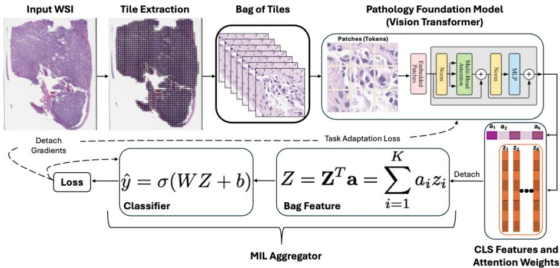

[← 返回 README](../README.md)

# 02 — Methodology

## 3.1 Problem Formulation

> **原文**:

Let X = {x_1, x_2, ..., x_K} represent an H&E stained WSI composed of K non-overlapping tiles, where each tile x_i ∈ R^{HxWxC} corresponds to the tissue region extracted from the WSI. For MIL, a cancer patient's WSI has a bag-level label y ∈ {0, 1} for binary classification tasks (e.g., presence or absence of a gene mutation in a patient), but no tile-level annotations. Our goal is to adapt a pretrained PFM f_θ, parametrized by θ, to extract tile-level features that are relevant for a downstream task. A ViT [4] based PFM maps each tile to a feature vector z_i = f_θ(x_i) ∈ R^D [5, 8, 9] by first diving each input tile into a grid of N non-overlapping patches (tokens) of size PxP, with an additional learnable CLS token prepended to the sequence. These tokens are linearly projected and embedded with position information before being processed through multiple self-attention layers to compute tile feature representations.

> 💡 **符号体系**: Hao 批注 — 标准 MIL 形式化。关键符号：X = WSI (bag)，x_i = tile (instance)，y = slide-level label，z_i = CLS token embedding (tile 特征)，K = tiles per WSI。注意这里的 K 是训练时随机采样的 tile 数量（75-300），非完整 WSI 的 tile 数量。

> 💡 **CLS token 的作用**: Hao 批注 — 在标准 ViT 中，CLS token 是唯一聚合全局信息的表示。DINOv2 训练的 PFM 中，CLS token 通过自注意力聚合了所有 patch token 的信息——这正是 TAPFM 利用 ViT 内部结构做 MIL 聚合的基础。

## 3.2 Attention-Based Aggregation

> **原文**:

The CLS token attends to all other tokens, to compute attention weights that indicate the importance of each token for the feature representation. We propose to leverage these attention weights for MIL aggregation. For a WSI with K tiles, let Z = [z_1^T, z_2^T, ..., z_K^T]^T ∈ R^{KxD} denote the feature matrix, where each row z_i ∈ R^D is the feature vector (CLS token embedding) for tile i. Similarly, let a = [a_1, a_2, ..., a_K]^T ∈ R^K denote the vector of attention weights derived from the ViT. For each tile x_i, the attention weight a_i is computed as:

a_i = (1/H) * Σ_{h=1}^H (1/N) * Σ_{j=1}^N A_{cls,j}^h

where A_{cls,j}^h is the attention weight from the CLS token to the j-th token in the h-th attention head while H and N are the numbers of attention heads and tokens, respectively. The proposed approach maintains a separate computation graph for the aggregator by detaching tile features and attention weights from the PFM's computation graph. The detached attention weights undergo min-max scaling to the range [0,1] followed by softmax normalization, ensuring they form a proper probability distribution for tile importance scoring to compute the bag representation Z as:

Z = Z^T a = Σ_{i=1}^K a_i z_i

where both Z and a are detached from the PFM's computation graph. This ensures that the gradients from the classification loss only flow through the aggregator parameters while keeping the PFM's parameters fixed during this stage of optimization. The bag representation Z is then passed through a linear classifier to predict the bag-level label:

ŷ = σ(WZ + b)

where σ is the sigmoid activation while W ∈ R^{1xD} and b ∈ R are aggregator parameters θ_agg: {W, b}, that are learned during backpropagation with weighted cross-entropy loss:

L_agg(y, ŷ) = -w_y [y log(ŷ) + (1-y) log(1-ŷ)]

where w_y is the weight assigned to class y to handle class imbalance.

> 💡 **注意力权重的构建**: Hao 批注 — 核心公式 a_i = mean over heads of (mean over tokens of CLS→token attention)。这里做了两级平均：(1) 跨 head 平均，因为不同 head 关注不同模式；(2) 跨 token 平均，因为 CLS 对所有 patch token 的注意力总和反映了该 tile 的整体重要性。这个设计简单但合理——CLS token 在 DINOv2 训练中学会关注对表示最有信息量的 patch。

> 💡 **Detach 的第一层含义**: Hao 批注 — 第一次 detach 的作用：在更新 aggregator 参数 (W, b) 时，PFM 参数 θ_PFM 被视为常数。这意味着 aggregator 的训练是标准的线性分类器训练（给定固定特征 Z 和注意力 a），不会出现"特征在变，分类器也在变"的不稳定局面。

> 💡 **Min-max + softmax 归一化的必要性**: Hao 批注 — 原始 ViT 注意力权重在数值范围上没有约束（不同 tile 的注意力分布可能差异很大）。Min-max 缩放到 [0,1] 消除尺度差异，softmax 确保权重和为 1 形成概率分布。这本质上是将原始的"token 级重要性"转化为"tile 级归一化权重"。

> 💡 **Aggregator 的极简设计**: Hao 批注 — 注意这里的 aggregator 只有一个线性层 W^T Z + b + sigmoid，比 ABMIL（需要学注意力网络）、DSMIL（双流）、TransMIL（transformer）都简单得多。这是因为 tile 级重要性评分已经由 PFM 的 CLS 注意力提供了，不需要额外学习。Aggregator 只做一件事：加权特征求和后的线性分类。

## 3.3 PFM Adaptation

> **原文**:

Instead of employing conventional end-to-end backpropagation, we propose to detach gradients from the aggregator's computation graph to formulate a dedicated loss function for PFM adaptation.

**Feature Alignment Loss**: Let us define G_z = [g_{z_1}^T, g_{z_2}^T, ..., g_{z_K}^T]^T ∈ R^{KxD} as the feature gradient matrix where k-th row contains the gradient of the aggregator loss (equation 4) with respect to the corresponding tile's feature vector. During backpropagation through the aggregator, the gradients with respect to each feature vector are automatically computed (by chain rule) based on their contribution to the bag representation as g_{z_i} = ∂L_agg/∂z_i = a_i * ∂L_agg/∂Z. We propose to detach the feature gradients from the aggregator's computation graph to compute the feature alignment loss as:

L_feature = -tr(Z G_z^T) = Σ_{i=1}^K ⟨z_i, g_{z_i}⟩ = Σ_{i=1}^K Σ_{d=1}^D z_{i,d} × g_{z_i,d}

This loss guides feature vectors to move in the direction that reduces the classification loss and can be interpreted as a first-order approximation of the effect of feature changes on the aggregator loss.

**Attention Loss**: Let us define the gradient of the aggregator loss with respect to attention weights as g_a = [g_{a_1}, g_{a_2}, ..., g_{a_K}]^T ∈ R^K. Similar to the feature gradients, the gradient of the aggregator loss with respect to each attention weight is automatically computed by the chain rule as g_{a_i} = ∂L_agg/∂a_i = ⟨z_i, ∂L_agg/∂Z⟩. We propose to compute the attention loss using the detached attention gradient as:

L_attention = a^T g_a = Σ_{i=1}^K a_i · g_{a_i}

This loss encourages attention weights to adjust based on the informativeness of each tile for the downstream task, increasing (or decreasing) weights for informative (or uninformative) tiles.

**Task Adaptation Loss (TAL)**: For PFM updates, TAL combines the feature and the attention loss:

L_PFM = L_feature + λ L_attention

where λ is the hyperparameter that controls the relative importance of the attention loss. The PFM parameters, θ_PFM, are then updated with the backpropagation using its own loss: L_PFM. The training procedure for the proposed approach is presented in Algorithm 1 with illustration shown in Figure 2 and its implementation is available at https://github.com/pfmadaptation/tapfm.

> 💡 **Detach 的第二层含义**: Hao 批注 — 第二次 detach 的作用：在更新 PFM 参数时，aggregator 的梯度 (G_z, g_a) 被视为常数（不再反向传播到 aggregator）。这意味着 PFM 的更新目标是"在当前 aggregator 参数下，调整特征使分类 loss 降低"，而非"同时优化 aggregator 和 PFM"。这一步打破了联合优化的循环依赖。

> 💡 **L_feature 的直觉**: Hao 批注 — L_feature = Σ⟨z_i, g_{z_i}⟩ 是一个内积形式。梯度 g_{z_i} 指向能降低 L_agg 的方向，所以最小化 -tr(Z G_z^T) 等价于最大化 Σ⟨z_i, g_{z_i}⟩，即让特征向量"跟上"梯度方向。这是对"如果特征能沿梯度方向移动，分类 loss 会降低多少"的一阶近似——本质上是一个 local linearization。

> 💡 **L_attention 的直觉**: Hao 批注 — g_{a_i} = ⟨z_i, ∂L_agg/∂Z⟩ 表示"改变 tile i 的注意力权重 a_i 对最终 loss 的影响"。如果 g_{a_i} > 0，增大 a_i 会降低 loss（该 tile 信息量大），L_attention = a_i · g_{a_i} 鼓励增大 a_i；反之亦然。这比 ABMIL 的注意力学习更"直接"——ABMIL 通过 loss 隐式学习哪些 tile 重要，而 TAPFM 直接利用梯度信号指导注意力方向。

> 💡 **λ 的作用**: Hao 批注 — λ 平衡 feature adaptation 和 attention adaptation 的相对强度。λ=1.0 表示两者等权。Ablation 显示 λ=1.0 最优，λ 在 0.25-1.0 范围内均能稳定收敛，说明方法对 λ 不敏感——这是一个好的工程性质。

## 3.4 Theoretical Analysis

> **原文**:

The key innovation in our approach lies in the decoupling of the optimization process. In conventional end-to-end training with a unified computational graph, gradients flow through both the PFM and aggregator simultaneously:

∇_{θ_agg,θ_PFM} L = (∂L_agg/∂ŷ · ∂ŷ/∂θ_agg, ∂L_agg/∂ŷ · ∂ŷ/∂Z · (∂Z/∂Z · ∂Z/∂θ_PFM + ∂Z/∂a · ∂a/∂θ_PFM))

TAPFM instead implements the following two-stage optimization:

Stage 1 (Aggregator Update): ∇_{θ_agg} L_agg = ∂L_agg/∂ŷ · ∂ŷ/∂θ_agg

Stage 2 (PFM Update): ∇_{θ_PFM} L_PFM = detach(∂L_agg/∂Z) · (∂Z/∂a · ∂a/∂θ_PFM + ∂Z/∂Z · ∂Z/∂θ_PFM)

**Proposition 1 (Gradient Stabilization)**. The TAPFM approach breaks the circular dependency at each iteration t by enforcing:

∂L_agg/∂θ_agg|_t ∝ g(θ_PFM_{t-1}, θ_agg_{t-1}) and ∂L_PFM/∂θ_PFM|_t ∝ f(θ_PFM_{t-1}, θ_agg_t)

resulting in more stable parameter trajectories than joint optimization.

**Proof**. In joint optimization, the parameter updates create an implicit feedback loop:

θ_PFM_t = θ_PFM_{t-1} - η_PFM ∇_{θ_PFM} L_agg(θ_PFM_{t-1}, θ_agg_{t-1})
θ_agg_t = θ_agg_{t-1} - η_agg ∇_{θ_agg} L_agg(θ_PFM_t, θ_agg_{t-1})

Note that θ_agg_t depends on θ_PFM_t, which itself depends on θ_agg_{t-1}. This creates a circular dependency where each parameter set is chasing a moving target. However, the proposed approach breaks this loop by detaching the gradient computation graphs:

θ_agg_t = θ_agg_{t-1} - η_agg ∇_{θ_agg} L_agg(detach(θ_PFM_{t-1}), θ_agg_{t-1})
θ_PFM_t = θ_PFM_{t-1} - η_PFM ∇_{θ_PFM} L_PFM(θ_PFM_{t-1}, detach(θ_agg_t))

This detaching operation ensures that during aggregator optimization, θ_PFM is treated as a constant, and during PFM optimization, the updated θ_agg influences the loss but does not receive gradient updates. This effectively eliminates the circular dependency and stabilizes training.

> 💡 **循环依赖的本质**: Hao 批注 — 在标准联合优化中，θ_PFM_t 依赖于上一轮的 θ_agg_{t-1}，而 θ_agg_t 又依赖于当前轮的 θ_PFM_t。这意味着两个参数集互为"移动目标"——PFM 在适应一个还在变化的 aggregator，aggregator 也在适应一个还在变化的 PFM。这类似于控制论中的耦合系统，容易导致震荡或发散。

> 💡 **Detach 的数学效果**: Hao 批注 — Detach 本质上是做了一个"快照"：aggregator 更新时用 θ_PFM 的当前快照（不追踪梯度），PFM 更新时用 aggregator 参数和梯度的快照（不反向传播到 aggregator）。这使两步优化解耦为交替优化——先固定 PFM 优化 aggregator，再固定 aggregator 优化 PFM。类似于 EM 算法中的交替最大化。

> 💡 **理论分析的局限性**: Hao 批注 — Proposition 1 证明的是"打破循环依赖"，但并未定量证明"更稳定"——没有给出收敛速度的上界、没有证明 TAPFM 的 stationary points 与传统联合优化 stationary points 的关系。这更接近一个 intuitive argument 而非 rigorous analysis。不过作为应用 paper，这个理论深度是合理的。

## Appendix A — 补充理论

> 💡 **A.1 置换不变性**: Hao 批注 — 标准 MIL 性质，bag representation Z = Σ a_i z_i 经 permutation matrix P 变换后保持 Z^T a 不变——因为 (PZ)^T(Pa) = Z^T P^T P a = Z^T a。证明简明直接。

> 💡 **A.2 计算复杂度**: Hao 批注 — 总复杂度 O(K · C_ViT)，其中 C_ViT 是单个 tile 的前向+反向传播复杂度，主要由 self-attention O(L·N^2·D) 主导。复杂度对 K 线性——但受限于 GPU 内存，实践中 K 被截断到 75-300。

> 💡 **A.3 空间复杂度**: Hao 批注 — 空间复杂度 O(|θ_PFM| + K·(S_act + S_grad))，其中 S_act ∝ L·N·D + L·H·N^2（激活存储），S_grad 同阶（梯度存储）。关键约束：K 的增大导致激活存储线性增长——这就是为什么 H-Optimus-0（ViT-giant）只能处理 75 tiles，而 UNI（ViT-H）可以处理 300 tiles。

> 💡 **A.4 灾难性遗忘**: Hao 批注 — 作者通过 Fisher Information Matrix 论证 detach 梯度起到隐式正则化作用，近似 natural gradient descent（F^{-1} ∇L_task），从而保留预训练知识。这个论证有启发性但缺乏实验验证——没有对比 TAPFM 和直接 fine-tune 在 pretraining task 上的性能退化。

> 💡 **A.5 Cosine 正则化**: Hao 批注 — 额外添加的 cosine regularization term L_reg = Σ(1 - cos(z_i, g_{z_i})) 对性能无显著影响。这说明基础 L_feature design 已经足够好——cosine reg 防止"特征和梯度方向相反"，但实验中这种情况似乎不常见。
