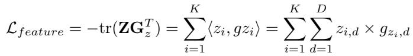
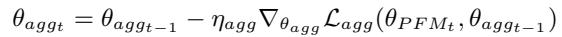
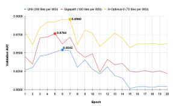
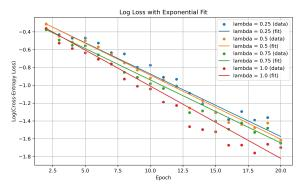
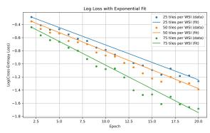

[← 返回 README](../README.md)

# 03 — Experiments

## 4 Experiments

> **原文 (实验设置)**:

The proposed TAPM approach is evaluated on clinically relevant mutation prediction tasks using institutional and public cohorts of bladder cancer (BLCA) and lung adenocarcinoma (LUAD) patients.

**Datasets**: The institutional dataset consists of H&E WSIs of 2,030 BLCA and 8,820 LUAD patients collected during routine clinical care at *institute*, including both 20x and 40x (~30% of all WSIs in each cohort) magnifications to reflect real-world data acquisition variability. WSIs from The Cancer Genome Atlas (TCGA) cohorts – TCGA-BLCA (260 patients) and TCGA-LUAD (438 patients), all scanned at 40x resolution, are exclusively used for external validation to assess generalizability of the proposed approach. Only one WSI per patient is used in all training and validation cohorts.

For the binary classification task, TAPM is evaluated on two clinically relevant mutation prediction tasks: FGFR3 in BLCA and EGFR in LUAD. For multilabel classification, TAPM's ability to simultaneously predict four actionable mutations in LUAD patients is assessed: EGFR, KRAS, MET, and ALK. The prevalence rate of these mutations across institutional (TCGA) cohorts are: 16% (14%) for FGFR3 in BLCA, and in LUAD: 26% (14%) for EGFR, 27% (35%) for KRAS, 4% (2%) for MET, and 3% (1%) for ALK.

**Benchmarks**: State-of-the-art PFMs such as UNI [5], GigaPath [8], and H-Optimus-0 [9]. Motivated by prior findings that lightweight MIL models can attain clinical performance comparable to computationally expensive aggregators [28], this work employs memory-efficient MIL methods on single-GPU systems: ABMIL [2], DSMIL [24], CLAM [10], and VarMIL [25].

**Implementation Details**: All reported experiments in this paper are conducted using PyTorch 2.5.1 on a single NVIDIA H100 (80GB memory). Each WSI is processed at native resolution (20x or 40x) to extract non-overlapping tiles in a sliding window manner after filtering out the non-tissue regions with Otsu thresholding. For 20x WSIs, tiles of size 224x224x3 pixels are extracted directly, while for 40x images, tiles of size 448x448x3 pixels are extracted and resized to 224x224x3 pixels to maintain consistent spatial context. As detailed in the space complexity analysis (Appendix A.3), the memory requirements of the proposed TAPFM method scale quadratically with the number of tokens (patches) processed by ViTs. The 224x224 tile size is selected as the optimal dimension that prevents out-of-memory errors while maximizing the contextual information captured per tile. During training, 300, 100, and 75 tiles per WSI per epoch are randomly sample without replacement for UNI, Gigapath, and H-Optimus-0 respectively – the maximum number of tiles processable for each PFM on a single H100 GPU while maintaining end-to-end fine-tuning capability. At inference, all tiles obtained from a given WSI are used for downstream mutation prediction tasks.

For the proposed TAPFM method λ = 1.0 is used for all experiments. The institutional data was stratified into training (80%), validation (10%), and test (10%) sets maintaining patient level separation with balanced distribution of labels and resolutions across splits. Area Under the ROC Curve (AUC) is used as the primary evaluation metric. Model selection is performed using the validation set, with standard AUC for binary classification tasks and macro-average AUC for multi-label classification tasks determining the best checkpoint for further assessment on the testing sets.

For training, AdamW [32] with weight decay of 1e-4 is used as optimizer, applying differential learning rates of 1e-6 and 1e-5 for PFM and aggregator parameters, respectively. Training data augmentation included random horizontal flips, random rotations (of 90, 180, or 270 degrees), and Gaussian blur. A cosine annealing scheduler with warm restarts (T_0=10, T_mult=2) is also used for better convergence [33]. Each batch contained 1 WSI, and TAPFM is trained for 20 epochs while all other benchmarks are trained for 50 epochs, with the institutional validation set used to select the best-performing model for all evaluations on the institutional and TCGA testing sets.

> 💡 **数据集设计的优点**: Hao 批注 — 实验设计在几个方面做得很好：(1) 机构内+TCGA 外部验证，评估泛化性；(2) 混合 20x/40x 放大倍数（~30% 是 40x），反映真实世界的采集变异性；(3) 多 PFM 对比（UNI/GigaPath/H-Optimus-0），测试方法对不同架构的通用性；(4) 每个患者只用一张 WSI，避免数据泄露。

> 💡 **Tile 采样策略的影响**: Hao 批注 — 训练时随机采样 tiles（无放回），推理时使用全部 tiles。这意味着训练时模型只看到部分 WSI 内容——如果关键区域恰好在未采样的 tiles 中，训练信号会偏弱。作者依赖"每个 epoch 重新随机采样"来缓解这一问题（20 epoch 后大部分 tiles 可能都被见过），但在 tile 极多的 WSI 上仍可能有问题。

> 💡 **差异化学习率**: Hao 批注 — PFM 用 1e-6（保守更新，防止灾难性遗忘），aggregator 用 1e-5（更快收敛）。这是 fine-tuning 的标准做法——预训练权重应谨慎更新，随机初始化的 head 可以更大步长。与 Appendix A.4 的 Fisher Information 论证形成呼应。

> 💡 **Benchmark 训练 epoch 差异**: Hao 批注 — TAPFM 训练 20 epoch，其他 benchmark 训练 50 epoch。作者论证 TAPFM 收敛更快（5-7 epoch），所以 20 epoch 足够。但这也意味着其他方法有 2.5x 的优化时间——如果它们在更早 epoch 已收敛而后续 overfit，则实际对比是公平的；但如果它们需要更多 epochs 才能充分收敛，则 TAPFM 的优势可能被高估。

## 4.1 Results

> **原文**:

Table 1 shows the performance comparison of three sets of models on the testing data: (1) fixed-PFM with trained MIL aggregators, (2) fine-tuned PFM and MIL aggregators (equivalent to setting λ = 0 in equation 7 with external MIL methods), and (3) proposed TAPFM. It is evident that the proposed TAPFM approach outperforms the other benchmarks across both binary mutation prediction tasks. H-Optimus-0 (TAPFM) consistently achieves the best performance across both institutional and external TCGA testing cohorts, followed by Gigapath (TAPFM), indicates generalizability of the proposed approach. Table 2 extends TAPFM evaluation to the more challenging task of simultaneously predicting four actionable mutations in LUAD. H-Optimus-0 (TAPFM) consistently outperforms GigaPath (TAPFM) across all mutations, even for the rare MET and ALK mutations.

> 💡 **三组对比的层次**: Hao 批注 — 三组实验的递进逻辑很好：(1) Fixed-PFM + trained MIL（基准：不微调 PFM）；(2) FT-PFM + MIL（中间：端到端微调 PFM 和外部 MIL，相当于 λ=0）；(3) TAPFM（proposed：detach 双图 + ViT 自注意力聚合）。从 (1) 到 (2) 的增益 = PFM 微调的贡献；从 (2) 到 (3) 的增益 = TAPFM 方法（detach 优化 + 自注意力聚合）的贡献。

> 💡 **关键数字**: Hao 批注 — BLCA FGFR3: H-Optimus-0 TAPFM 0.8647 (institutional) / 0.9021 (TCGA)，比 best fixed-PFM（H-Optimus-0+ABMIL 0.8412/0.8786）提升 +2.35/2.35pp，比 best FT（H-Optimus-0+VarMIL FT 0.8526/0.8889）提升 +1.21/1.32pp。LUAD EGFR: H-Optimus-0 TAPFM 0.8491/0.8553，比 best fixed-PFM（0.7742/0.8295）提升 +7.49/2.58pp。注意 LUAD 上 fixed-PFM 到 TAPFM 的增益明显大于 BLCA，说明 EGFR 预测比 FGFR3 更难从通用特征中捕获——PFM 微调的价值更大。

> 💡 **FT-PFM 对比的有趣现象**: Hao 批注 — 在 BLCA FGFR3 上，H-Optimus-0 + VarMIL (FT) AUC 0.8526 超过了 H-Optimus-0 + ABMIL (FT) 0.8512，但 fixed-PFM 时 ABMIL 略优于 VarMIL (0.8412 vs 0.8401)。说明微调后不同 MIL 聚合器的相对优劣可能变化——这个交互效应值得注意但未被深入讨论。

> 💡 **GigaPath vs UNI 的相对提升**: Hao 批注 — GigaPath TAPFM 在 TCGA BLCA 上达到 0.8994，仅次于 H-Optimus-0 的 0.9021，差距仅 0.27pp。考虑到 GigaPath 训练时只能处理 100 tiles/WSI（vs H-Optimus-0 的 75），GigaPath 的效率比可能更高。UNI TAPFM (0.8536) 明显落后——说明更大规模的 PFM 从 task adaptation 中获益更多，或者 UNI 的 ViT-H 架构不如 GigaPath 的 ViT-giant 适合突变预测任务。

> 💡 **多标签分类的挑战**: Hao 批注 — 同时预测四种突变（EGFR/KRAS/MET/ALK），其中 MET (4%/2%) 和 ALK (3%/1%) 是稀有突变。H-Optimus-0 TAPFM 对 ALK 仍达到 0.8702 AUC（institutional），对 MET 达到 0.8420——考虑到 prevalence 仅 3-4%，这些数字相当不错。但也反映了极端类别不平衡下的挑战：KRAS AUC 0.8153 反而低于稀有突变 MET/ALK，原因可能是 KRAS 的组织形态学特征本身就比 MET/ALK 更难从 H&E 中识别。

## 4.2 Runtime Performance

> **原文**:

Training times for BLCA are 12 hours for UNI, 21 hours for Gigapath, and 24 hours for H-Optimus-0. For LUAD cases, training required 2 days 4 hours for UNI, 4 days 2 hours for Gigapath, and 4 days 6 hours for H-optimus. Inference times per WSI are 4.85 minutes for UNI, 6.38 minutes for Gigapath, and 7.15 minutes for H-Optimus-0. These results confirm that TAPFM enables efficient PFM task adaptation on standard hardware making it suitable for clinical implementation.

> 💡 **训练时间的规模关系**: Hao 批注 — BLCA 训练时间：UNI 12h < GigaPath 21h < H-Optimus-0 24h。LUAD 约为 BLCA 的 4x（病例数约为 4x: 8820 vs 2030），时间基本线性缩放。推理时间也随模型大小增长（4.85 → 6.38 → 7.15 min/WSI）。在临床场景中，7 min 的推理时间是可接受的（比分子检测的几天快得多），但需要确认是否包含了完整 WSI 的 tile 提取和前向传播。

## 4.3 Convergence

> **原文**:

For binary FGFR3 classification in BLCA, Figure 3a shows UNI reaching maximum validation performance by epoch 6 (AUC 0.8542), Gigapath by epoch 5 (AUC 0.8764), and H-Optimus-0 by epoch 7 (AUC 0.8960). Additionally, experiments on LUAD datasets (not shown) demonstrated that all PFMs converge within 4 epochs for binary classification tasks. For multi-label LUAD classification, convergence occurred at epoch 10 for Gigapath and epoch 11 for H-Optimus-0.

> 💡 **快速收敛的意义**: Hao 批注 — 5-7 epoch 收敛意味着 20 epoch 的训练设置充分保守。这也暗示 TAPFM 的优化动态确实稳定——如果存在震荡（循环依赖的后果），收敛应该更慢或不稳定。快速收敛也是单 GPU 实用性的重要保障——如果需要在单 GPU 上训练几百个 epoch，临床部署的时间成本就太高了。

## 4.4 Ablation Studies

> **原文**:

Systematic ablation studies investigate the influence of key hyperparameters – attention loss weighting (λ in equation 7) and number of tiles sampled per WSI per epoch – on the performance of H-Optimus-0 (TAPFM) model for the binary FGFR3 prediction task in BLCA patients.

**Lambda**: To evaluate the impact of the attention loss term in TAL (Equation 7), log-linear convergence fits of the form log L_k = a + bk were computed over epochs k = 2 to 20. Log-transformed loss fits are shown in Figure 3b, with raw curves in Appendix 4a. All values of λ yielded consistent exponential decay, with convergence rates of b = -0.0701 (R^2=0.9737), -0.0718 (R^2=0.9808), -0.0706 (R^2=0.9765), and -0.0810 (R^2=0.9693) for λ ∈ {0.25, 0.5, 0.75, 1.0} respectively. Although convergence behavior remained stable across this range, increasing λ produced steeper decay and lower final training loss, with the best performance observed at λ = 1.0. These results suggest that stronger weighting of the TAL attention supervision improves training efficiency without compromising stability.

**Number of tiles**: Figure 3c shows that increasing the number of tiles per WSI consistently improved the performance of H-Optimus-0 (TAPFM) model (raw loss curves in Appendix 4b). Another exponential decay model, log L_k = a + bk, was fit to training loss curves over epochs k = 2 to 20, with estimated convergence rates of b = -0.0532 (R^2=0.9731), -0.0569 (R^2=0.9811), and -0.0725 (R^2=0.9752) for models trained with 25, 50, and 75 tiles per WSI, respectively. The 75-tile model converged by epoch 7 with a validation AUC of 0.8960, while the 50-tile model reached 0.8764 by the same epoch. The 25-tile variant (TAPFM H-Optimus-0) converged earlier—by epoch 5—but plateaued at a lower AUC of 0.8527. These findings indicate that denser tile sampling both accelerates convergence and improves performance on the institutional validation set.

**Cosine regularization**: Experimental analysis of incorporating a cosine regularization term (see Appendix A.5) for feature alignment loss in equation 7 revealed no significant variation in FGFR3 prediction performance. Consequently, λ = 1.0 and the maximum number of tiles per WSI per epoch that could be accommodated on a single GPU for each PFM are used in all subsequent LUAD experiments.

> 💡 **Ablation 的充分性**: Hao 批注 — 消融覆盖了 λ 和 tile 数量，但几个关键 ablations 缺失：(1) 没有消融 detach 机制本身——对比"detach 双图" vs "统一计算图联合优化"，这是 TAPFM 的核心设计但没有直接验证；(2) 没有消融 CLS 注意力聚合 vs 外部 MIL 聚合（在固定 PFM 下）——无法判断性能提升是来自 PFM 微调还是来自自注意力聚合；(3) 没有消融不同的归一化策略（min-max+softmax vs 纯 softmax vs 其他）；(4) 没有消融只用最后一层注意力 vs 多层注意力融合。

> 💡 **Tile 数量的边际收益**: Hao 批注 — 从 25 → 50 → 75 tiles，AUC 提升: 0.8527 → 0.8764 (+2.37pp) → 0.8960 (+1.96pp)。虽然边际收益递减但在减小，说明 75 tiles 可能仍未达到饱和——如果能在多 GPU 上扩展到更多 tiles（如 150-200），可能还有提升空间。作者在 conclusion 中确认了这一点。

> 💡 **λ=1 的最优性**: Hao 批注 — 所有 λ 值都能稳定指数衰减（R^2 > 0.96），λ 增大使衰减更快——说明 attention loss 对收敛有正面影响。λ=1 最优意味着 feature alignment 和 attention alignment 应该等权——这个发现暗示两者对任务适应同样重要，缺一不可。
