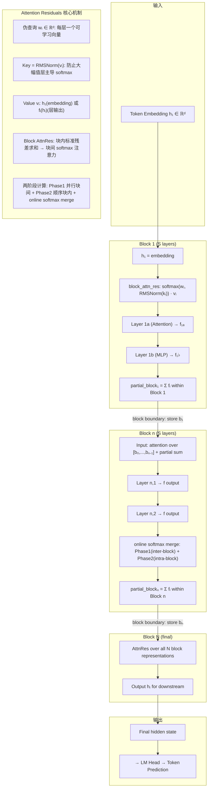

# Attention Residuals (AttnRes): 把深度维度的残差累积换成可学习注意力

**作者**: Kimi Team (MoonshotAI) | Guangyu Chen, Jianlin Su, et al.
**arXiv**: 2603.15031 | **日期**: March 2026
**官方仓库**: https://github.com/MoonshotAI/Attention-Residuals
**本地 PDF**: [paper.pdf](paper.pdf)

## 一句话总结

这篇论文提出 Attention Residuals (AttnRes)，把 LLM 中固定的残差连接替换为跨层 softmax 注意力——每层通过一个可学习的伪查询向量选择性聚合前面所有层的输出，从而解决 PreNorm 导致的深层贡献稀释问题。48B 模型（3B 激活）训练 1.4T tokens 后在 15 个下游任务上全面超越基线，其中 GPQA-Diamond +7.5pp、Math +3.6pp、HumanEval +3.1pp。

## 核心贡献

1. **时间-深度对偶性与 AttnRes 方法**: 论文指出残差连接的深度递归 `h_l = h_{l-1} + f_{l-1}` 与 RNN 的时间递归结构完全相同。正如 Transformer 用自注意力替代了 RNN 的时序递归，AttnRes 用深度维度的 softmax 注意力替代固定残差累积——每条深度维度上的信息聚合路径变成可学习的、输入依赖的。

2. **Block AttnRes 的可扩展工程方案**: Full AttnRes 需要 O(Ld) 内存和跨流水线阶段的通信。Block AttnRes 将 L 层划分为 N 个 block（通常 N≈8），块内标准残差求和，块间 softmax 注意力，将内存和通信降至 O(Nd)，配合跨阶段缓存和两阶段计算策略实现可部署。

3. **Scaling Law 验证**: 5 个模型规模（194M-528M 激活参数），Block AttnRes 在全计算量范围内一致优于基线，等效于 1.25x 计算优势；Full AttnRes 与 Block AttnRes 的差距随模型增大而缩小（最大规模仅差 0.001）。

4. **48B 规模全面验证**: 在 Kimi Linear 48B 架构上预训练 1.4T tokens，Block AttnRes 在全部 15 个下游任务上匹配或超越基线，多步推理任务提升尤为显著。

5. **PreNorm Dilution 的机制级解决**: AttnRes 通过 block 边界的注意力重置，将输出幅值限制在有界周期模式内，梯度分布更均匀，从根本上缓解了 PreNorm 下 `||h_l||` 随深度 O(L) 增长的问题。

6. **结构化矩阵 M 的统一视角**: 论文用深度混合矩阵 M 框架统一了所有残差变体——标准残差是 rank-1 半可分矩阵，Highway 是 rank-1 输入依赖，mHC 是 rank-m，Full AttnRes 是 dense rank-L，Block AttnRes 的秩介于 N 和 N+S 之间。

## 📖 批读导航

| Section | 内容 |
|---|---|
| [00 - 摘要](sections/00-abstract.md) | 论文摘要、核心贡献 |
| [01 - 引言与动机](sections/01-introduction.md) | Introduction（残差连接的两张面孔）、Motivation（PreNorm dilution 问题） |
| [02 - 方法](sections/02-method.md) | Full/Block AttnRes 核心方法、基础设施（训练 <4% 开销、推理 <2% 延迟） |
| [03 - 实验](sections/03-experiments.md) | Scaling Law（5 规模 1.25x 计算优势）、48B 主结果（15 任务全提升）、消融 |
| [04 - 讨论](sections/04-discussion.md) | 架构搜索、注意力模式、结构化矩阵 M 框架、序列-深度对偶、相关工作、Conclusion |

## 关键数字

| 指标 | 数值 | 说明 |
|---|---:|---|
| 最终模型规模 | 48B total / 3B activated | MoE, Kimi Linear 架构 |
| 预训练数据量 | 1.4T tokens | WSD schedule, Muon optimizer |
| 参数增加 | 可忽略 | 每层 1 个 RMSNorm + 1 个 d 维伪查询向量 |
| GPQA-Diamond | +7.5pp (36.9->44.4) | 最大单任务提升 |
| Math (Minerva) | +3.6pp (53.5->57.1) | 多步推理 |
| HumanEval | +3.1pp (59.1->62.2) | 代码生成 |
| MMLU | +1.1pp (73.5->74.6) | 知识导向任务 |
| BBH | +1.7pp (76.3->78.0) | 推理 |
| 下游任务全面性 | 15/15 提升 | 无一退化 |
| Scaling Law 计算优势 | 1.25x | Block AttnRes 等效于基线 1.25x 计算量 |
| Block 数量 | N≈8 | 回收 Full AttnRes 大部分增益 |
| 训练开销 | <4% | 流水线并行下 |
| 推理延迟开销 | <2% | 典型推理负载 |
| 每层 I/O (Block AttnRes) | 5.5d | vs 3d(标准残差), 34d(mHC, m=4) |
| Full vs Block 差距（最大规模） | 0.001 loss | 随模型增大而缩小 |
| 架构搜索配置数 | 25 种 | 全优于基线 (+0.019~0.063 loss) |
| 最优架构偏移 | d_model/L_b 从 60 降至 45 | AttnRes 倾向更深/更窄 |

## 数据流：输入 → 中间表示 → 输出

## 优点与局限

**优点**

- 核心 idea 极其优雅：时间-深度对偶性提供了坚实的理论动机，不是靠大量工程试出来的 heuristic。
- 方法实现极轻量：每层只增加 1 个 d 维向量 + 1 个 RMSNorm，总参数量可忽略。
- Block AttnRes 是教科书级的实用工程妥协：用约 8 个 block 回收 Full AttnRes 绝大部分增益，同时把内存和通信从 O(Ld) 降到 O(Nd)。
- 15/15 下游任务全面提升，无 trade-off——这在架构改进论文中非常罕见。
- 结构化矩阵 M 框架为后续架构设计提供了统一的数学视角。
- 消融实验设计干净且覆盖面广：softmax vs sigmoid、输入依赖查询、RMSNorm、multihead、sliding window、DenseFormer、mHC 全测。
- 训练动态分析不是附带的，而是揭示了 PreNorm dilution 被真正解决的机制证据。

**局限**

- 论文坦承 Full AttnRes 在流水线并行下的 O(Ld) 通信在当前硬件上是瓶颈，Block AttnRes 是一个妥协方案而非最终形态。
- 输入依赖查询（从 hidden state 投影）能带来额外 0.006 loss 改进但被放弃——说明方法仍有未开发的潜力。
- 最终 48B 实验只训了 1.4T tokens，相对于 Chinchilla-optimal 还有距离，更大数据量下的收益曲线未知。
- 深度混合矩阵 M 的分析偏理论，未直接指导新的实用设计选择。
- 代码虽已开源，但复现 48B 模型的训练需要工业级集群资源。
- 论文聚焦架构改进，未讨论与特定训练策略（如 curriculum learning、数据配比）的交互。

## Q&A

**Q1: AttnRes 与标准残差连接的核心区别是什么？**
A: 标准残差对前面所有层的输出做等权重加法：h_l = sum(v_i)，每层贡献完全一样。AttnRes 改为加权 softmax 聚合：h_l = sum(α_i→l · v_i)，其中 α 由每层一个可学习的伪查询向量 w_l 与各层输出的 key 做内积+softmax 得到。这使得深层可以选择性地"注意"浅层——本质是把 Transformer 在序列维度做的事情搬到了深度维度。

**Q2: 为什么 Block AttnRes 只用约 8 个 block 就能回收大部分增益？**
A: 论文的实验（Fig. 6）表明，从 S=1（Full AttnRes）逐渐增大 block size 时，loss 退化非常平缓，S=2/4/8 都在 ~1.746 附近。关键在于深度维度上的信息变化是渐进的——相邻层的输出高度相关，不需要逐层独立访问。8 个 block 已经提供了足够的跨阶段信息选择性，再细分收益递减。这类似于 KV cache 压缩中"保留头尾、中间可粗粒度"的直觉。

**Q3: 训练和推理引入多少额外开销？**
A: 训练：在无流水线并行时几乎零开销（层输出本来就为反向传播保存）；在流水线并行下，通过跨阶段缓存优化，端到端开销 <4%。推理：两阶段计算策略（Phase 1 并行块间 + Phase 2 顺序块内 + online softmax merge）将每层 I/O 控制在 5.5d（vs 标准残差的 3d），延迟开销 <2%。

**Q4: 时间-深度对偶性到底说了什么？**
A: RNN 在时间维度的递归是 s_t = s_{t-1} + g(x_t, s_{t-1})。残差连接在深度维度的递归是 h_l = h_{l-1} + f(h_{l-1})。两者形式上完全一样——都是把之前所有信息压缩进一个向量再叠加新信息。Transformer 通过自注意力解开了 RNN 的时间瓶颈（每个位置直接访问所有历史），AttnRes 做了完全对称的事情：解开深度维度的瓶颈（每层直接访问所有历史层输出）。论文进一步指出，mHC 等方法是"深度维度的线性注意力"，而 AttnRes 是"深度维度的 softmax 注意力"，完成了线性到 softmax 的跃迁。

**Q5: AttnRes 对哪类任务帮助最大？**
A: 多步推理任务（GPQA-Diamond +7.5, Math +3.6）和代码生成（HumanEval +3.1）收益最大；知识导向任务（MMLU +1.1, TriviaQA +1.9）也有稳定提升但幅度较小。这符合直觉：组合性任务需要深层选择性利用浅层抽取的特征，而知识回忆更多依赖 embedding 和特定层的记忆，对跨层信息流的依赖较弱。

**Q6: AttnRes 与 mHC（manifold Hyper-Connections）和 DenseFormer 的对比如何？**
A: DenseFormer 给每层分配固定（训练后不变）的跨层权重——完全无增益（1.767 vs 1.766 基线），说明输入依赖性才是关键而非单纯的跨层访问。mHC 维护 m 条并行流并学习混合矩阵，有收益（1.747）但不如 Block AttnRes（1.746）且 I/O 高得多（34d vs 5.5d）。AttnRes 用一个向量就超越了 m 条流的效果，因为 softmax 竞争性归一化本身就是高效的通道选择机制。

**Q7: 为什么伪查询 w_l 是学习参数而非从 hidden state 投影得到？**
A: 这是一个刻意的工程设计。从 hidden state 投影（输入依赖查询）确实能带来 +0.006 loss 改进（1.731 vs 1.737），但代价是每层增加一个 d×d 投影矩阵，且在推理解码时需要顺序访问内存（因为 query 依赖当前 hidden state）。学习固定 w_l 则完全不依赖输入，使得一个 block 内所有层的查询可以并行批处理——这是两阶段计算策略（Phase 1 批处理）成立的前提。这种"用可忽略的精度换取显著的系统和训练效率"的设计是 AttnRes 能被部署到 48B 规模的关键。
