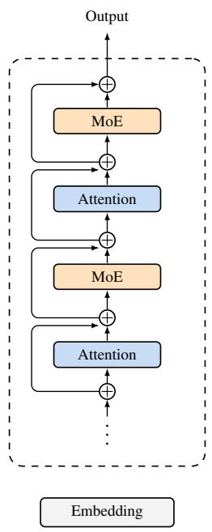
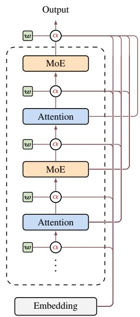
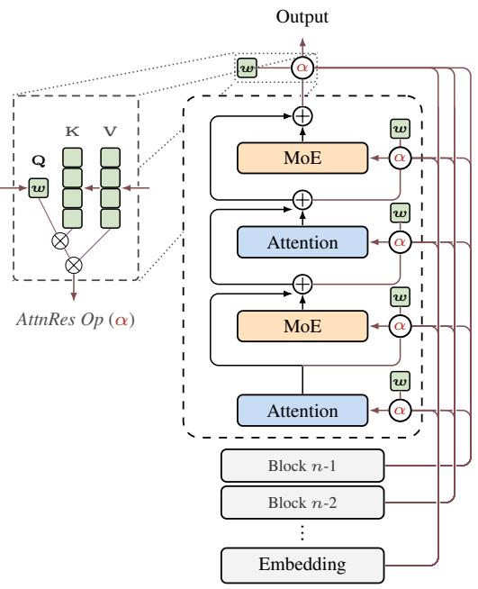

[← 返回 README](../README.md)

# 01 - 引言与动机

## 1. Introduction: 残差连接的两张面孔

> Standard residual connections are the de facto building block of modern LLMs. The update h_l = h_{l-1} + f_{l-1}(h_{l-1}) is widely understood as a gradient highway that lets gradients bypass transformations via identity mappings, enabling stable training at depth. Yet residuals also play a second role that has received less attention. Unrolling the recurrence shows that every layer receives the same uniformly-weighted sum of all prior layer outputs; residuals define how information aggregates across depth. Unlike sequence mixing and expert routing, which now employ learnable input-dependent weighting, this depth-wise aggregation remains governed by fixed unit weights, with no mechanism to selectively emphasize or suppress individual layer contributions.

论文指出残差连接有两张面孔：

- **面孔一（被广泛讨论）**: 梯度高速公路——反向传播时恒等项 I 保证梯度直达浅层，使深度训练稳定可行。
- **面孔二（长期被忽视）**: 深度维度上的信息聚合机制——展开递归后每层接收前面所有输出的等权和。

序列维度已有 Transformer 自注意力（输入依赖的 token mixing），专家维度已有 MoE routing（输入依赖的 expert selection），唯独深度维度仍用固定权重。

> 💡 **Hao 批注 - 关键定位**: 这不是一篇"改残差连接"的论文，而是"把深度当作序列来注意"的论文。类比：RNN → Transformer 是把序列维度的加性递归换成自注意力；AttnRes → 标准残差是把深度维度的加性递归换成自注意力。论文在 §6.1 把这个类比推到了极致。

> 💡 **Hao 批注 - PreNorm 的根本矛盾**: PreNorm（对输入做 Norm 而非对残差分支做 Norm）为梯度创建了干净的 identity path，但代价是隐藏状态幅值随深度 O(L) 增长——因为每个 f_l 的输出都加进残差流而没有归一化约束。这迫使深层学习越来越大的输出来维持影响力。PostNorm 幅值可控但梯度被反复归一化压缩。AttnRes 通过 block 级别的注意力重置避开了这个 trade-off。

> In practice, PreNorm has become the dominant paradigm, yet its unweighted accumulation causes hidden-state magnitudes to grow as O(L) with depth, progressively diluting each layer's relative contribution. Early-layer information is buried and cannot be selectively retrieved; empirically, a significant fraction of layers can be pruned with minimal loss. The situation parallels the challenges that recurrent neural networks (RNNs) faced over the sequence dimension before attention mechanism provided an alternative.

> We observe a formal duality between depth-wise accumulation and the sequential recurrence in RNNs. Building on this duality, we propose Attention Residuals (AttnRes), which replaces the fixed accumulation h_l = Σ_i v_i with h_l = Σ_i α_{i→l}·v_i, where α_{i→l} are softmax attention weights computed from a single learned pseudo-query w_l ∈ R^d per layer. This lightweight mechanism enables selective, content-aware retrieval across depth with only one d-dimensional vector per layer.

标准残差连接存在三个根本限制：

1. **无法选择性访问**: 注意力层和 MLP 层收到同样的聚合状态，尽管它们可能受益于不同的历史层加权。
2. **不可逆信息丢失**: 通过聚合损失的信息无法在更深层选择性恢复。
3. **输出增长**: 深层被迫学习越来越大的输出以在累积残差中获得影响力。

> 💡 **Hao 批注 - 这三个限制构成了论文动机的核心**: 特别是第一点——不同子层类型（attention vs MLP）可能需要不同的历史层偏好，但标准残差只提供一个聚合态。后面的实验结果（Fig. 8）验证了这一点：pre-attention 层有更宽的感受野，pre-MLP 层更依赖近期输出。

图 1: (a) 标准残差——每层只接收紧邻上一层的聚合状态。(b) Full AttnRes——每层通过 softmax 注意力选择性聚合所有前面层的输出。(c) Block AttnRes——层被分组为 block，块内标准残差求和，块间 softmax 注意力。

> 💡 **Hao 批注 - 图 1 的视觉语言**: (a) 展示"瀑布式"单线信息流——每层只看到上一层的压缩态。(b) Full 版本形成全连接的有向无环图——类似 DenseNet 的跨层连接但权重是学习+输入依赖的。(c) Block 版本在连接模式上和 Full 类似，但每个 block 内部压缩成一个向量后再参与跨块注意力。

### 规模化路径

> In standard training, Full AttnRes adds negligible overhead, since the layer outputs it requires are already retained for backpropagation. At scale, however, activation recomputation and pipeline parallelism are routinely employed, and these activations must now be explicitly preserved and communicated across pipeline stages. We introduce Block AttnRes to maintain efficiency in this regime: layers are partitioned into N blocks, each reduced to a single representation via standard residuals, with cross-block attention applied only over the N block-level summaries.

> Scaling law experiments confirm that AttnRes consistently outperforms the baseline across compute budgets, with Block AttnRes matching the loss of a baseline trained with 1.25x more compute. We further integrate AttnRes into the Kimi Linear architecture (48B total / 3B activated parameters) and pre-train on 1.4T tokens.

## 2. Motivation: PreNorm Dilution 的形式化

### Notation

考虑 batch 输入序列 B×T×d。对单个 token：h_l ∈ R^d 表示进入第 l 层的隐藏状态，l ∈ {1,...,L}，token embedding 为 h_1。f_l 表示第 l 层的变换（每个 self-attention 或 MLP 视为独立层）。

### 标准残差的展开

残差学习的核心更新规则：

h_l = h_{l-1} + f_{l-1}(h_{l-1})

展开递归后：

h_l = h_1 + Σ_{i=1}^{l-1} f_i(h_i)

即每层接收 embedding 加上所有前面层输出的等权和。

反向传播梯度：

∂L/∂h_l = ∂L/∂h_L · Π_{j=l}^{L-1} (I + ∂f_j/∂h_j)

恒等项 I 始终保留，提供从 loss 到任何层的直接梯度路径。

### Highway Networks 的尝试

Highway Networks 引入可学习元素级门控：

h_l = (1-g_l) ⊙ h_{l-1} + g_l ⊙ f_{l-1}(h_{l-1})

更一般的形式：h_l = α_l·h_{l-1} + β_l·f_{l-1}(h_{l-1})，其中残差设 α_l=β_l=1，Highway 设 α_l=1-g_l, β_l=g_l。

### 统一限制

不论固定权重（残差）还是门控权重（Highway），两者共享一个根本约束：**每层只能访问其紧邻输入 h_{l-1}**——一个将所有更早层输出混在一起的压缩态，而非各层的独立输出。

这导致：(1) 无选择性访问；(2) 不可逆信息丢失；(3) 深层输出增长以获取影响力。

> 💡 **Hao 批注 - Highway 和 AttnRes 的关键区别**: Highway 改变的是每层如何混合"旧状态 vs 新输出"的比例，但信息来源仍只是上一层的压缩态。AttnRes 改变的是信息来源——从"只能看上一层的汇总"变成"选择性看所有历史层的原始输出"。在结构化矩阵 M 框架下（§6.2），Highway 是 rank-1 但权重输入依赖，AttnRes 是 dense rank-L。

> 💡 **Hao 批注 - 论文真正的 motivation 来源**: 不是"残差不好"，而是"残差在深度维度的聚合方式缺少了序列维度和专家维度已经具备的东西——输入依赖的选择性"。这是一个"统一性"的动机：让模型在所有维度上都拥有输入依赖的聚合能力。
