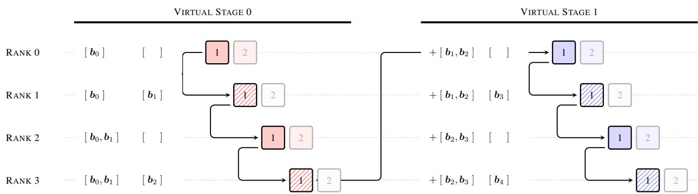

[← 返回 README](../README.md)

# 01 - 基础设施设计

## 📌 预览

这一部分涵盖 §4 Infrastructure Design：训练侧的跨阶段缓存（pipeline communication optimization）将通信开销从 O(C²) 降至 O(P²)，推理侧的两阶段计算策略（Phase 1 并行批处理 + Phase 2 顺序 + online softmax merge）将每层 I/O 控制在 5.5d。最终训练开销 <4%，推理延迟开销 <2%。

## 核心原文信息

### 4.1 训练基础设施

#### 问题的来源

Block AttnRes 在流水线并行（pipeline parallelism）下引入了新的系统挑战：
- 标准残差连接：pipeline stage 之间只传递固定大小的 hidden state
- Block AttnRes：每个 stage 需要访问所有累积的 block 表示来进行块间注意力
- 朴素实现：每次 stage 转换时传输完整的历史 block 列表，通信量随虚拟 stage 数 O(C²) 增长

> 💡 **为什么 Full AttnRes 在大规模训练下不实用**: 不是计算量问题（O(L²d) 在深度维度上不大），而是流水线并行下每层输出都要跨 stage 传递——L 个 d 维向量，每个都要在 P 个物理 stage 之间通信。在 V 个虚拟 stage 的 interleaved 调度下，朴素通信量是 C(C-1)/2 · N_p · d，其中 C = P·V。

#### 跨阶段缓存 (Cross-Stage Caching)

**核心观察**: 每个物理 stage 连续处理多个虚拟 stage，后续虚拟 stage 需要的 block 表示大部分已在前序虚拟 stage 中接收过。

**优化方案**:
- 每个物理 stage 本地缓存已接收的 block 表示
- 第一个虚拟 stage (v=1) 正常累积
- 后续虚拟 stage (v≥2) 只传输增量部分（约 P·N_p 个 block）

**通信量对比**:
- 朴素: Comm_naive = C(C-1)/2 · N_p · d
- 缓存后: Comm_cached = P(P-1)/2 · N_p · d + (V-1)·P²·N_p·d
- 改善: 峰值每次转换从 O(C) 降至 O(P)，V× 改善

> 💡 **与标准 1F1B 调度的配合**: 缓存优化后的通信可以完全与稳态 1F1B 的计算重叠——因为增量传输量是 O(P) 而非 O(C)，通信时间小于一个 micro-batch 的计算时间。

图 3: 4 个物理 rank × 2 个虚拟 stage 的示例。阴影框标记 AttnRes block 结束位置，数字表示 micro-batch 索引。每个 rank 缓存之前接收的 block，stage 转换时只传输增量 (如 +[b₁,b₂])。

#### 内存开销分析

- 跨 stage 缓存后，每个 block 在 V 个虚拟 stage 中只存储一次，相对标准 per-layer activation cache 可忽略
- Per-layer activation footprint 与标准架构相同：激活重计算消除所有块间注意力中间结果，checkpointed input h_l 的内存大小与被替换的 hidden state 匹配

#### 训练墙钟时间开销

- 无流水线并行时：可忽略（层输出本来就为反向传播保存）
- 有流水线并行时：端到端实测开销 <4%

### 4.2 推理基础设施

#### 两阶段计算策略 (Two-Phase Computation)

这是 AttnRes 推理效率的核心设计。以 Block AttnRes 为例（Full AttnRes 同样适用），将每 block 的注意力计算分为两个阶段：

**Phase 1: 并行块间注意力**

- 利用伪查询 w_l 独立于前向计算的性质
- 将一个 block 内所有 S 层的查询向量 [w_l]_{l∈B_n} 堆叠为矩阵 Q ∈ ℝ^{S×d}
- 对缓存的已完成 block 表示做一次批处理注意力：Q·K^T
- 返回 S 个层的输出 o_l^{(1)} 和 softmax 统计量（max m_l^{(1)} 和 log-sum-exp ℓ_l^{(1)}）
- **关键收益**: 将 S 次内存读取（N 个 block 的 K/V）摊销为 1 次

**Phase 2: 顺序块内注意力 + Online Softmax Merge**

- 按顺序遍历 block 内各层
- 第一层 (i=0)：直接使用 Phase 1 结果 o_l^{(1)} / ℓ_l^{(1)}
- 后续层 (i≥1)：
  1. 计算当前部分和 b_n^i 作为唯一的块内 source 的单步注意力 → o_l^{(2)}, m_l^{(2)}, ℓ_l^{(2)}
  2. 通过 online softmax [31] 合并 Phase 1 和 Phase 2 的结果：
     - m̄_l = max(m_l^{(1)}, m_l^{(2)})
     - ℓ_l = e^{m_l^{(1)}-m̄_l}·ℓ_l^{(1)} + e^{m_l^{(2)}-m̄_l}·ℓ_l^{(2)}
     - o_l = (e^{m_l^{(1)}-m̄_l}·o_l^{(1)} + e^{m_l^{(2)}-m̄_l}·o_l^{(2)}) / ℓ_l
  3. 更新部分和: b_n^{i+1} = b_n^i + f_l(h_l)

> 💡 **Online softmax merge 为什么重要**: 如果不做两阶段，每层都要完整扫描所有 N 个历史 block 和 i-1 个块内层，I/O 是每层 O((N+i)d)。两阶段把共同的 N 个 block 扫描合并为一次批处理，块内仍是顺序的但源极少。Online softmax merge 是使 Phase 1+2 结果在数学上完全等价的技巧——不是近似。

> 💡 **Phase 2 的 kernel fusion 机会**: 论文提到 Phase 2 的 element-wise online softmax merge 自然支持与周围操作做 kernel fusion，因为计算模式简单（exp/div/max）+ 输入已经都在 cache 中。

#### 每层 I/O 分析 (Table 1)

| 方法 | 操作 | 每层 I/O (符号) | 每层 I/O (典型值) |
|---|---|---|---|
| **Standard Residuals** | Residual Merge | 3d | 3d |
| **mHC (m streams)** | Compute α_l,β_l,A_l + Apply + Residual Merge | (8m+2)d + 2m²+4m | 34d (m=4) |
| **Full AttnRes** | Phase 1 (amortized) + Phase 2 | (S+N)d | 24d |
| **Block AttnRes** | Phase 1 (amortized) + Phase 2 | (N/S + 5)d | 5.5d |

典型值假设: L=128, N=8, S=L/N=16, m=4

> 💡 **Block AttnRes 只比标准残差多 2.5d I/O 的原因**: Phase 2 的块内部分和标准残差几乎一样 I/O（读当前部分和 + 写回）；额外开销全部来自 Phase 1 的批处理块间读取，而这一部分被摊销到 S=16 层中，每层只分担 N/S · d = 0.5d 的 reads。Phase 1 还可以与 block 的第一层计算部分重叠。

#### 内存高效 Prefilling

对于长上下文 prefilling，存储 N·T·d 个 block 表示在 128K 上下文时约需 15 GB。论文提出两种解决方案：

1. **序列维度分片 (TP sharding)**: 将 block 表示沿序列维度在 P 个 tensor-parallel 设备间分片 → 每设备 N·(T/P)·d，128K 下约 1.9 GB/设备

2. **分块预填充 (Chunked Prefill)**: 进一步将预填充分为 16K 大小的 chunk → 每设备 <0.3 GB

> 💡 **TP 分片与标准通信路径的融合**: Phase 2 的 online softmax merge 被设计为自然融入标准 TP all-reduce 通信路径：输出先 reduce-scatter，本地 merge，再 all-gather 重建。这种融合避免了额外通信，使推理实现可以在现有推理框架上最小化改动。

#### 推理延迟开销

端到端推理延迟开销 <2%。论文将其归因于：
- Phase 1 批处理摊销了跨块 I/O
- Phase 2 与标准残差的 I/O 接近
- Phase 1 可与 block 首层计算重叠

## 批读

> 💡 **这篇论文的系统工程是"隐藏的硬核"**: 读者容易只关注方法创新（时间-深度对偶、softmax 聚合），但真正让 AttnRes 能部署到 48B 规模的是 §4 的基础设施设计。跨阶段缓存 + 两阶段计算 + online softmax merge 三者缺一不可，它们共同把 AttnRes 从一个"有趣的 idea"变成一个"可部署的方法"。

> 💡 **为什么两阶段计算策略可以工作**: 这完全依赖于伪查询 w_l 独立于前向计算的特性。如果论文选择了输入依赖查询（从 hidden state 投影），Phase 1 的批处理就不成立——每个查询依赖当前 hidden state，只能顺序计算。这是一个方法设计为系统工程创造可能性的典范。

> 💡 **Table 1 的比较传达了一个清晰的信息**: Block AttnRes 的 I/O (5.5d) 比 mHC (34d) 低一个数量级，比标准残差 (3d) 只多 ~80%，比 Full AttnRes (24d) 低 4.3x。这解释了为什么 Block AttnRes 可以"几乎无痛"地替换标准残差，而 mHC 虽然 loss 表现相近（1.747 vs 1.746）但 I/O 成本高得多。

> 💡 **推理 prefilling 的 15 GB → 0.3 GB 优化不是 trivial 的**: 128K 上下文的 15 GB 在某些推理卡（如 A100 40GB）上已经是显著占比。TP 分片利用已有通信模式来分摊存储的做法优雅且实用——没有引入新的 collective operation。

> 💡 **训练 <4% 的上下文**: 这个数字是在"有流水线并行"的条件下测的。在无流水线并行的小规模实验中，AttnRes 的激活存储与反向传播需要的存储完全重叠，额外开销接近零。这意味着研究和实验阶段可以无痛使用 Full AttnRes，只在超大模型部署时切换到 Block AttnRes——而这正是论文实际做的（scaling law 用 Full，48B 用 Block）。

## 小结

- 训练侧的跨阶段缓存将流水线通信从 O(C²) 降至 O(P²)，实现 V× 改善，可完全与 1F1B 计算重叠。
- 推理侧的两阶段计算利用伪查询的独立性：Phase 1 批处理摊销块间 I/O，Phase 2 顺序处理块内并 online softmax merge 合并结果。
- Block AttnRes 每层仅需 5.5d I/O，显著低于 mHC 的 34d，接近标准残差的 3d。
- 长上下文 prefilling 通过 TP 分片 + chunked prefill 将内存从 15 GB 降至 <0.3 GB/设备。
- 整体训练开销 <4%，推理延迟开销 <2%。
