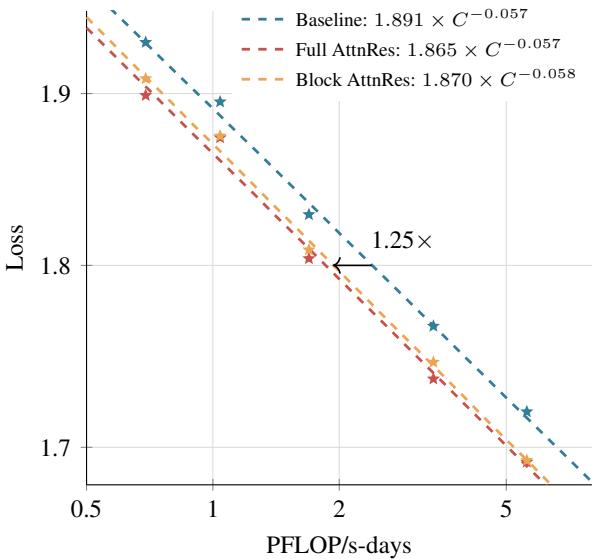
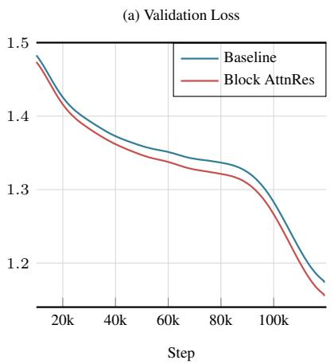
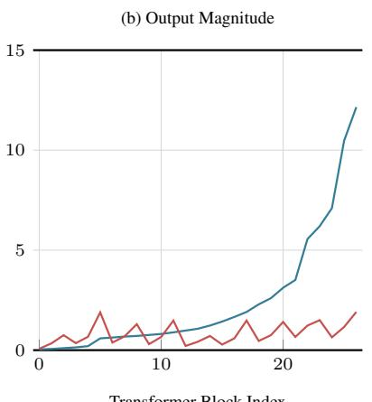
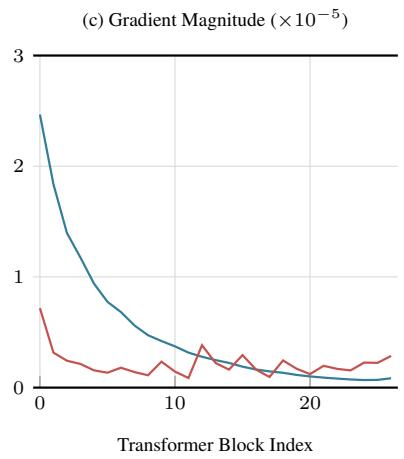
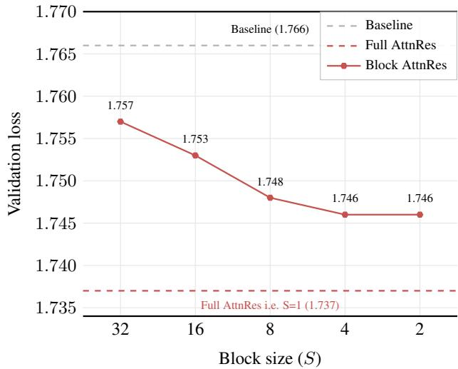

[← 返回 README](../README.md)

# 02 - 实验

## 📌 预览

这一部分涵盖 §5 的全部实验结果：Scaling Law（5 个规模，Block AttnRes 等效 1.25x 计算优势）、48B 主结果（15/15 下游任务提升）、消融实验（softmax>sigmoid、RMSNorm 关键、multihead 有害、DenseFormer 零增益、输入依赖查询有额外收益但代价不菲）。

## 核心原文信息

### 架构与训练细节

论文的实验架构基于 Kimi Linear [69]——MoE Transformer（Moonlight/DeepSeek-V3 风格），混合 KDA 和 MLA 注意力层（3:1 比例），每层后接 MoE feed-forward。AttnRes 是唯一的改动：每层增加 1 个 RMSNorm + 1 个伪查询向量 w_l ∈ ℝᵈ。

> 💡 **伪查询必须零初始化**: 论文强调所有 w_l 必须初始化为零。这确保训练初始时所有 α_{i→l} 均匀分布（相当于等权平均），AttnRes 退化为标准残差的近似。这是防止训练初期波动的关键工程细节。

### 5.1 Scaling Laws

**实验设置**: 5 个模型规模（Table 2），每个规模 3 个变体（Baseline / Full AttnRes / Block AttnRes, N≈8），所有变体共享基线优化的超参数（故意偏袒基线以保持比较保守）。8192 token 上下文，cosine LR schedule。

**Table 2 数据**:

| Act. Params | Tokens | L_b | H | d_model | Baseline | Block AttnRes | Full AttnRes | mHC(-lite) |
|---:|---:|---:|---:|---:|---:|---:|---:|---:|
| 194M | 38.7B | 12 | 12 | 896 | 1.931 | 1.909 | 1.899 | 1.906 |
| 241M | 45.4B | 13 | 13 | 960 | 1.895 | 1.875 | 1.874 | 1.869 |
| 296M | 62.1B | 14 | 14 | 1024 | 1.829 | 1.809 | 1.804 | 1.807 |
| 436M | 87.9B | 16 | 16 | 1168 | 1.766 | 1.746 | 1.737 | 1.747 |
| 528M | 119.0B | 17 | 17 | 1264 | 1.719 | 1.693 | 1.692 | 1.694 |

> 💡 **Block AttnRes 与 mHC 的数值竞争**: 在 5 个规模中，Block AttnRes 与 mHC(-lite) 的 val loss 非常接近（最大差距 0.006 在 241M 规模 mHC 略优，其他规模 AttnRes 优）。但关键区别在 I/O 成本：Block AttnRes 每层 5.5d vs mHC 34d（m=4 时）。如果考虑 I/O 效率，AttnRes 明显更优。

图 4: 三条拟合幂律曲线。Baseline: L=1.891×C^{-0.057}, Block AttnRes: L=1.870×C^{-0.058}, Full AttnRes: L=1.865×C^{-0.057}。三者斜率相近（说明 AttnRes 的改进是"常数级偏移"而非"改变了 scaling 行为"），但 AttnRes 在全计算量范围内一致更低。

**关键发现**:
- 三条曲线斜率几乎相同（~−0.057），说明 AttnRes 的增益是**常数级偏移**而非改善 scaling 指数
- 在 5.6 PFLOP/s-days，Block AttnRes 达到 1.692 vs 基线 1.714 → **等效 1.25x 计算优势**
- Full vs Block 差距随模型增大而缩小：最大规模仅差 0.001

> 💡 **常数级偏移也是好消息**: 虽然 AttnRes 没有改善 scaling 指数（α 不变），但"常数级"的 0.02+ loss 降低意味着在任何计算预算下都比基线更好。如果基线需要 1.25x 更多计算才能达到相同 loss，这在实际训练成本中是巨大差异。

> 💡 **Full vs Block 差距缩小的趋势说明什么**: 更大模型天然有更多冗余和更强的表达能力来弥补 block 压缩的信息损失。这暗示在更大规模（如 100B+）下，Block AttnRes 可能与 Full AttnRes 几乎无差别。

### 5.2 主结果: 48B 模型

**训练配方**:
- 架构: Kimi Linear 48B, 27 Transformer blocks (54 layers), 8/256 routed experts + 1 shared expert
- Block AttnRes: 6 层/block → 9 blocks + token embedding = 10 depth-wise sources
- 数据: 1.4T tokens total（1T pre-training + ~400B mid-training annealing）
- 优化器: Muon, WSD (Warmup-Stable-Decay) LR schedule, global batch 8M tokens
- 上下文: 4096 tokens（预训练），后续扩展到 32K

#### 训练动态分析

图 5: 基线与 Block AttnRes 的训练动态。(a) AttnRes 全程更低，decay 阶段差距拉大。(b) 基线输出幅值随深度单调增长（PreNorm dilution），AttnRes 在 block 边界重置，呈有界周期模式。(c) AttnRes 梯度分布更均匀（softmax 竞争导致）。

> 💡 **Fig. 5b 是 PreNorm dilution 被解决的"可视化证据"**: 基线的输出幅值曲线是单调上升的——每层都在越来越大的残差流中挣扎。AttnRes 的曲线是有界周期锯齿——每个 block 内幅值小幅增长，block 边界被注意力"重置"。这完美对应了 §3 的机制描述。

> 💡 **梯度均匀性（Fig. 5c）的含义**: 标准残差下，早期层因为残差流的累积效应获得不成比例的大梯度。AttnRes 的 softmax 竞争意味着如果一个源（比如 embedding）获得了太多权重，其他源必须获得更少——这种概率质量的竞争自然使梯度在源之间更均匀分布。更均匀的梯度分布对训练稳定性有利，尤其是在超深网络中。

#### 下游任务性能 (Table 3)

| 类别 | 任务 | Baseline | AttnRes |
|---|---|---|---|
| **General** | MMLU | 73.5 | **74.6** (+1.1) |
| | MMLU-Pro | **52.2** | **52.2** (0.0) |
| | GPQA-Diamond | 36.9 | **44.4** (+7.5) |
| | BBH | 76.3 | **78.0** (+1.7) |
| | ARC-Challenge | 64.6 | **65.7** (+1.1) |
| | HellaSwag | 83.2 | **83.4** (+0.2) |
| | TriviaQA | 69.9 | **71.8** (+1.9) |
| **Math & Code** | GSM8K | 81.7 | **82.4** (+0.7) |
| | MGSM | 64.9 | **66.1** (+1.2) |
| | Math (Minerva) | 53.5 | **57.1** (+3.6) |
| | CMath | 84.7 | **85.1** (+0.4) |
| | HumanEval | 59.1 | **62.2** (+3.1) |
| | MBPP | 72.0 | **73.9** (+1.9) |
| **Chinese** | CMMLU | 82.0 | **82.9** (+0.9) |
| | C-Eval | 79.6 | **82.5** (+2.9) |

> 💡 **GPQA-Diamond +7.5pp 是惊人数值**: 在 48B/3B 规模的模型上，GPQA-Diamond 从 36.9 跳至 44.4，这在没有改变模型大小、数据或训练配方的条件下是极少见的。论文将此归因于"多步推理需要深层选择性复用浅层抽取的中间表示"——非常合理的解释。

> 💡 **知识密集型任务提升温和但一致**: MMLU +1.1、TriviaQA +1.9 的幅度说明 AttnRes 对这些任务也有帮助，但不如推理任务显著。这符合预期——知识回忆更多依赖特定层的参数记忆，对跨层信息流的依赖较弱。

> 💡 **数学和代码任务的提升模式**: Math +3.6 和 HumanEval +3.1 的幅度虽不如 GPQA +7.5 夸张但仍显著。值得注意的是 GSM8K 仅 +0.7——GSM8K 是相对简单的数学推理，可能不需要复杂的跨层信息整合；而 Math (Minerva) 题目更难，更需要选择性检索深层/浅层信息。

### 5.3 消融实验

使用 Table 2 中 436M 激活参数的 16-head 模型（即 Baseline loss = 1.766 的规模）。

**Table 4: 关键组件消融**:

| 变体 | Loss | Δ vs Baseline |
|---|---|---|
| Baseline (PreNorm) | 1.766 | — |
| DenseFormer [36] | 1.767 | +0.001 (无增益) |
| mHC [59] | 1.747 | −0.019 |
| **AttnRes Full** | **1.737** | **−0.029** |
| + input-dependent query | 1.731 | −0.035 |
| + input-independent mixing | 1.749 | −0.017 |
| + sigmoid (替代 softmax) | 1.741 | −0.025 |
| + w/o RMSNorm | 1.743 | −0.023 |
| + SWA (sliding window, W=1+8) | 1.764 | −0.002 |
| **Block AttnRes (S=4)** | **1.746** | **−0.020** |
| + multihead (H=16) | 1.752 | −0.014 |
| + w/o RMSNorm | 1.750 | −0.016 |

> 💡 **DenseFormer 零增益的深层含义**: DenseFormer 也是跨层访问（每层可以看所有前面层），但权重是固定标量（训练后不变）。AttnRes 是输入依赖的（权重取决于层输出的内容）。这个对比干净地证明：**输入依赖性（内容感知的选择）才是关键，而非单纯的跨层访问**。这也解释了为什么 Fig. 8 中的注意力权重有清晰的模式——模型根据内容决定注意谁。

> 💡 **softmax vs sigmoid (1.737 vs 1.741)**: softmax 的竞争性归一化（概率和为 1）迫使模型做"选择性"——分配给一个源更多权重意味着其他源更少。sigmoid 没有这种零和约束，导致注意力更分散。在只有 ~L 个源的深度维度上，softmax 的竞争机制更有利于集中权重。

> 💡 **Multihead 有害 (1.752 vs 1.746)**: 论文测试了 H=16 头的 Block AttnRes（类似标准自注意力的多头机制，不同头看不同通道组），结果反而变差。论文解释为"最优的深度混合在通道维度上基本一致——当一个层的输出有用时，它对所有通道都有用"。这与标准自注意力中多头机制的成功形成对比——说明深度维度注意力与序列维度注意力有不同的信息结构。

> 💡 **RMSNorm 的关键作用**: 去掉 RMSNorm 在 Full (1.743 vs 1.737) 和 Block (1.750 vs 1.746) 上都造成退化。在 Block 版本中尤其关键——block 表示是多个层的求和，幅值差异可能很大，没有 RMSNorm 时大 block 会主导 softmax。RMSNorm 使得每个 key 被归一化到单位方差，softmax 分数反映的是"方向相关性"而非"幅值"。

> 💡 **输入依赖查询的 0.006 改进 (1.737→1.731)**: 这个差距不大但足以说明有额外信息——当前层的 hidden state 中包含了"我最需要什么类型的历史信息"的信号。但代价巨大：每层 d×d 投影 + 无法批处理 Phase 1。论文正确的判断是用这个精度换系统工程效率。

> 💡 **Sliding Window 不够 (1.764 vs 1.746)**: 只保留最近 W=8 层 + token embedding 远不如 Full/Block AttnRes。这说明**选择性访问远距离层比密集访问近邻层更重要**——某些关键信息（如早期检测到的模式、embedding 中的知识）需要在深层被重新检索。

图 6: Block size 从 S=1(Full) 到 S=32 的 val loss。S=2/4/8 都在 ~1.746 附近，S=16 开始退化，S=32 接近基线。说明深度维度信息高度冗余。

> 💡 **Block 大小的"甜点区"很宽**: S=2 到 S=8 的 loss 几乎不变，这对于部署非常友好——可以根据硬件条件（内存、带宽）灵活选择 block 大小而不显著牺牲性能。

## 小结

- Scaling Law: 5 个规模下 AttnRes 一致优于基线，Block AttnRes 等效 1.25x 计算优势，Full/Block 差距随规模缩小至 0.001。
- 48B 主结果: 15/15 下游任务全面提升，GPQA-Diamond +7.5pp 最显著，多步推理和代码生成收益大，知识任务提升温和。
- 训练动态: AttnRes 将输出幅值约束在有界周期模式内，梯度分布更均匀——直接解决 PreNorm dilution。
- 消融: softmax>sigmoid, RMSNorm 关键, multihead 有害, DenseFormer 零增益（证明输入依赖性而非跨层访问是核心）, 输入依赖查询有 +0.006 空间但代价不菲, sliding window 不够。
