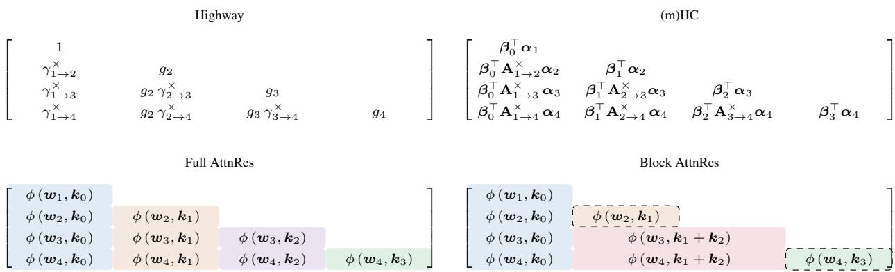
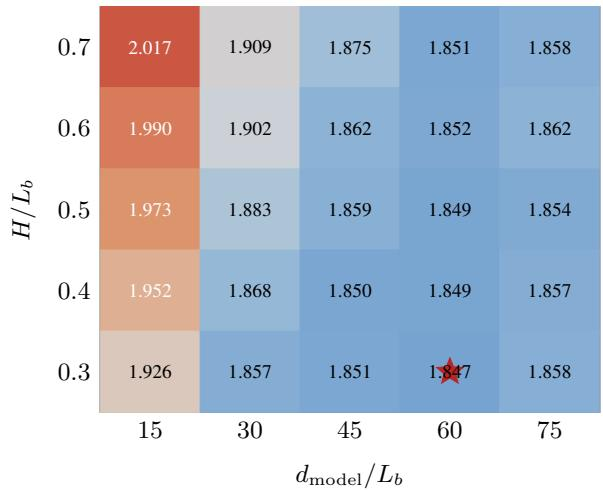
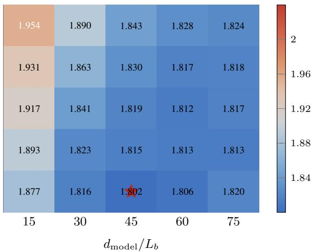
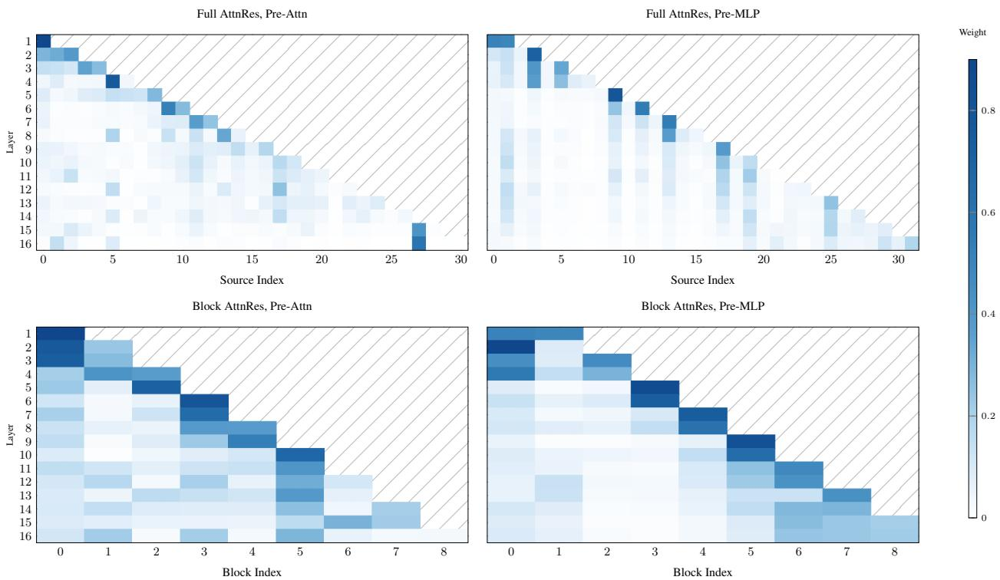

[← 返回 README](../README.md)

# 04 - 讨论与分析

## 6.1 序列-深度对偶性: 完整的理论图景

论文在 §6.1 将时间-深度对偶性推到了极致，建立了一套完整的对应关系：

**序列维度的演进 → 深度维度的对应方法:**

| 序列维度方法 | 核心机制 | 深度维度对应 |
|---|---|---|
| RNN (vanilla) | s_t = s_{t-1} + g(x_t, s_{t-1}) | 标准残差 h_l = h_{l-1} + f(h_{l-1}) |
| 带门控的 RNN | data-dependent gates | Highway Networks |
| Delta Rule / Fast Weight | W_t = W_{t-1} - η∇ℓ(W_{t-1}; x_t) | DDL [67] |
| Linear Attention | S_t = S_{t-1} + k_t v_t^T | mHC (m 流状态扩展) |
| Gated Linear Attention (GLA) | gated linear attention | MRLA [10] |
| Softmax Attention (Transformer) | α = softmax(QK^T)V | **AttnRes** (本文) |

> 💡 **Hao 批注 - 这篇论文真正在做的事情**: 不是"设计一个新的残差变体"，而是"在深度维度上完成线性注意力到 softmax 注意力的跃迁"。在序列维度上，这个跃迁（Transformer 替代 RNN）改变了整个领域。论文的论点是：深度维度上同样的跃迁也有价值，而且由于深度 L << 序列长度 T，直接用 O(L²) 的 softmax 注意力是可行的。

> Residual connections propagate information over depth via a fixed recurrence h_l = h_{l-1} + f_{l-1}(h_{l-1}), much as RNNs propagate information over time. Test-Time Training (TTT) formalizes the sequence side of this analogy, casting each recurrent step as gradient descent on a self-supervised loss. When f is linear, this reduces to vanilla linear attention S_t = S_{t-1} + k_t v_t^T. The standard residual exhibits the same additive form along depth, with h_l serving as the state and each layer f_l acting as one "gradient step."

> 💡 **Hao 批注 - 与 TTT 的联系**: 论文引用了 TTT [46] 的视角——TTT 把 RNN 隐藏态更新看作梯度下降（fast weights），残差连接也可以看作一种简化的梯度下降（每层像一个"梯度步骤"）。从 TTT 视角看，AttnRes 相当于在深度维度上用注意力替代了梯度下降式更新。

**未来方向**: 论文提出，既然 AttnRes = 深度维度的 softmax 注意力，那么自然可以探索深度维度的**线性复杂度注意力**（类似序列维度上 Katharopoulos 的线性注意力）。考虑到未来模型可能更深（L>1000），线性深度注意力可能变得必要。

## 6.2 残差连接作为结构化矩阵: M 框架

这是论文最 formal 的理论贡献——用深度混合矩阵 M ∈ R^{L×L} 统一表述所有残差变体。

**定义**: h_l = Σ_{i=0}^{l-1} M_{i→l} · v_i，其中 v_0=h_1(embedding), v_i=f_i(h_i)(层输出), i≥1。

**各方法的 M 的秩（半可分秩）**:

| 方法 | M 结构 | 秩 | 权重来源 |
|---|---|---|---|
| Standard Residual | 全 1 下三角 | rank-1 | 固定 |
| Highway | 通过标量 gate 的累乘积 | rank-1 | 输入依赖 |
| mHC | m×m 转移矩阵的累乘积 | rank-m | 输入依赖 |
| Full AttnRes | 全 dense 下三角 | rank-L | 输入依赖 |
| Block AttnRes | 块内共享权重 + 块间注意力 | rank ∈ [N, N+S] | 输入依赖 |

> 💡 **Hao 批注 - M 作为分析工具而非设计工具**: 论文用 M 框架做"理解"而非"设计"——通过比较各种方法的 M 结构，揭示了为什么某些方法有效、某些无效。例如 DenseFormer 的 M 也是 dense 但 rank-1（因为标量权重），这解释了它为什么无增益——输入依赖性才是提升秩的驱动力。

图 9: 四种残差变体的深度混合矩阵 M（L=4, Block AttnRes S=2）。Highway 显示为标量 gate。AttnRes 显示未归一化的 φ score，背景颜色标记共享相同 source（Full）或相同 source block（Block）的条目。

**现有残差变体作为深度线性注意力**: 论文进一步指出，mHC 的权重 M_{i→l} = β_i^T A_{i+1→l}^× α_l 可以自然解释为一种**深度维度的线性注意力**: α_l 是层 l 发出的"查询"，β_i 是层 i 的"key"，A^× 是深度相关的"位置算子"。m 条流相当于深度维度的状态扩展（state expansion）。在这种视角下，mHC 是**深度线性注意力**，AttnRes 是**深度 softmax 注意力**——完成了线性到 softmax 的跃迁。

> 💡 **Hao 批注 - 论文对 [58] (Xie 2026) 的引用**: "DeepSeek mHC 可能不需要 m"——如果去掉 A^×（转移矩阵的累乘），只用恒等矩阵 + 状态扩展，性能仍然有竞争力。这暗示 mHC 的增益可能来自状态扩展（增加 rank）而非复杂的转移动力学。AttnRes 用 softmax 注意力天然达到了更高 rank，而且只用一个查询向量——这可以看作另一种"不需要 m"的答案。

> 💡 **Hao 批注 - 结构化矩阵视角的更深含义**: 当核函数 φ 可分解为 φ(q,k)=φ(q)^T·φ(k)（即特征映射，如线性注意力），深度注意力会退化回递归——正是 MRLA↔GLA、DDL↔DeltaNet 对应的结构。这揭示了"线性注意力 vs softmax 注意力"在深度维度上的相同分界线：线性对应递归，softmax 对应直接访问。

## 6.3 架构搜索

图 7: 架构搜索热力图。固定计算预算（≈6.5×10^{19} FLOPs）和激活参数量（≈2.3×10^8），5×5 网格枚举 25 种架构配置。每格报告 val loss（越低越好），星号标记最优配置。

**关键发现**:
- AttnRes 在**所有 25 种配置**上全优于 Baseline（+0.019~0.063）
- Baseline 最优: d_model/L_b≈60（较宽/较浅，loss 1.847）
- AttnRes 最优: d_model/L_b≈45（较窄/较深，loss 1.802）
- 两者在 H/L_b 维度上一致最优 ≈0.3

> 💡 **Hao 批注 - "AttnRes 让模型倾向更深"的含义**: 在固定参数量下，d_model/L_b 越小意味着深度越大、宽度越小。AttnRes 改变了 deep vs wide 的最优权衡——传统 Transformer 倾向于"足够宽以保证每层的表示能力"，但 AttnRes 通过改善跨层信息流使得"更多的浅层"比"更少的深层"更有效。这验证了 AttnRes 确实在做它声称的事：改善深度维度上的信息利用。

> 💡 **Hao 批注 - 部署注意事项**: 论文特别指出"更深"不一定意味着更好的部署效率——更深模型推理延迟更高（顺序计算更多）。架构搜索的结论是"诊断性"的：它揭示了 AttnRes 的好处来自哪里，而非直接推荐更深的模型。

## 6.4 学习到的注意力模式可视化

图 8: 16-head 模型的深度注意力权重分布（上: Full AttnRes, 下: Block AttnRes, N=8）。左列为 pre-attention 层的权重，右列为 pre-MLP 层的权重。

**三个关键观察**:

1. **对角线主导（局部性保持）**: 每层最关注其紧邻前驱层——标准残差连接的信息路径仍然是最主要的。但选择性非对角线集中出现，表明学习到了超越标准残差路径的"跳跃连接"。

2. **层特化**: Token embedding (source 0) 在全深度保持非平凡权重，尤其在 pre-attention 层中。Pre-MLP 层显示更尖锐的对角线（更依赖近期表示），而 pre-attention 层维持更宽的感受野——与"attention 跨层路由信息、MLP 局部操作"的直觉一致。

3. **Block AttnRes 保存了关键结构**: 对角线主导、embedding 持续性、层特化全部从 Full 迁移到 Block 变体。Block 版本的权重更"锐利"（更集中的概率分布），可能是 block 压缩的隐式正则化效果。

> 💡 **Hao 批注 - Embedding 持续性的意义**: Token embedding 在整个深度范围内保留非零权重——模型在每一层都在"查询"原始 token 信息。在标准残差中这是隐式发生的（embedding 在残差流中一直存在），在 AttnRes 中变成了显式的可学习行为——模型可以选择在任何深度重新关注 embedding。

## 7. Related Work

### 三条技术脉络

#### 归一化、缩放与深度稳定性

- **PostNorm**[52]: 对残差输出做归一化。幅值可控但梯度被反复压缩。
- **PreNorm**[34,60]: 对残差输入做归一化。梯度有干净的 identity path，但隐藏状态幅值 O(L) 增长。
- **DeepNorm**[54]: 在残差路径上引入缩放因子 α 平衡两者。
- **KEEL**[4]: 通过放大的跳跃连接和嵌套归一化保护 identity gradient 同时限制幅值。
- **Highway**[45]: 可学习门控 g_l 插值 identity 和变换路径。

> 💡 **Hao 批注 - AttnRes 与这条线的根本不同**: 上述所有方法都在改善"单状态递归"的质量——仍保持 h_l = f(h_{l-1}, 新信息) 的形式。AttnRes 跳出这个框架，让每层直接访问历史层输出，从而绕开了 PreNorm/PostNorm 的 trade-off。

#### 多状态递归 (Multi-State Recurrence)

- **Hyper-Connections (HC)**[72]: 维护 m 条并行流，通过学习的转移矩阵混合。
- **mHC**[59,64]: HC 的稳定化版本，约束转移矩阵为 doubly stochastic。
- **DDL**[67]: 维护矩阵状态，通过 delta rule "擦除-写入"机制更新。
- **SiameseNorm**[27]: 两条流共享参数——一条 PreNorm（梯度好）、一条 PostNorm（幅值稳）。

> 💡 **Hao 批注 - AttnRes 与多状态递归是正交互补的**: AttnRes 提供"访问哪些历史层"的能力，多状态递归提供"用多大容量承载当前状态"的能力。Table 1 说明为什么组合有吸引力：AttnRes 的 I/O (5.5d) 远低于 mHC 的 I/O (34d)。

#### 跨层连接 (Cross-Layer Connectivity)

**静态权重**: DenseNet [17], ELMo [38], DenseFormer [36], ANCRe [68]。

> 💡 **Hao 批注 - 静态权重为什么失败**: DenseFormer 在本文消融中 1.767 vs 1.766 基线——零增益。静态权重的核心问题是：同一组跨层权重被用于所有输入，无法根据当前 token 的内容决定"此时我需要看第 3 层还是第 12 层"。

**输入依赖聚合**: MUDDFormer [56], MRLA [10], Value Residual Learning [71], LAuReL [30], Dreamer [24]。

> 💡 **Hao 批注 - AttnRes 在这一脉中的独特位置**: AttnRes 是唯一同时满足三个条件的方法：(1) softmax 归一化的输入依赖权重，(2) 通过单个 d 维伪查询访问所有前驱层，(3) 通过 block 结构将成本从 O(L²) 降至 O(LN)。

### Table 5: 残差更新机制全景对比

论文的 Table 5 系统分类了所有残差变体：

| 类别 | 代表方法 | 信息来源 | 权重类型 |
|---|---|---|---|
| 单状态递归 | Residual, ReZero, LayerScale, Highway, DeepNorm, KEEL | h_{l-1} | 固定/静态/动态 |
| 多状态递归 | SiameseNorm, HC/mHC, DDL | m 个流状态 | 固定/动态 |
| 跨层访问 | DenseNet, DenseFormer, MRLA, **AttnRes** | [h_1,...,h_{l-1}] | 静态/动态 |

> 💡 **Hao 批注 - Table 5 是"这个领域的地图"**: 它揭示了设计空间的三个自由度——(1) 信息来源（单层 vs 多流 vs 全跨层），(2) 权重类型（固定 vs 学习静态 vs 输入依赖），(3) 权重计算方式（标量 vs 向量 vs 矩阵 vs softmax attention）。AttnRes 选择的是"全跨层 + 输入依赖 + softmax"——这是此前所有工作中未被探索的角落。许多格子仍然空白（如"多状态 + 跨层访问 + softmax"），暗示未来方向。

## Conclusion

论文的结论简洁地总结了三点：

1. **方法**: 受序列-深度对偶性启发，AttnRes 用学习的输入依赖深度注意力替代固定残差累积。
2. **验证**: 消融和 Scaling Law 证明增益跨规模持续存在。Block AttnRes 用约 8 个 block 回收大部分增益。
3. **实用化**: 跨阶段缓存 + 两阶段计算使 Block AttnRes 在大规模训练和推理中可部署，开销微小（训练 <4%，推理 <2%）。

> 💡 **Hao 批注 - Conclusion 的克制**: 论文没有过度宣称。它承认 Block AttnRes 是在硬件约束下的折中方案，"更细粒度的 block 随着硬件约束的放松是一个有希望的方向"。这种诚实使得方法的可信度更高。

## 附录 B: Full AttnRes 的优化推理 I/O

为 Full AttnRes 提供了两阶段 I/O 推导。将 L 层分为 N 个 block（纯粹是推理调度手段，不改变模型架构）:

- Phase 1 (并行块间): Read_inter = dL(N-1), Write_inter = Ld
- Phase 2 (顺序块内): Read_intra = N·S(S-1)d
- 总计摊到每层: I/O = (S+N)d

典型值: L=64, N=8, S=8 → 每层 16d（vs naive 的 O(Ld)）。

> 💡 **Hao 批注 - Full AttnRes 两阶段与 Block AttnRes 的不同**: 在附录 B 中，分块不会改变模型计算（每层仍然访问所有前驱层的原始输出），只是调度上分批处理以减少 I/O。而在 Block AttnRes 中，分块改变了模型本身——块内输出先求和再被块间注意力使用。附录 B 的分块是"纯 I/O 优化"，Block AttnRes 的分块是"模型压缩 + I/O 优化"。

> 💡 **Hao 批注 - 总体评价**: AttnRes 是一篇"idea 优雅 + 工程扎实"的论文。时间-深度对偶性提供了清晰的理论叙事，结构化矩阵 M 框架提供了统一的分析语言，Block AttnRes + 基础设施优化提供了实际可部署性。48B 模型 1.4T token 的验证远超"proof of concept"级别。method 本身与现有的归一化、门控、多流方案正交兼容，为后续组合创新留下了大量空间。
