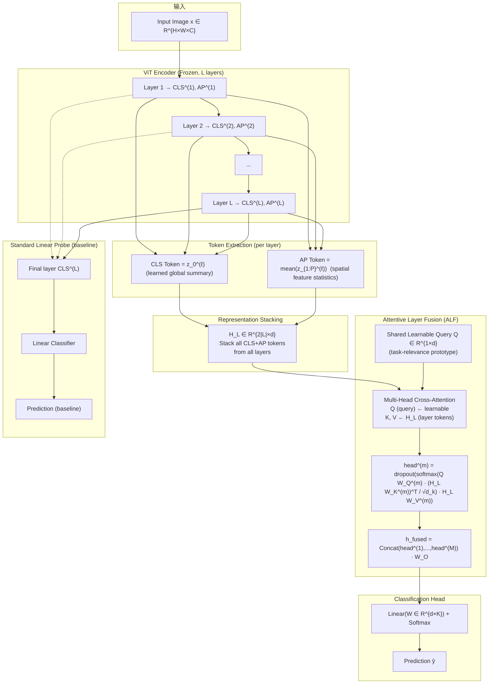

# [Arxiv 2026] Attentive Multi-Layer Fusion for Vision Transformers

> **arXiv**: 2601.09322 | **作者**: Laure Ciernik\*, Marco Morik\*, Lukas Thede, Luca Eyring, Shinichi Nakajima, Zeynep Akata, Lukas Muttenthaler (\*equal contribution)
> **发表于**: ICML 2026 (Proceedings of the 43rd International Conference on Machine Learning, Seoul, South Korea. PMLR 306, 2026)

---

## 一句话总结

提出 Attentive Layer Fusion (ALF)：用**可学习共享 query** 对 ViT 全部中间层的 CLS+AP token 做 multi-head cross-attention，动态融合层级表征。20 数据集 9 模型验证，平均 +5.54pp 超越标准 linear probe，揭示了"任务相关信息分布在网络全深度，而非仅最后一层"的关键发现。

---

## 核心贡献

1. **提出 ALF (Attentive Layer Fusion)**：将 attentive probing 从最后层 patch token 扩展到所有中间层的 CLS+AP summary token，用共享可学习 query Q 做 cross-attention，自动发现哪些层包含任务相关信息。
2. **证明任务信息分布于网络全深度**：中间层提供有价值的任务相关信息，且不同类型的任务（近预训练域 vs 远预训练域）偏好不同深度范围的表征。ALF 的 attention 权重可视化提供了可解释的分布景观。
3. **CLS+AP token 互补性**：CLS 捕获学习的全局摘要（后期层主导），AP 保留空间统计特征（广度覆盖中间层），两者互补在 20 个数据集上一致优于单独使用任一。
4. **层级融合与空间融合的正交性**：Cross-attention over layers（ALF）与 cross-attention over patches within a layer（AAT）是正交的信息聚合轴，组合使用可获得峰值性能。
5. **20 数据集 × 9 模型全面验证**：覆盖监督 ViT/DINOv2/CLIP 三家族 small/base/large，证明 ALF 在不同预训练范式下一致有效，且 gains 与任务-预训练域距离正相关。

---

## 📖 批读导航

| Section | 文件 | 要点 |
|---------|------|------|
| 摘要 | [sections/00-abstract.md](sections/00-abstract.md) | 论文摘要、ALF 定位、与 MIL 关联 |
| 引言与相关工作 | [sections/01-introduction.md](sections/01-introduction.md) | 问题背景、动机、Prob/PEFT 对比、中间层表征价值 |
| 核心方法 | [sections/02-method.md](sections/02-method.md) | ALF 架构、CLS+AP 提取、multi-head cross-attention、训练策略 |
| 实验分析 | [sections/03-experiments.md](sections/03-experiments.md) | 20 数据集结果、模型尺度/家族分析、消融、与 LoRA 对比 |
| 讨论 | [sections/04-discussion.md](sections/04-discussion.md) | Attention 模式、层级选择性、CLS vs AP 分工、局限、与 WSI MIL 关联、阅读 Q&A |

---

## 关键数字

| 指标 | 数值 |
|------|------|
| 评估数据集 | 20 (natural, specialized, structured) |
| ViT 模型 | 9 (3 families × 3 scales) |
| 平均 accuracy gain vs linear probe | +5.54pp |
| SVHN 最大单数据集 gain | +27.25pp |
| GTSRB gain | +13.47pp |
| FER2013 gain | +10.05pp |
| FGVC Aircraft gain | +6.43pp |
| Stanford Cars gain | +6.35pp |
| Diabetic Retinopathy gain | +6.86pp |
| DINOv2-L-14 平均 gain | +6.04pp |
| Country-211 gain | +4.96pp |
| EuroSAT gain | +4.37pp |
| RESISC45 gain | +5.23pp |
| STL-10 gain (近饱和) | +0.04pp |
| CIFAR-10 gain (近饱和) | +0.77pp |
| 每层提取 token 类型 | CLS + AP (2 tokens/layer) |
| Attention 复杂度 | O(\|L\|²), \|L\|≈12 (远小于 patch 级别的 O(P²), P≈200) |
| 可学习参数 | 轻量 (主导项为 d×d 投影矩阵) |
| 模型家族 | 监督 ViT, DINOv2 (自监督), CLIP (图文对齐) |
| 尺度 | Small, Base, Large (每家族 3 尺度) |
| CLIP small 模型获益最大 | 小型模型无法将所有信息压缩进最后一层 |
| DINOv2 大模型获益最大 | 更丰富的层级分布，gains 随尺度递增 |

---

## 数据流 Mermaid

---

## 优缺点与还能做什么

### 优点
- **方法简洁且有效**：仅增加一个轻量 multi-head cross-attention 模块（backbone 完全冻结），平均 +5.54pp，在 probing 方法中竞争力极强
- **发现具有普适性**：20 数据集 × 9 模型（3 家族 × 3 尺度）全部正收益，说明"利用中间层信息"不是 trick 而是基本需求
- **Attention 权重可解释**：可以直观地看到哪些层被哪些任务使用，为理解预训练模型内部表征分布提供了工具
- **层级融合与空间融合正交**：ALF（cross-attention over layers）和 AAT（cross-attention over patches）可组合叠加，两个方向独立贡献
- **计算高效**：Attention 复杂度 O(|L|²)，|L|≈12，远低于 patch-level attention O(P²)，P≈200
- **任务自适应**：共享 query Q 作为 task prototype，学的是"这个任务需要什么类型的特征"，而非 per-input 的动态权重

### 缺点
- **CLS+AP 仅对 CLS 预训练的模型优化**：对于 MAE 等 masked image modeling 预训练（无 CLS token），需要额外处理（论文在附录讨论了 MAE 的适配）
- **参数多于 linear probe**：增加 O(M·d²) 参数（M 个 attention head 的 Q/K/V 投影 + output 投影），可能带来过拟合风险（a 注意力 dropout 和 weight decay 缓解）
- **AP pooling 丢失空间细节**：AP 是对 patch token 的空间平均，对于需要精细定位的 fine-grained 任务（如 GTSRB 交通标志细节），AAT (patch-level attention) 可以更好，ALF 的空间归纳偏置偏弱
- **仅 probing，不调 backbone**：与 LoRA/Adapter 等 PEFT 方法不同，ALF 不修改 backbone 表征本身，可能仍不如 fine-tuning（但训练成本低得多）
- **数据集近饱和时 gains 小**：STL-10 (+0.04pp) 和 CIFAR-10 (+0.77pp) 几乎无提升，说明 ALF 的价值在"预训练域与下游任务差距大"时才凸显

### 还能做什么 (与 topic "ckmil-re-attn-mil" 的关联)
- **MIL 中的层间融合**：WSI MIL 通常用 frozen ViT 提取 patch embedding（单层），ALF 的核心思路——"不同深度包含互补的任务信息"——可直接移植到 WSI 场景：对每个 patch 提取多层 CLS/AP，在 MIL aggregator 之前做跨层融合，或在 bag-level 做 layer-wise attention
- **重注意力 (re-attention) 视角**：ALF 的 cross-attention over layers 可以看作一种重新配置注意力——不是让模型重新关注 patch，而是让模型重新关注"哪些深度的表征"。这与 re-attention MIL 的核心精神一致
- **关键实例筛选 (CK-MIL)**：ALF 的 shared query Q 是一个 task prototype，与 MIL 中的 gated attention 机制结构相似——两者都是用可学习 query 对一组 representations 做注意力聚合
- **与 ReadySlide 的关联**：ReadySlide 压缩 patch 后再过 FM，压缩后的表征质量可能与"哪些层的编码被破坏"有关。ALF 的发现（不同任务偏好不同深度）暗示：压缩对下游任务的影响可能取决于任务偏好的层是否被压缩破坏

---

## 阅读 Q&A

**Q1: 为什么 ALF 能超越 standard linear probing？**

两个层面：(1) 信息源扩展——standard linear probe 只看最后一层 CLS，ALF 看所有层的 CLS+AP；(2) 选择性融合——共享 query Q 作为任务原型，自动给相关层高权重、不相关层低权重。两者缺一不可。

**Q2: ALF 什么时候帮助最大？什么时候帮助最小？**

帮助最大：任务与预训练域差距大（领域专用数据集如 EuroSAT +4.37pp、Diabetic Retinopathy +6.86pp，细粒度任务如 SVHN +27.25pp）。帮助最小：任务接近预训练域（STL-10 +0.04pp, CIFAR-10 +0.77pp），因为预训练模型已把所需信息压缩到 CLS token。

**Q3: 为什么 linear concatenation 不稳定而 attention 稳定？**

Linear concatenation 两个问题：维度爆炸（拼接所有层 → 2|L|×d 维，数据集小时容易过拟合）、等权假设（不相关层的噪声直接进入分类器）。ALF 的 attention 通过 soft selection 自动"关闭"不相关层，同时 fused representation 维度固定为 d，分类器参数量恒定。

**Q4: CLS 和 AP token 各自扮演什么角色？**

CLS 是"模型自己觉得重要的全局信息"（后期层质量高），AP 是"空间上的平均特征统计量"（不依赖 attention quality，早期层可靠）。两者互补：早期层 AP > CLS，后期层 CLS > AP。ALF 的 attention 自动学会了这种分工。

**Q5: 层级融合和空间融合是什么关系？**

它们是正交的两个聚合维度——层级融合 (ALF) 沿深度轴聚合不同类型特征，空间融合 (AAT) 沿空间轴聚合不同位置特征。两者可叠加使用。对于 fine-grained spatial 任务 AAT 可能更好，对于大多数任务 ALF 更稳健且更高效。

**Q6: ALF 与 LoRA 等 fine-tuning 方法的关系？**

定位不同：ALF 是 probing（读不改），LoRA 是 PEFT（改 backbone 表征）。性能：Full finetuning > LoRA > ALF > Linear probe。ALF 适用于需要快速适配大量任务或保持 backbone 共享的场景。

**Q7: ALF 如何随模型尺度变化？**

取决于预训练目标：CLIP 小模型 gains 大→大模型 gains 小（信息被推入 CLS）；DINOv2 gains 随尺度递增（自监督表征分布更均匀）；监督 ViT Base > Small ≈ Large。
