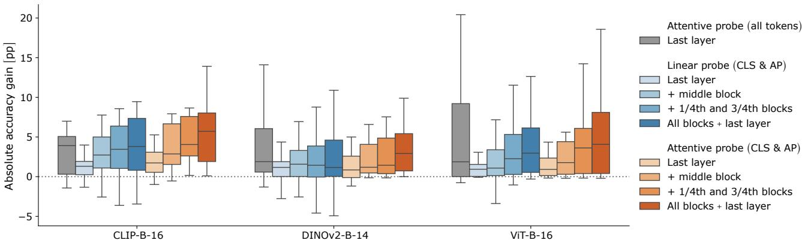
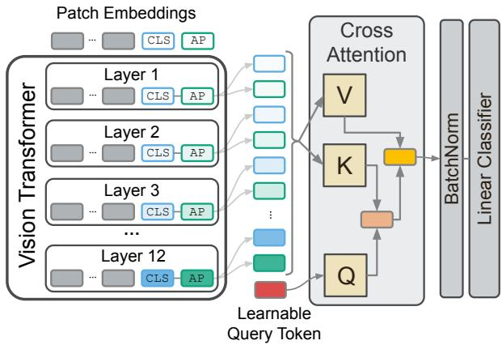

[← 返回 README](../README.md)

# 02 核心方法

> 💡 **Hao 批注 - 方法核心**: ALF 的本质是"用 attention 在一个 frozen ViT 的所有中间层表征上做 soft selection"。关键创新不在架构复杂度，而在三个设计选择：(1) 用 cross-attention 而非 concatenation（避免维度爆炸和噪声）；(2) 用 shared learnable query Q（任务级原型而非 per-input 动态权重）；(3) CLS+AP 双 token（捕获 global summary 和 spatial statistics）。

> 💡 **Hao 批注 - 与 MIL gated attention 的类比**: ALF 的 shared query Q → cross-attention over layer tokens → fused representation → classification，这个管道与 ABMIL 的 gated attention 高度相似。区别在于：MIL 的 instances 是 per-patch 的表征（N 个 instance/bag），ALF 的 instances 是 per-layer 的 summary tokens（2|L| 个 token/image）。两者都是用 attention 从一组可变数量的表征中聚合出任务最优的 summary。

---

## 3. Method: Attentive Layer Fusion (ALF)

### 3.1 Problem Formulation

Consider a ViT encoder with L attention layers processing an input image x ∈ R^{H×W×C}. At each layer ℓ ∈ {1, ..., L}, the transformer produces a sequence of patch tokens z_{1:P}^(ℓ) ∈ R^{P×d} and a CLS token z_0^(ℓ) ∈ R^d.

**Token Extraction.** To capture both global and spatial information at each layer ℓ, we extract two complementary representations:

```
h_CLS^(ℓ) = z_0^(ℓ)           # CLS token: learned global summary
h_AP^(ℓ)  = (1/P) Σ_i z_i^(ℓ) # AP token: spatial feature statistics
```

> 💡 **Hao 批注 - 为什么是 CLS+AP**: CLS 通过 self-attention 聚合了全局上下文，是"模型认为重要的全局信息"。但 CLS 受预训练目标驱动——如果下游任务与预训练域差距大，CLS 提取的信息可能不相关。AP 是简单的空间平均——更"民主"但缺乏选择性。两者互补：CLS 擅长后期语义层，AP 擅长早期空间层。

**Representation Stacking.** Given a subset of layers L = {ℓ_1, ..., ℓ_|L|} ⊆ {1, ..., L}:

```
H_L = [h_CLS^(ℓ_1), h_AP^(ℓ_1), ..., h_CLS^(ℓ_|L|), h_AP^(ℓ_|L|)]^T ∈ R^{2|L|×d}
```

The goal is to learn an attention-based fusion function f_θ: R^{2|L|×d} → R^d, producing a single fused representation for classification via a linear layer.

### 3.2 Multi-Head Cross-Attention Design

> 💡 **Hao 批注 - 为什么 cross-attention 而非 self-attention**: Self-attention 让 tokens 互相 attend（包括 Q from tokens themselves），cross-attention 用外部 query attend to tokens。ALF 选 cross-attention 是因为：(1) query 是"任务想找什么"，tokens 是"各层有什么"，语义上 cross-attention 更匹配；(2) shared query 参数少（d 维 vs |L|×d 维）；(3) 外部的 query 是 task-specific prototype，不随输入改变。

ALF employs a multi-head cross-attention mechanism where the CLS and AP tokens from intermediate layers serve as keys (K) and values (V), while a set of **trainable query tokens Q** attends to them:

**Cross-Attention Architecture.** For each head m ∈ {1, ..., M}, we introduce trainable projection matrices W_key^(m), W_val^(m) ∈ R^{d×d_k} and a shared learnable query Q ∈ R^{1×d}:

```
K^(m) = H_L · W_key^(m)        # Keys: projected layer tokens
V^(m) = H_L · W_val^(m)        # Values: projected layer tokens
Q^(m) = Q · W_query^(m)        # Query: shared task prototype
```

> 💡 **Hao 批注 - Shared query Q 的意义**: Q ∈ R^{1×d} 是唯一可学习的 query（单 token），对所有输入图像共享。这意味着 Q 学的是"这个任务需要什么类型的特征"——一个**任务级原型**。这与 per-input 的动态 query 完全不同——它是静态的 task embedding，通过 attention 权重在不同输入上选择不同的层。类比于 MIL：gated attention 的 V 向量也是任务级参数，对所有 bag 共享。

The output of each head is computed as:

```
h_head^(m) = dropout(softmax(Q^(m) · K^(m)^T / √d_k) · V^(m))
```

where attention dropout serves as regularization during training.

**Fused Representation.** The outputs of all heads are concatenated and linearly projected:

```
h_fused = Concat(h_head^(1), ..., h_head^(M)) · W_O
```

where W_O ∈ R^{M·d_k×d}. Classification for a downstream task with K classes is performed using a single linear layer with softmax activation: ŷ = softmax(h_fused · W_cls + b), where W_cls ∈ R^{d×K}.

> 💡 **Hao 批注 - 复杂度分析**: Attention 复杂度是 O(|L|²) = O((2L)²) = O(4L²) ≈ O(144) for L=12 (ViT-Base)。对比 patch-level attention (AAT) 的 O(P²) ≈ O(40000) for P=200。差了约 300 倍——这也是为什么 ALF 比 AAT 更稳定（更少参数、更小 attention 矩阵）。

### 3.3 Training and Regularization

ALF is trained on downstream task labels with the ViT backbone fully frozen. Key training details:

- **Regularization**: Attention dropout (prevent overfitting to specific layers), weight decay on ALF parameters, and standard data augmentation (random resized crop, horizontal flip, RandAugment for some datasets).
- **Optimization**: AdamW optimizer with cosine learning rate schedule.
- **Early stopping**: Based on validation accuracy, preventing overfitting on small datasets.
- **Layer selection**: All L layers are used by default. Layer subset experiments show that including all layers is generally best, with diminishing but positive returns from adding more layers.

> 💡 **Hao 批注 - Regularization 的重要性**: 这也是一个重要的工程 insight——ALF 比 linear probe 参数多，过拟合风险更大。Pets 数据集上 naive linear concatenation 比 linear probe 还差（-2.01pp），而 ALF 依然正收益（+0.29pp），说明 attention + dropout 的组合起到了正则化作用。

### 3.4 Baseline Comparisons

ALF is compared against three probing baselines:

| Baseline | Description | Pros | Cons |
|----------|-------------|------|------|
| **Standard Linear Probe** | Linear classifier on final-layer CLS only | Simple, minimal parameters | Discards all intermediate-layer information |
| **AAT** (Chen et al., 2024) | Cross-attention over ALL patch tokens of the LAST layer | Captures fine spatial details | Higher complexity O(P²), more variance |
| **Linear Concatenation** | Concatenate CLS+AP from all layers, linear classifier | Uses all layers | Dimension explosion, overfitting, unstable |

> 💡 **Hao 批注 - Baseline 设计的精妙之处**: 三个 baseline 正好对应三个维度：(1) linear probe = 只用最后一层的信息深度；(2) AAT = 只在最后一层但用所有 patch 的信息宽度；(3) 线性拼接 = 用所有层但无选择性。ALF 是"用所有层且选择性融合"，在各维度间找到平衡。

---

## Key Images



> 💡 **Hao 批注 - Figure 2**: Linear probing (仅 final CLS) vs attentive probing (ALF) 的 accuracy 随包含层数的变化。关键发现：(1) ALF 随层数增加持续提升（diminishing returns 但始终正收益）；(2) 用所有层的 ALF vs 仅用最后一层的 ALF ≈ ALF vs linear probe 的差距的本质——不是 attention 好而是"多层信息"好。



> 💡 **Hao 批注 - 方法总览**: (Left) ViT 逐层处理并提取 CLS+AP token。(Center) Stack 构成 H_L。(Right) Shared query Q 通过 multi-head cross-attention 融合得到 h_fused，输入 linear classifier。注意 Q 是共享的——所有输入图像使用相同的 query。
