[← 返回 README](../README.md)

# 03 实验分析

> 💡 **Hao 批注 - 实验设计特色**: 这篇论文的实验设计有几个亮点：(1) 20 数据集覆盖 natural/specialized/structured 三类，远多于典型 probing 论文；(2) 9 模型覆盖 3 家族 × 3 尺度，不只是"挑最好的 backbone 报告"；(3) attention 权重可视化为分析工具而非仅报告 accuracy；(4) 与 LoRA/fine-tuning 的对比揭示了精度-效率 trade-off。

> 💡 **Hao 批注 - 可复现性**: 20 datasets + 9 models + 3 seeds 的矩阵实验是巨大的计算投入。这种全面性对于建立"这不是 cherry-picking"的信用很重要。

---

## 4. Experiments

### 4.1 Experimental Setup

**Datasets (20 total, 3 categories):**

| Category | Datasets | Characteristics |
|----------|----------|-----------------|
| **Natural Images** | CIFAR-10, CIFAR-100, STL-10, Flowers-102, Food-101, Stanford Cars, FGVC Aircraft, Pets, DTD (textures), GTSRB (traffic signs), SVHN (digits), Country-211 | Standard benchmarks, varying granularity |
| **Specialized/Domain** | EuroSAT (satellite), RESISC45 (remote sensing), Diabetic Retinopathy (medical), FER2013 (facial expressions) | Far from natural image pretraining |
| **Structured** | CLEVR (object counting), dSprites (disentanglement) | Test different cognitive abilities |

> 💡 **Hao 批注 - 数据集分类的意义**: Natural→Specialized→Structured 的距离递增，正好对应 ALF gains 的递增。这系统性地验证了"中间层信息对远预训练域任务更重要"的假设。

**Models (9 total, 3 families × 3 scales):**

| Family | Small | Base | Large |
|--------|-------|------|-------|
| **Supervised ViT** | ViT-S-16 | ViT-B-16 | ViT-L-16 |
| **DINOv2** (self-supervised) | DINOv2-S-14 | DINOv2-B-14 | DINOv2-L-14 |
| **CLIP** (image-text) | CLIP-B-32 (small equiv.) | CLIP-B-16 | CLIP-L-14 |

All backbones are frozen (no fine-tuning). ALF is trained with AdamW, cosine LR schedule, attention dropout, and weight decay.

### 4.2 Main Results

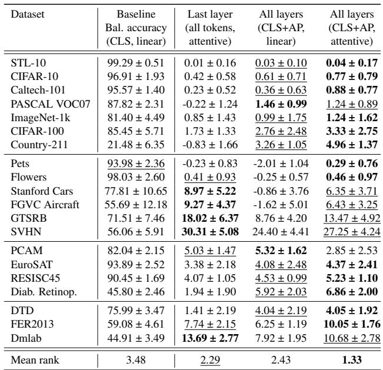

> 💡 **Hao 批注 - Table 1**: 20 datasets × 多模型 × 多方法的完整结果表。核心数字：ALF 平均 +5.54pp vs linear probe。SVHN +27.25pp 是最大单数据集 gain——SVHN 是街景数字识别，与 ImageNet 预训练域差距极大，CLS 丢弃的中间层信息（数字形状的局部特征）在 AP token 中被恢复。

**Key results by dataset category:**

| Category | Representative Gains | Interpretation |
|----------|---------------------|----------------|
| **Fine-grained** | Cars +6.35, Aircraft +6.43, GTSRB +13.47, SVHN +27.25 | ALF recovers local discriminative features lost in final CLS |
| **Domain-specialized** | EuroSAT +4.37, RESISC45 +5.23, Diabetic Ret. +6.86 | Satellite/medical tasks need structural cues from early/mid layers |
| **Facial expression** | FER2013 +10.05 | Emotion recognition relies on mid-level features not in final CLS |
| **Near-saturation** | STL-10 +0.04, CIFAR-10 +0.77 | When pretraining and task are close, final CLS already captures relevant info |

> 💡 **Hao 批注 - Gains 的阶梯分布**: Fine-grained > Domain-specialized > Near-pretraining。这个模式与"MIL 中不同 bag 构造策略的效果差异"类似——任务与预训练域的距离是性能提升量的主导因素。

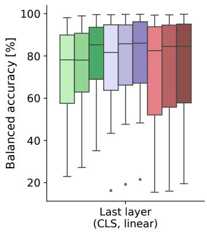

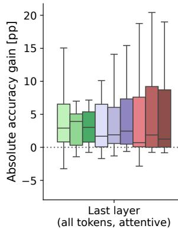

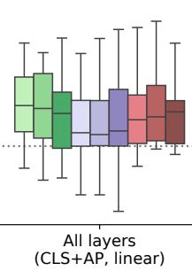

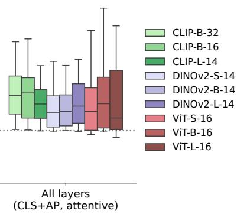

> 💡 **Hao 批注 - Figure 3**: 四个子图展示了 balanced accuracy 的分布和 gains 随模型架构的变化。关键信息：(1) ALF (attentive) 在所有架构上均优于 linear probe；(2) gains 在不同模型家族中表现不同——CLIP 小模型获益最大，DINOv2 大模型获益最大；(3) 方差（分布的 spread）在 attention 条件下明显减小。

### 4.3 Model Scale and Family Analysis

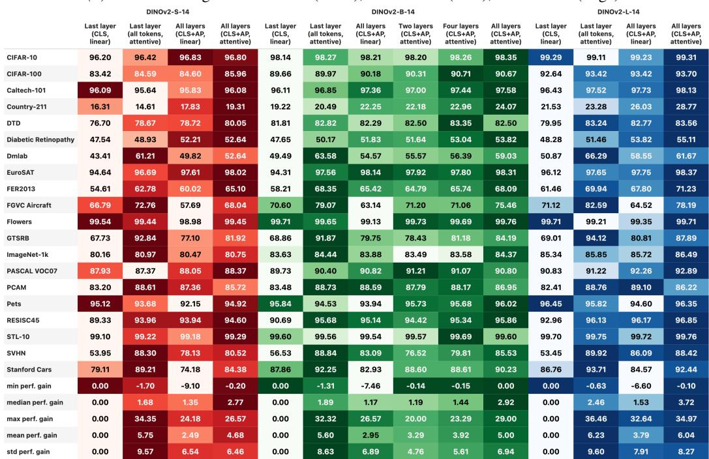

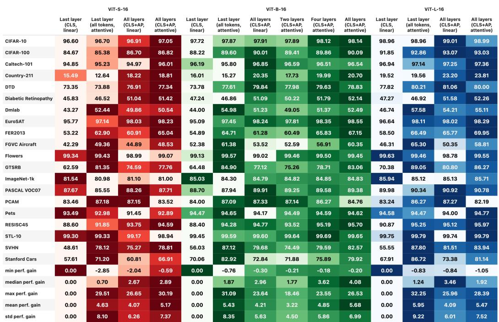

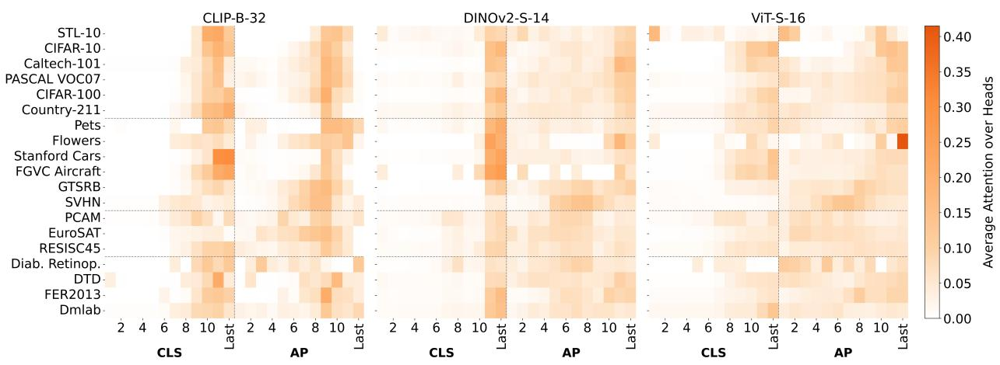

> 💡 **Hao 批注 - Figure 6**: 各模型家族和尺度的逐数据集 accuracy。三个家族的不同行为：(1) **CLIP**: 小模型 gains 最大（CLIP-B-32 small 受困于将信息压缩进 CLS），大模型 gains 递减——CLIP-L-14 的 CLS 已有足够能力编码丰富信息；(2) **DINOv2**: gains 随尺度递增——DINOv2-L-14 +6.04pp，自监督预训练产生更丰富的层级分布；(3) **监督 ViT**: Base 模型 gains 最大，ViT-S-16 的中间层信息有限（浅模型），ViT-L-16 的 CLS 已经较好。

**Key insight from model family analysis:**

| Observation | Interpretation |
|-------------|----------------|
| CLIP small benefits most, CLIP large benefits least | CLIP's contrastive objective pushes info to final layer; small models fail to compress all info → intermediate layers retain valuable signals |
| DINOv2 benefits increase with scale | Self-supervised ViTs distribute information more broadly across depth; larger DINOv2 models have richer hierarchies |
| Supervised ViT peaks at Base | Supervised training focuses on final-layer classification; Small lacks depth, Large has sufficient CLS capacity |

> 💡 **Hao 批注 - 预训练目标决定层级分布**: 这是这篇论文最有洞见的发现之一。CLIP 的对比目标迫使信息集中到最后一层（用于 image-text matching），所以小模型"压不进去"的时候中间层才有更多残余信息。DINOv2 的自监督目标不强制信息聚集，所以各层信息更均匀分布，大模型层更多→信息分布更丰富。这个分析暗示：选 ALF 还是 linear probe 应该取决于 backbone 的预训练目标。

### 4.4 Ablation Studies

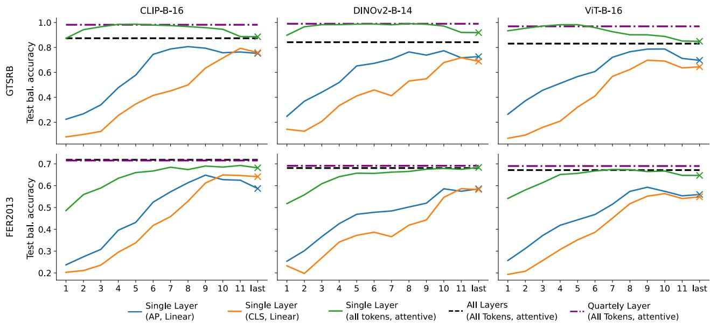

> 💡 **Hao 批注 - Figure 5**: GTSRB 和 FER2013 上逐层 probing 的性能。关键结果：某些中间层的单层 probing 性能比最后一层还好！这直接证明了"最后一层不是最优的信息源"。GTSRB 在第 8-9 层峰值，FER2013 在中间层更均匀。这意味着不同任务最优的信息深度不同。

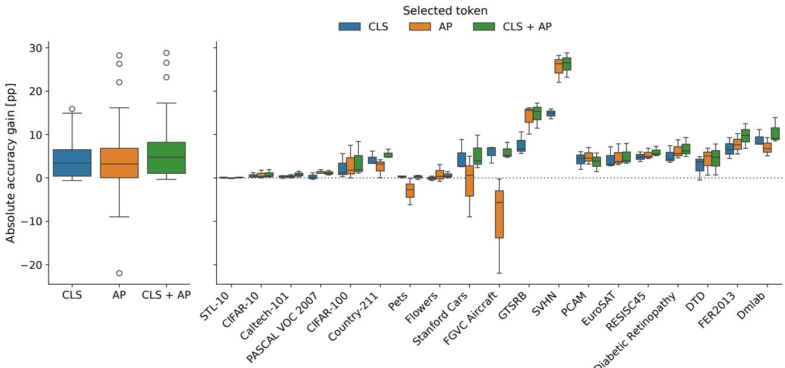

> 💡 **Hao 批注 - Figure 15**: CLS-only, AP-only, CLS+AP 三种 token 配置的 gains 分布。CLS+AP 一致优于单独使用任一 token 类型。左侧是 3 base models × 19 datasets 的分布，右侧是 per-dataset breakdown。CLS 和 AP 的互补性是稳健的。

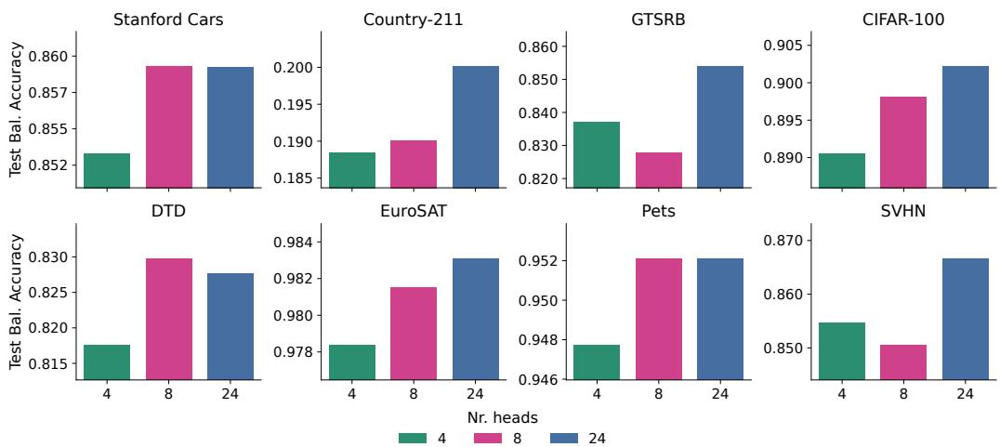

> 💡 **Hao 批注 - Figure 17**: 不同 attention head 数量对性能的影响。最佳 head 数量 ≈ 要融合的表示数量（即层数或 token 类型数）。这个结果符合直觉：每个 head 可以专门关注不同的层或 token 类型。

### 4.5 Comparison with Fine-tuning and LoRA

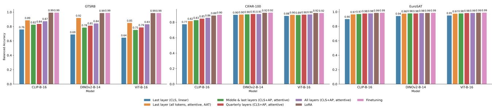

> 💡 **Hao 批注 - Figure 18**: GTSRB, CIFAR-100, EuroSAT 上 probing (linear, AAT, ALF) vs full finetuning vs LoRA 的性能对比。关键发现：(1) Full finetuning > LoRA > ALF > AAT > linear probe (性能递减)；(2) 但对某些接近预训练域的任务(CIFAR-100)，probing 方法与 LoRA 差距不大；(3) ALF 在 probing 系列中 consistently 最佳。

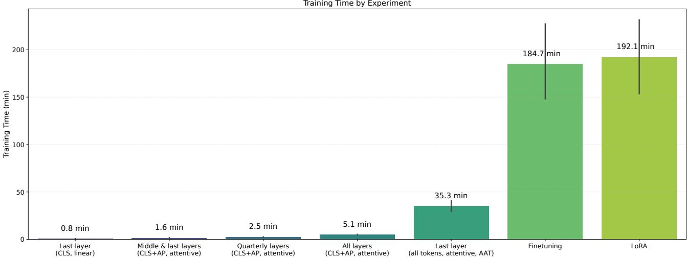

> 💡 **Hao 批注 - Figure 19**: 训练时间对比 (minutes, averaged across datasets and 3 base models)。Full finetuning >> LoRA >> ALF > AAT > Linear probe。ALF 的训练时间比 LoRA 少很多（因为 backbone 冻结，不需要反向传播通过 L 层 transformer），但比 linear probe 多（额外的 cross-attention 前向+反向）。这是一个明确的精度/效率 Pareto frontier。

### 4.6 Extension to MAE (Masked Autoencoder)

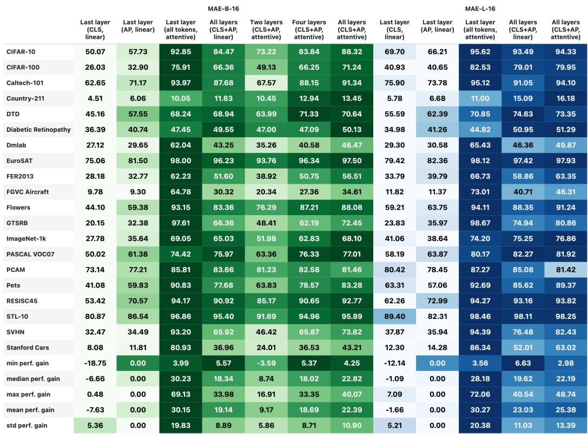

> 💡 **Hao 批注 - MAE 扩展**: MAE (Masked Autoencoder) 预训练的 ViT 没有 CLS token（因为 MAE 只用 patch token 做重建）。作者在附录中将 ALF 适配到 MAE：只使用 AP tokens（无 CLS），同时验证了 spatial attention (AAT) 与 layer fusion 的组合。MAE 的关键发现：由于信息分布在 image tokens 而非 summary token，AAT 对 MAE 尤为重要——仅用 AP tokens 的 ALF 在 MAE 上 gains 较小。

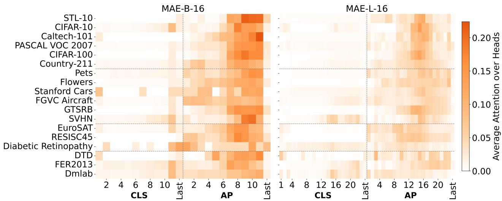

> 💡 **Hao 批注 - Figure 12**: MAE 的 attention 模式显示任务相关信息主要集中在后期层的 AP token，与 CLS-pretrained ViT 的 attention 分布不同。这强化了"预训练目标决定了信息在深度上的分布"的核心发现。

### 4.7 Comparison with Other Intermediate-Feature Methods

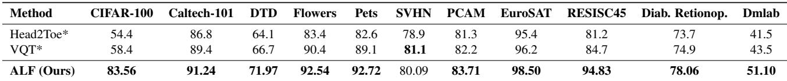

> 💡 **Hao 批注 - Table 4**: ALF 与其他利用中间特征的方法对比（Head2Toe, SSF, VPT 等），均使用 ViT-B-16 (ImageNet-1K) backbone。ALF 在 10/11 数据集上最优。这个对比的价值在于：它不仅比 linear probe 好，也比其他利用中间特征的 probing/PEFT 方法好。

---

## Key Images Summary

> 💡 **Hao 批注 - Table 1 全貌**: 按数据集、模型家族、probing 方法组织的完整结果。注意 linear concatenation 的方差大（有些数据集甚至负收益），attention 方法（ALF/AAT）的方差小且一致正收益。

> 💡 **Hao 批注 - 逐层 probing 的价值**: 这不只是消融——它是最直接的"信息分布"证据：如果某些中间层的单层 probing 已经超过最后一层，说明 CLS token 确实在丢弃有用信息。GTSRB 的中层 peak 和 SVHN 的较早层 peak 都说明了 fine-grained recognition 对中间层特征的依赖。

> 💡 **Hao 批注 - ALF 的定位**: Full finetuning > LoRA > ALF > AAT > Linear probe——这个顺序在三个数据集上一致。ALF 的定位是 probing 方法的 Pareto-optimal 点：比 linear probe 好很多（+5.54pp），比 LoRA 训练快很多（backbone 不需要梯度），在某些任务上甚至能接近 LoRA。
