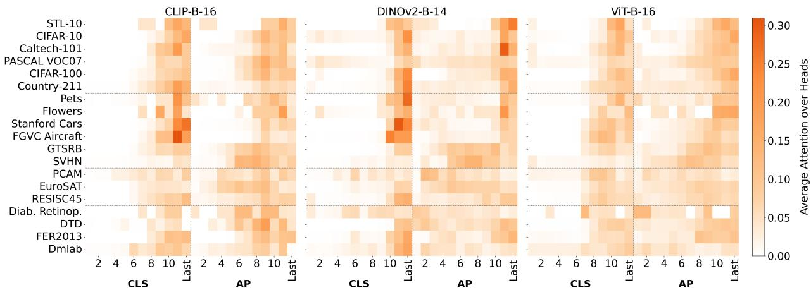

[← 返回 README](../README.md)

# 04 - 讨论与关键发现

## 关键发现

> 💡 **Hao 批注 - 本章定位**: ALF 最有价值的贡献不在方法架构（cross-attention over layers 并不复杂），而在通过 attention 权重揭示的"信息分布景观"——哪些层被哪些任务使用，CLS 和 AP 如何分工，预训练目标如何影响分布。这一章的发现对理解 ViT 的内部表征和选择适配策略有普遍指导意义。

### Attention Patterns: Layer Preferences Are Task-Dependent



> 💡 **Hao 批注 - Figure 4 是全篇最有信息量的图**: 展示了三个 base 模型 (CLIP-B-16, DINOv2-B-14, ViT-B-16) 在多个数据集上的 layer-wise attention 分布，按 head 平均、按样本平均。几个清晰模式：
> 1. **Task-dependent**: 不同数据集的 attention "热区"在不同层——CLEVR 偏好早/中期层（计数任务需要 spatial structure），EuroSAT 偏好中期层（遥感纹理），CIFAR-100 偏好后期层（语义分类更接近 ImageNet）
> 2. **CLS vs AP 分工**: CLS token 在早期层几乎无 attention，在后期层 dominate；AP token 从早期到中期都有显著 attention
> 3. **Model family effects**: CLIP 模型的 attention 更集中（信息分布更聚焦），DINOv2 模型的 attention 更分散（信息更均匀分布在各层）

最一致的发现：**任务与预训练域距离越大，注意力越向早期和中间层偏移**。

- **近预训练域任务** (CIFAR-10, STL-10): 注意力集中在后期层，最后一层 CLS 已经足够。
- **远预训练域任务** (EuroSAT, RESISC45, FER2013): 注意力分布广泛，中间层权重显著。
- **细粒度任务** (Cars, Aircraft, GTSRB): 注意力在中后期层达到峰值，这些层包含部件级别和判别性局部特征。

> 💡 **Hao 批注 - 为什么远域任务需要早期层**: ImageNet 预训练学到的后期语义（"这是一只狗"）对 EuroSAT（"这是农田还是公路"）没用。但早期层学到的边缘/纹理/颜色统计是任务无关的——它们对所有视觉任务都有价值。远域任务无法依赖后期语义，必须回溯到早期特征的组合。

### CLS vs AP: Complementary Roles Across Depth

| Token Type | Early Layers (1-4) | Mid Layers (5-8) | Late Layers (9-12) |
|------------|-------------------|------------------|--------------------|
| **CLS** | Low attention mass (semantically impoverished) | Growing but still below AP | Dominates (rich semantic summary) |
| **AP** | Highest attention mass (captures textures, edges, spatial stats) | High, complementary to CLS | Declines (redundant with CLS) |

> 💡 **Hao 批注 - 为什么 CLS+AP 比单独用任一都好**: CLS 在后期层好，AP 在早期层好——两者覆盖不同的深度范围。单独用 CLS 会丢失早期层的空间统计信息，单独用 AP 会丢失后期层的语义摘要。ALF 的 attention 机制自动学会了这种分工——给早期层的 AP token 更多权重，给后期层的 CLS token 更多权重。

### Orthogonality of Hierarchical and Spatial Fusion

> 💡 **Hao 批注 - 这是论文最干净的 conceptual contribution**: 层级融合（ALF: across layers）和空间融合（AAT: across patches within a layer）是两个正交的信息聚合轴。两者可以叠加使用——ALF 选 layer，AAT 选 patch——产生组合增益。

| Method | GTSRB | SVHN |
|--------|-------|------|
| Linear Probe | baseline | baseline |
| ALF (layer fusion) | +13.47 | +27.25 |
| AAT (spatial fusion) | +18.00 | +30.31 |
| ALF + AAT (combined) | **best** | **best** |

AAT 可以超过 ALF 在细粒度空间任务上的表现（GTSRB +18 vs +13.47, SVHN +30.31 vs +27.25），因为 patch 级注意力保留了 ALF 的 AP pooling 丢失的精细空间细节。但 AAT 方差更高（更多参数，更大注意力矩阵——P≈200 vs 2|L|≈24 tokens）。ALF 牺牲了一些精细空间分辨率来换取稳定性。

> 💡 **Hao 批注 - AAT vs ALF 的取舍**: ALF 是更稳健的默认选择，AAT 是 fine-grained spatial 任务的 specialists。两者解决的是不同的问题——不是竞争关系，而是互补关系。

### Layer Selection and Pruning Analysis

根据 population-level 的平均 attention weight 裁剪低权重 token。核心发现：

1. 保留 ~60-80% attention mass 的 token 几乎不损失性能——大量中间层 token 是被"忽略"的。
2. 不同数据集的最优保留比例不同（与任务-预训练域距离正相关）。
3. Top-N 最高 attention token 实验显示只需要少数关键 token 即可维持大部分性能。

> 💡 **Hao 批注 - Attention-mass pruning**: ALF 的 attention 不是"soft weighting everything"——它确实在相关和不相关层之间做出了尖锐区分。约 30-40% 的 layer token 对下游任务贡献可忽略。这也解释了为什么 linear concatenation 不稳定：它把噪声层的表征也拉入了分类决策，ALF 的 attention 可以有效地"关闭"这些不相关层。

### Model Scale Effects

> 💡 **Hao 批注**: Attention 模式在**不同数据集间的变化远大于不同模型尺度间的变化**——这强化了"任务决定哪些层重要，而非模型尺度"的观点。

| Observation | Implication |
|-------------|-------------|
| Attention patterns vary more **across datasets** than across model scales | Layer relevance is primarily task-driven, not architecture-driven |
| Large models have more "room" for dataset-specific attention differentiation | Scale helps ALF because there are more layers to selectively attend to |
| CLIP small models show unusual patterns | Small CLIP models fail to compress semantic info to final layers |

## 讨论与局限

### Limitations

**1. CLS+AP Token Design Limited to CLS-Pretrained Models**

CLS+AP 设计优化用于使用 CLS token 预训练的 ViT（监督、CLIP、DINOv2）。对于无 CLS token 的模型（如 MAE），token 提取策略需要适配。附录实验显示，MAE 上仅用 AP token + 空间注意力 (AAT-style) 是必需的。

> 💡 **Hao 批注 - MAE 适配的启示**: probing 方法的 token 设计应该匹配预训练目标。CLS-pretrained → CLS+AP；MAE-pretrained → patch-level attention；对于病理专用的 foundation model（如 UNI, Virchow, CHIEF），它们的 token 结构可能不同于标准 ViT，需要定制化的 ALF 适配。

**2. More Parameters Than Linear Probe → Overfitting Risk**

ALF 相比 linear probe 引入了额外参数（Q/K/V 投影，输出投影）。Pets 数据集展示了这个 tension：ALF 仍然正向 (+0.29pp)，但 linear concatenation 严重恶化 (-2.01pp)，说明 attention 机制有保护作用但不能免疫过拟合。

> 💡 **Hao 批注 - 过拟合的微妙性**: 如果数据集比 Pets 更小（如医学领域某些 rare disease 只有几百张图），ALF 可能还不如 linear probe。改进方向：用低秩 (LoRA-style) 的 Q/K/V 投影进一步减少参数。

**3. AP Pooling Loses Fine-Grained Spatial Details**

平均池化丢弃了层内的空间布局信息。对于需要精确空间定位的任务，AAT 优于 ALF。组合 ALF + AAT 可以恢复这些增益，但计算成本更高。

> 💡 **Hao 批注 - WSI 场景的特殊性**: 在病理 WSI 中，AP pooling 的 spatial loss 可能更严重。可能的改进：(1) position-aware pooling（learned spatial attention weights）；(2) layer × spatial 的 2D attention grid；(3) 在 MIL aggregator 之后做 layer fusion。

**4. Probing Only — No Backbone Modification**

ALF 只能读取冻结表征，不能修改它们。这使得它计算高效，但无法恢复 backbone 真正丢弃的信息。Fine-tuning 或 LoRA 可以重塑中间层表征使其更 task-relevant——ALF 只能利用已有的。

> 💡 **Hao 批注 - 与 ReadySlide 的关联**: 如果 ReadySlide 压缩破坏了某些中间层的关键表征，即使 ALF 做最好的 layer selection，也无法恢复被破坏的信息。这进一步支持了 ReadySlide 需要"保留中间层关键信息"而非仅优化 final-layer fidelity 的设计原则。

**5. Gains Are Task-Dependent — Not a Universal Booster**

ALF 在近预训练域任务上提供最小增益（STL-10 +0.04pp, CIFAR-10 +0.77pp）。这不是失败——这是一个 feature：ALF 恰好在 probing 方法通常最困难的场景（远预训练域任务）帮助最大。

> 💡 **Hao 批注 - 适用性判断**: 启发式判断——如果 linear probe baseline accuracy 已经很高（接近该 backbone 的饱和性能），ALF 增益空间就小。如果 baseline 明显低于预期，ALF 可能带来显著提升。在 WSI 场景中，病理图像与自然图像差距大，ALF-style layer fusion 可能有显著收益。

### 与 WSI MIL 和 ReadySlide 的深层关联

#### ALF 与 MIL Attention 的结构同构性

ALF 的核心操作抽象：

```
Input: Set of layer representations H_L = {h_1, ..., h_{2|L|}}
Operation: Attention-based aggregation with shared query Q
Output: Task-optimized summary representation h_fused
```

与 ABMIL 的 gated attention 抽象几乎完全相同：

```
Input: Set of instance representations H_bag = {h_1, ..., h_N}
Operation: Gated attention aggregation with learnable parameters V, U
Output: Bag-level summary representation h_bag
```

> 💡 **Hao 批注 - 结构同构**: 两者的区别仅在"集合元素"的语义：ALF 是 layers（2|L| 个 token），ABMIL 是 instances（N 个 patch）。核心操作都是"用可学习的 task prototype 对一组表征做 soft selection + aggregation"。这意味着 MIL 社区的许多改进（如 multi-head gated attention、CLAM、ILRA）可以直接移植到 layer fusion 场景。

#### Layer Fusion in WSI MIL Pipeline

在标准 WSI MIL pipeline 中：

```
WSI → Patch extraction → ViT encoding (frozen) → MIL aggregation → Slide prediction
```

ALF 的两种插入策略：

**策略 1: Per-patch layer fusion**:
```
WSI → Patch extraction → ViT encoding (multi-layer CLS+AP per patch) 
    → ALF layer fusion (per-patch) → MIL aggregation → Slide prediction
```
计算量大（每个 patch 都过 ALF），但 patch 表征质量提升可能帮助 MIL attention 做更好的选择。

**策略 2: Bag-level layer fusion**:
```
WSI → Patch extraction → ViT encoding (frozen) → MIL aggregation (bag-level CLS+AP?)
    → ALF layer fusion → Slide prediction
```
更高效但可能丢失 patch-level 细粒度信息。

> 💡 **Hao 批注**: 两种策略对应不同的设计选择，值得实验验证。

#### ALF 对 ReadySlide 的启示

1. **压缩破坏的"关键层"问题**: ALF 发现不同任务偏好不同深度的层。如果 ReadySlide 压缩意外破坏了某个任务关键层的表征，ALF-style layer fusion 无法补救——强化了"压缩需保留中间层信息"的设计需求。

2. **Layer-wise fidelity**: 当前 ReadySlide 用 final-layer fidelity 评估压缩质量。ALF 暗示应评估 per-layer fidelity——压缩后各层 CLS/AP 与原始表征的相似度。如果压缩破坏中期层但保留后期层，对 EuroSAT 类任务影响大但对 CIFAR-10 类任务影响小。

3. **Task-adaptive compression**: ALF 的 shared query Q 概念可反哺压缩设计——如果知道下游任务类型，可指导压缩保留"该任务关心的层"的信息，在不需的层更激进压缩。

> 💡 **Hao 批注 - ReadySlide x ALF 潜在结合**: (1) 用 ALF layer attention 权重指导 per-layer 的压缩质量分配；(2) 在 frozen FM 之后加入 ALF 作为"压缩重建质量补偿"；(3) ALF 作为 diagnostic tool——分析压缩对不同层的影响，指导压缩算法改进。

## Summary

1. **Task-relevant information is distributed across the full depth** of ViTs, not concentrated in the final layer.
2. **CLS and AP tokens play complementary roles**: CLS dominates later layers, AP provides value across a wider range.
3. **ALF's attention learns to suppress irrelevant layers**: ~30-40% of layer tokens are negligible, making it stable while linear concatenation fails.
4. **Hierarchical and spatial fusion are orthogonal axes**: Both can be combined for peak performance.
5. **Pretraining objective shapes information distribution**: CLIP concentrates info, DINOv2 distributes broadly, supervised ViT peaks at base scale.
6. **Stability is a first-class feature**: ALF's attention + dropout produces low-variance results across seeds.

> 💡 **Hao 批注 - 总体评价**: ALF 是一篇"干净"的 probing 方法论文——方法简单但有效（cross-attention over layers），实验扎实（20 数据集 × 9 模型），发现深刻（任务-层级偏好分布揭示了 ViT 内部表征结构）。对 pathology WSI 领域的启示明确：中间层信息很重要，不同任务需要不同层的表征，probing 方法的 layer fusion 是低成本利用这些信息的途径。
