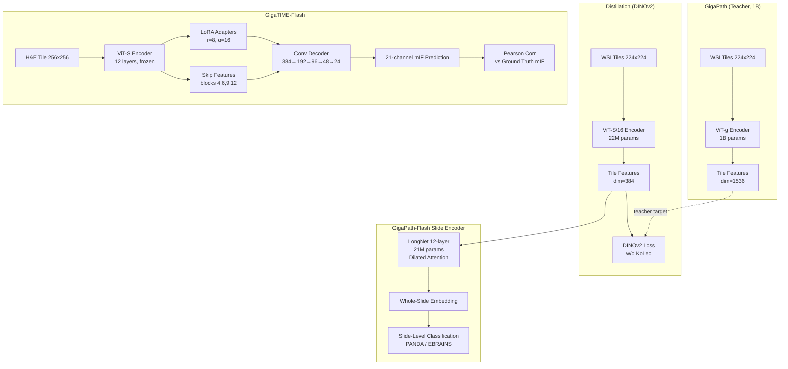

# GigaPath-Flash and GigaTIME-Flash: Efficient Pathology Foundation Models for Whole-Slide and Tumor Microenvironment Analysis

> 一句话总结：通过**知识蒸馏**将 1B 参数的 GigaPath (ViT-g) 压缩为 22M ViT-S 瓦片编码器，配合 21M LongNet 全切片编码器，GigaPath-Flash 以 **50x 更低计算量保留 97% 的全切片性能**，且以 Apache-2.0 开源；GigaTIME-Flash 将蒸馏编码器用于 H&E→多重免疫荧光预测，比原 CNN 版 GigaTIME **快 6x、显存降 8x 且精度更高**。

## 核心贡献

1. **高效瓦片编码器蒸馏**：用 DINOv2 目标将 GigaPath ViT-g (1B) 的知识蒸馏到 ViT-S (22M)，参数减少 45x，保留 97% 平均性能。
2. **端到端全切片 FM**：ViT-S 瓦片编码器 + LongNet (21M) 切片编码器联合预训练，以 290 TFLOPs/slide（GigaPath 的 1/50）完成上下文感知的全切片嵌入。
3. **GigaTIME-Flash**：将蒸馏编码器 + LoRA 微调 + 轻量卷积解码器用于 H&E→21 通道 mIF 预测，比原 CNN 版 GigaTIME 更快、更省显存且泛化更强。
4. **Apache-2.0 全开源**：与多数病理 FM 的受限许可不同，GigaPath-Flash 允许自由使用和再分发，降低病理 AI 的应用门槛。

## 📖 批读导航

```
README.md                              ← 当前文件 (总览)
sections/00-abstract.md               ← 摘要与问题背景
sections/01-introduction.md           ← 引言：病理 FM 四大痛点
sections/02-method.md                 ← 方法：蒸馏 + LongNet + GigaTIME-Flash
sections/03-experiments.md            ← 实验：全切片基准 + TME 预测 + 效率
sections/04-discussion.md             ← 局限性与结论
```

## 关键数字

| 指标 | 数值 | 说明 |
|------|------|------|
| ViT-g teacher params | 1.0B | GigaPath 原始瓦片编码器 |
| ViT-S student params | 22M | 蒸馏后（45x 压缩） |
| LongNet slide encoder | 21M | 12 层，维度 384 |
| GigaPath-Flash FLOPs/slide | 290.3 TFLOPs | 以 EBRAINS 最大切片（31,469 tiles）计 |
| vs GigaPath FLOPs | 14,367 TFLOPs | 49.5x 差距 |
| 平均性能保留率 | 97% | (0.826/0.853) PANDA+EBRAINS 均值 |
| PANDA QWK | 0.947 | 六类前列腺癌 Gleason 分级 |
| EBRAINS Bal. Acc. | 0.705 | 30 类脑肿瘤亚型分类 |
| GigaTIME-Flash FLOPs | 14.9G (vs 69.1G) | 单 tile 推理（256x256） |
| GigaTIME-Flash 吞吐 @bs128 | 1,679 tiles/s (vs 390) | A100 GPU |
| GigaTIME-Flash 显存 @bs128 | 2.16 GB (vs 16.68 GB) | ~8x 降低 |
| LoRA rank/alpha | r=8, α=16 | 仅微调 LoRA + 解码器 |
| GigaTIME-Flash 总参数 | 23.8M | 22M 编码器 + 2M 解码器 |
| 训练 epoch | 300 | BCEDice loss, Adam lr=1e-4 |
| License | Apache-2.0 | 全系列开源 |

## 数据流 Mermaid



> 💡 **Hao 批注 - 对 ReadySlide 的启示**: GigaPath-Flash 的蒸馏范式直接验证了一个关键假设——大病理 FM 的知识可以高效压缩为小模型，且性能损失可控（3%）。这对 ReadySlide 中"压缩的 WSI 特征是否保留诊断信息"的问题提供了参考：如果 22M 模型可以保留 1B 模型的 97% 能力，那么精心设计的压缩方案也应能保留大部分诊断相关特征。此外，LongNet 的 dilated attention（线性复杂度长序列建模）是 WSI 级别的上下文编码器，与 ReadySlide 中 slide-level 的 MIL 聚合器形成技术对偶。

## 优缺点

### 优点
- **极致效率**：仅 290 TFLOPs/slide（49.5x 低于 GigaPath），使大规模队列（十万级 WSI）的全切片推理在经济上可行。
- **全切片上下文**：LongNet 切片编码器在瓦片特征之上学习空间上下文，非简单 tile-level 聚合——这意味着模型"看到"了组织架构而非孤立 patch。
- **开源许可**：Apache-2.0 vs 多数病理 FM 的 NC/ND 限制，对学术和商业应用均友好。
- **双任务验证**：分类（PANDA/EBRAINS）+ 空间蛋白质组预测（mIF），证明蒸馏特征的多功能性。
- **LoRA 微调**：仅训练少量参数即可适配新任务/新模态（H&E→mIF），降低下游适配成本。

### 缺点
- **评估范围窄**：仅 2 个公开分类基准 + 单次运行，无交叉验证，无生存分析/检索/治疗响应预测等更多下游任务。
- **自定义划分**：使用非标准 train/val/test split，结果不可直接与其他论文对比。
- **五轮训练**：仅 5 epoch 的下游微调可能未充分优化某些模型（特别是大模型需要更多轮次），可能不公平地低估 baseline。
- **蒸馏细节不完整**：未详细说明 DINOv2 蒸馏中去掉 KoLeo 正则项的理论理由，蒸馏温度、数据量等关键超参数也未展开。
- **OOD 评估样本小**：Prov-TMA 每器官仅 10-20 患者，置信区间宽。
- **Pearson 相关性局限**：仅报告 8x8 窗口的 Pearson 相关，未评估细胞级准确性或临床实用性。
- **LongNet 未开源实现**：训练代码和预训练细节未完全公开（仅权重），复现困难。
- **单一硬件测试**：所有效率数据仅基于 A100，其他 GPU 上的表现未知。
- **无多模态对比**：仅与 tile-level FM 对比，未与病理-语言多模态模型（如 CONCH）对比。

## 阅读 Q&A

**Q1**: GigaPath-Flash 的 "97% 性能保留"是如何计算的？
**A1**: 取 PANDA QWK 和 EBRAINS Balanced Accuracy 的未加权平均：(0.947+0.705)/2=0.826 vs (0.965+0.741)/2=0.853, 0.826/0.853 ≈ 96.8% ≈ 97%。注意这不是严格的性能上限——它反映的是这两个特定基准和特定划分下的相对表现。

**Q2**: 为什么蒸馏时去掉了 DINOv2 的 KoLeo 正则化？
**A2**: 文章只说去掉 KoLeo 项因为它在蒸馏到小型 student 时"破坏训练稳定性"，未给出详细分析。KoLeo 正则化的作用是鼓励特征均匀分布在球面上（最大化熵），在小容量模型中可能有过度约束导致坍缩。但因为缺乏详细消融，这个选择是否普适（如蒸馏到其他尺寸）需要验证。

**Q3**: GigaTIME-Flash 为什么比 CNN 版 GigaTIME 更快但参数更多（23.8M vs 9M）？
**A3**: 关键在于 FLOPs 而非参数量。ViT 的大部分计算在低维 latent token 空间进行（16x16=256 tokens），而 UNet++ 在整个高分辨率特征图上做密集卷积。具体来说，ViT-S 的 14.9G FLOPs vs UNet++ 的 69.1G FLOPs——前者是后者的 1/4.6。此外，ViT 的大矩阵乘法在现代 GPU 上的硬件利用率远高于小卷积核的碎片化计算。

**Q4**: LongNet 切片编码器与 ABMIL 聚合器的根本区别是什么？
**A4**: LongNet 是**可学习的位置感知**编码器——它在所有瓦片特征上运行 dilated attention，使每个瓦片的表示可以被整张切片的上下文信息所调制（如远处的肿瘤区域可以影响边界瓦片特征的编码）。ABMIL 则是**无序加权池化**——它仅学习每个瓦片的注意力权重，不改变瓦片特征本身，且不建模瓦片间的空间关系。TITAN 和 PRISM 同样有 slide encoder（使用不同的架构），因此与 GigaPath-Flash 同属 "whole-slide FM" 组。

**Q5**: GigaPath-Flash 对 ReadySlide 有什么技术参考价值？
**A5**: 三点：(1) 知识蒸馏的有效性——证明了从大 FM 压缩信息是可行的，暗示 ReadySlide 的压缩也可能保留足够的诊断信息；(2) 全切片编码的价值——LongNet 的 slide-level 上下文编码比简单 tile-pooling 更好，这与 ReadySlide 的关注方向一致；(3) 开源 + 效率的平衡——Apache-2.0 许可 + 50x 效率增益，为 ReadySlide 的方法在实用层面提供了对标基线。

---

> **论文标签**: #PathologyFoundationModel #KnowledgeDistillation #WholeSlideImaging #SpatialProteomics #EfficientFM #ApacheLicense #LongNet #GigaPath
> **与 CKMIL 主题关联**: GigaPath-Flash 提供了 SOTA 的全切片特征提取 baseline，其 LongNet 的 dilated attention 与 CKMIL 的跨尺度注意力机制共享"高效建模长序列空间依赖"的技术动机，是理解病理 FM 效率-性能权衡的必读。
