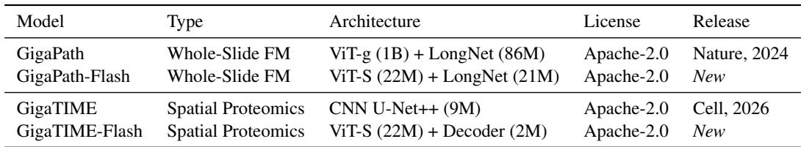

[← 返回 README](../README.md)

# 01 Introduction

> 📄 **原文**

Histopathology provides a direct view of tissue phenotype and is a central source of information across cancer biology, translational research, drug development, and patient care. A whole-slide image (WSI) captures information across multiple spatial scales, ranging from cellular morphology and local tissue composition to slide-wide tissue architecture and the organization of the tumor microenvironment. These patterns are relevant to a broad range of research and clinical applications, including tumor classification, biomarker discovery, patient stratification, prognosis, treatment-response prediction, and spatial characterization of immune states.

With the rise of foundation models as a powerful paradigm for learning transferable representations from large-scale data [1], computational pathology has increasingly embraced large-scale pretraining to capture the rich and diverse information encoded in WSIs. Over the past few years, a growing number of pathology foundation models have demonstrated strong performance across cancer types and downstream tasks, establishing large-scale pretraining as an important foundation for computational pathology.

Despite this progress, four barriers limit their broader use. First, many models are computationally expensive, a challenge amplified in whole-slide analysis because the tile encoder must be applied thousands of times per slide. Second, most are pretrained only at the tile level and therefore do not directly learn slide-wide tissue architecture or long-range spatial context. Third, many are trained primarily on public, research-curated cohorts rather than large-scale real-world diagnostic data. Finally, restrictive licenses can limit their use and adaptation in both academic and commercial research. Together, these considerations motivate efficient, slide-aware models pretrained on real-world data and released under permissive licenses.

We introduce GigaPath-Flash and GigaTIME-Flash, efficient models that address these four barriers and extend the GigaPath/GigaTIME family [2, 3] (Figure 1). GigaPath-Flash combines a 22M-parameter ViT-S tile encoder with a 21M-parameter LongNet slide encoder that together embed a whole slide using ~49.5x fewer FLOPs than the original GigaPath, both pretrained on large-scale real-world histopathology data. The tile encoder is distilled from the original GigaPath ViT-g (1B) teacher, and GigaTIME-Flash reuses this distilled encoder to predict spatial protein expression and characterize the tumor immune microenvironment directly from routine H&E images.

These models retain or improve upon the performance of original model, while being efficient in both GPU memory and inference time. GigaPath-Flash outperforms models with up to 31x more parameters on slide-level classification benchmarks while requiring 37x less compute. GigaTIME-Flash surpasses the original CNN-based GigaTIME while running approximately 6x faster and using 8x less GPU memory. Together with GigaPath and GigaTIME, these models form an open-weight, Apache 2.0-licensed family spanning tile-level representation learning, whole-slide analysis, and spatial proteomics prediction.

> 💡 **Hao 批注 - 四大障碍的具体分析**:

1. **计算昂贵**: 瓦片编码器需对每张 WSI 运行数千次。以 GigaPath ViT-g (1B) 为例，单张 WSI 的 31K tiles 推理消耗 >14K TFLOPs——A100 需约 10 分钟/张；10 万张 WSI 队列需要 ~700 GPU 天。这是真实的瓶颈而非理论担忧。
2. **仅瓦片级**: 多数模型（UNI, Hibou 等）+ ABMIL 聚合——瓦片特征是无上下文独立提取的，组织架构信息仅靠注意力权重隐含捕捉，不如显式的 slide encoder。
3. **数据偏差**: 公共数据集（TCGA 等）虽大但偏研究队列（多数为特定癌种、固定 protocol），与真实临床多样性有 gap。
4. **许可限制**: CC BY-NC-ND 4.0 禁止商业使用和再分发，对药企和诊断公司是硬障碍。这是产业界对大病理 FM 的普遍抱怨。

> 💡 **Hao 批注 - "37x less compute" 的对比**: 文中说 GigaPath-Flash 比 "models with up to 31x more parameters" 需要 37x 更少计算。这个数字来自对比 UNI2-h (参数更大但无 slide encoder) 等模型——同时参数更少（43M vs 1.3B）且性能相当或更好。但需要注意，GigaPath 本身也是 Apache-2.0，而 UNI2-h 是 CC BY-NC-ND，所以这里的对比组合了参数效率和许可优势两个维度。

> 💡 **Hao 批注 - 表1 信息**: 四个模型的完整参数和许可对比。注意 GigaTIME（原版）仅 9M 参数 (CNN UNet++) 而 GigaTIME-Flash 为 24M——参数量增加了但推理却更快（14.9G vs 69.1G FLOPs），再次说明参数效率不等于计算效率。
