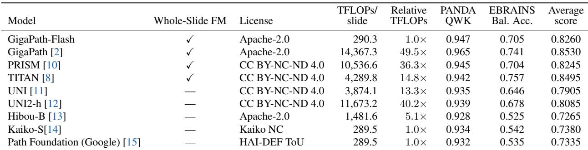

[← 返回 README](../README.md)

# 03 Experiments

## 3.1 全切片分类基准 (GigaPath-Flash)

> 📄 **原文 - 2.2 Slide-Level Benchmarks**

**Datasets & Metrics**:
- **PANDA**: H&E 前列腺穿刺活检，ISUP 分级 (0-5)，六类序数分类，**QWK** (二次加权 Cohen's Kappa)
- **EBRAINS**: 30 类脑肿瘤亚型分类，**Balanced Accuracy** (因类别不平衡)

**Protocol**:
- 20x 放大，256x256px 非重叠瓦片 (TITAN 用 512x512px，相邻瓦片拼接)
- Slide-level FM 使用各自原生 slide encoder；tile-level 模型用 ABMIL 聚合
- FLOPs: 基于最大的 EBRAINS 切片 (31,469 tiles@256px / 7,964 tiles@512px) 计算
- FLOPs 测量: PyTorch FlopCounterMode; LongNet 使用 unfused attention (公平对比)
- TensorFlow Path Foundation 的 FLOPs 从权重张量形状推导并用 PyTorch 实现验证
- 固定 train/val/test split (自定义，不可与官方 split 对比)
- 5 epoch 训练，取最后 checkpoint 评估 (无 validation-based selection)
- 单次运行 (无 seed 平均)

**Results (Table 2 & Figure 2)**:
- GigaPath-Flash: PANDA 0.947 / EBRAINS 0.705 / **Avg 0.826**
- GigaPath (1B): 0.965 / 0.741 / 0.853 (上限基线)
- 性能保留率: 0.826/0.853 = **96.8%**
- FLOPs: 290.3 vs 14,367 TFLOPs (**49.5x** 差距)
- 与 tile-only 模型对比: GigaPath-Flash > UNI (0.791, 13.3x compute), UNI2-h (0.809, 40.2x), Hibou-B (0.727, 5.1x), Kaiko-S (0.738, 1.0x), Path Foundation (0.734, 1.0x)
- TITAN (slide-level FM) 在 EBRAINS 上最高 (0.757) 但 FLOPs 为 4,290 (14.8x)

> 💡 **Hao 批注 - 图2效率-性能权衡**: 
> 横轴 TFLOPs/slide (log scale)，纵轴平均分数。圆形 = slide-level FM (GigaPath, GigaPath-Flash, PRISM, TITAN)；菱形 = tile-only + ABMIL。关键观察：
> - GigaPath-Flash 在所有 slide-level FM 中 TFLOPs 最低 (290)，但平均分仅次于 GigaPath 和 TITAN
> - TITAN 在 EBRAINS 表现最好 (0.757) 但 FLOPs 是 GigaPath-Flash 的 14.8x——如果用计算预算归一化，GigaPath-Flash 的效率优势更明显
> - 同 FLOPs 水平的 tile-only 模型 (Kaiko-S, Path Foundation ~290 TFLOPs) 的平均分低了 6-9 个百分点——slide encoder 的价值在此

> 💡 **Hao 批注 - 表2 关键对比解读**:
> - **GigaPath-Flash vs PRISM**: 平均分 0.826 vs 0.825 (平手)，但 PRISM 使用 36.3x 计算——GigaPath-Flash 的效率优势体现为"同等性能，36x 更快"
> - **GigaPath-Flash vs TITAN**: 平均分略低 0.024 (主要是 EBRAINS 差距)，但 TITAN 需要 14.8x 计算。如果用户计算预算有限且任务以 PANDA 类为主，GigaPath-Flash 更优
> - **许可对比**: GigaPath-Flash 和 GigaPath 是表中唯二的 Apache-2.0 模型——TITAN/PRISM 均为 CC BY-NC-ND 4.0

## 3.2 空间蛋白质组预测 (GigaTIME-Flash)

> 📄 **原文 - 3.2 Results**

**Datasets**:
1. **GigaTIME test set (in-distribution)**: 9,204 高质量配准 tiles (512x512)，来自 5 位 LUAD 患者的 5 种组织
2. **Prov-TMA (out-of-distribution)**: 4 个癌种 (Brain, Breast, Colon, LUSC)，每器官约 10-20 患者

**Metric**: 8x8 像素窗口 Pearson 相关系数（≈ 单细胞空间尺度），对 21 个 mIF 通道分别计算后取均值

**Results (Figure 3 & 4)**:
- GigaTIME-Flash > GigaTIME (CNN) 在所有数据集上，OOD 收益更大
- 在核/上皮/髓系/增殖/凋亡标记上提升明显
- CNN 在血管/间质/稀疏淋巴标记 (CD34, Transgelin, Actin, CD20) 上仍有竞争力

> 💡 **Hao 批注 - 图3/4 分析**: 
> - OOD 收益更大说明 ViT-S 的预训练特征比 CNN 更具泛化性——符合预期，因为 ViT-S 在 Providence 真实世界数据上蒸馏了 GigaPath 的丰富表示，而 CNN 仅训练于 LUAD 数据
> - CNN 在血管/间质标记上仍好于 ViT——这可能因为 CNN 的局部纹理 bias 更适合捕捉细线状结构（血管壁、间质纤维），ViT 的 patch-based token 化可能丢失了这种细粒度连续性
> - 这是常见的 "CNN vs ViT" 互补现象，解释了为什么一些方法同时使用两者

## 3.3 效率分析 (GigaTIME-Flash)

> 📄 **原文 - 3.3 Efficiency**

**单 tile 推理**: GigaTIME-Flash 14.9 GFLOPs vs GigaTIME 69.1 GFLOPs (~4.6x reduction)

**吞吐 @ A100 batch size 128**: GigaTIME-Flash 1,679 tiles/s vs GigaTIME 390 tiles/s (~4.3x speedup)

**显存 @ bs128**: GigaTIME-Flash 2.16 GB vs GigaTIME 16.68 GB (~7.7x reduction)

**为何更高效**: ViT 的主要计算在低维 latent token 空间 (16x16=256 tokens)，UNet++ 在高分辨率特征图上做密集卷积。现代 GPU 对大矩阵乘法 (matmul) 的硬件利用率远高于小卷积核的碎片化计算——batch size 增加时，matmul 的并行度继续提升而卷积架构迅速饱和。

> 💡 **Hao 批注 - 群体规模推理的算力账**: 单张 WSI 约含数千 tiles。以 10,000 tiles/slide 计：
> - GigaTIME 处理速度: 390 tiles/s → 25.6 s/slide → 10 万张 WSI 需要 ~29.6 GPU 天
> - GigaTIME-Flash 处理速度: 1,679 tiles/s → 6.0 s/slide → 10 万张 WSI 需要 ~6.9 GPU 天
> - 节省: ~77% GPU 时间，约 23 GPU 天 → 对于大规模队列和反复实验的学术界，这是实际可行的门槛差异
