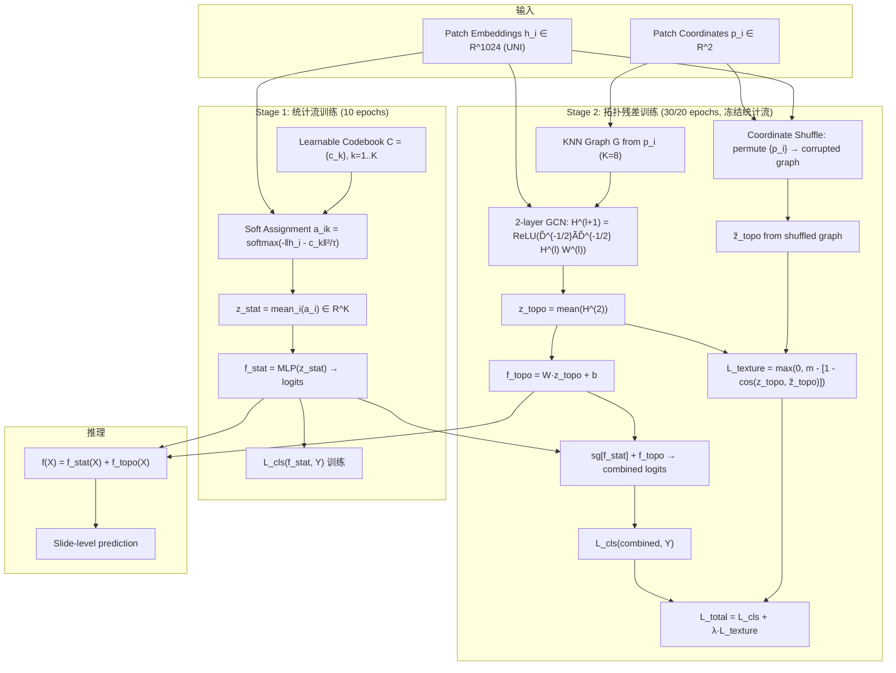

# [Arxiv 2026] Spatial Blindness in Whole-Slide Multiple Instance Learning

> **arXiv**: 2605.17449 | **作者**: Xiangyu Li, Ran Su (Tianjin University)
> **Semantic Scholar**: 获取失败 (API rate-limited)，引用数据待补充

---

## 一句话总结

提出并诊断 WSI MIL 的"空间盲"(spatial blindness)现象：具有图网络/Transformer等空间建模能力的 MIL 模型，在联合训练后实际并不利用组织拓扑结构，其预测几乎不受坐标置换影响。ResTopoMIL 通过**先学组合统计(composition)再学拓扑残差(topology residual)** 的两阶段残差训练 + 坐标打乱约束(shuffle loss)，强制让空间分支真正学习拓扑信息，在 9 个 WSI benchmark 上以 1.15M 参数取得最佳分类/生存预测/定位结果。

---

## 核心贡献

1. **定义并验证空间盲 (Spatial Blindness)**：提出 coordinate-shuffling stress test（固定 patch embedding，打乱坐标），发现 TransMIL、DS-MIL 等强 MIL baseline 在 TCGA-BRCA 上 AUC 几乎不变，说明其决策规则本质仍是 bag-of-visual-words，并未使用拓扑。
2. **受控诊断基准 Spatial-MNIST-Bag**：Dataset A (纯组合) 和 Dataset B (纯拓扑，固定 digit multiset) 干净地分离两个信号源，证明强 MIL 模型在纯拓扑任务上崩溃(AUC≈0.5)。
3. **ResTopoMIL 方法**：统计流(原型直方图)先学组合并冻结，拓扑流(浅层GCN)学残差，配合坐标打乱约束 \(\mathcal{L}_{texture}\) 强制拓扑分支不能退化为另一个纹理编码器。关键创新在于**训练策略而非架构复杂度**。
4. **9 benchmark 全面验证**：4 分类 + 5 生存预测数据集，超越 AB-MIL/CLAM/DS-MIL/TransMIL/ILRA-MIL/MHIM-MIL/2DMambaMIL 等 baseline，CAMELYON-16 定位 Dice=0.624 (vs 最佳 baseline 0.548)。

---

## 📖 批读导航

| Section | 文件 | 要点 |
|---------|------|------|
| Abstract | [sections/00-abstract.md](sections/00-abstract.md) | 空间盲定义 + ResTopoMIL 概述 |
| Introduction | [sections/01-introduction.md](sections/01-introduction.md) | 动机：病理标签依赖组织架构，但 context-aware MIL 实际不利用拓扑 |
| Method | [sections/02-method.md](sections/02-method.md) | 统计锚点(原型直方图) + 拓扑残差(GCN) + 两阶段残差训练 + shuffle loss |
| Experiments | [sections/03-experiments.md](sections/03-experiments.md) | Spatial-MNIST-Bag 诊断 + 4 分类 + 5 生存 + 消融 + 定位 |
| Discussion | [sections/04-discussion.md](sections/04-discussion.md) | 局限性(composition-dominant task未验证) + 信息论分析附录 |

---

## 关键数字

| 指标 | 数值 |
|------|------|
| WSI benchmarks | 9 (4 classification + 5 survival) |
| 参数量 | 1.15M (小于 TransMIL 2.67M, ILRA 3.68M, DGR 4.35M) |
| BRACS AUC | 0.9006 (最佳 baseline: CLAM-SB 0.8840) |
| PANDA AUC | 0.9426 (最佳 baseline: DS-MIL 0.9309) |
| TCGA-NSCLC AUC | 0.9753 (MHIM-MIL 0.9759 略高) |
| TCGA-BRCA AUC | 0.9838 (最佳 baseline: CLAM-SB 0.9814) |
| 生存 C-index | 5/5 数据集全最佳 |
| CAMELYON-16 Dice | 0.624 (最佳 baseline: MHIM-MIL 0.548) |
| CAMELYON-16 FROC | 0.5483 (最佳 baseline: TransMIL 0.4866) |
| Spatial-MNIST-Bag B (纯拓扑) AUC | 0.987 (vs TransMIL 0.532, AB-MIL 0.505) |
| Shuffle 敏感性 (BRACS ΔAUC) | -0.0656 (vs AB-MIL +0.0004, DS-MIL 0.0000) |
| 原型数 K | 32 |
| KNN degree | 8 |
| GCN 层数 | 2 |
| margin m | 0.3, λ=1.0 |
| 训练 | Stage1 10 epochs + Stage2 30/20 epochs |

---

## 数据流 Mermaid

---

## 优缺点与还能做什么

### 优点
- **问题定义清晰且可操作**：spatial blindness 有明确的 stress test (coordinate-shuffling)，不依赖主观判断
- **受控诊断基准**：Spatial-MNIST-Bag 的 Dataset A/B 设计巧妙，干净分离 composition 和 topology
- **训练策略创新而非堆架构**：两阶段残差训练 + stop-gradient + shuffle loss 三个简单设计组合解决优化偏置问题
- **实验全面**：9 benchmark + 消融(optimization/fusion/architecture/hyperparameter) + 跨 backbone (CTransPath) + 定位(CAMELYON-16)
- **理论支撑**：附录 B 用梯度范数上界和信息论解释了为什么 stop-gradient 和残差设计有效
- **参数量小**：1.15M，比多数 baseline 更轻量

### 缺点
- **两阶段训练不即插即用**：需要选择 warmup 长度和冻结时机，缺乏自适应停止规则
- **composition-dominant 任务未验证**：论文坦诚缺少一个真实 WSI 数据集用于测试"纯组合"场景下 ResTopoMIL 是否退化为统计流
- **图构建依赖坐标**：KNN graph 从物理坐标构建，对配准噪声/刚体变换的鲁棒性未经充分测试
- **GCN 仅 2 层**：可能限制了捕获长程拓扑关系的能力
- **UNI encoder 固定**：未测试 fine-tune encoder 时 spatial blindness 是否仍然存在

### 还能做什么 (与 topic "ckmil-re-attn-mil" 的关联)
- **重注意力 (re-attention) 视角**：ResTopoMIL 的统计流→拓扑流两阶段可以看作一种"重注意力"——先让组合信号被 attention 吸收，再让真正的空间注意力在残差上工作。能否显式设计 re-attention 结构来替代 stop-gradient？
- **关键实例筛选 (CK-MIL)**：原型直方图的 soft assignment 本质上是一种软聚类 + 关键实例筛选，统计流识别"哪些 phenotype 存在"，拓扑流识别"它们如何排列"。两者的信息互补关系值得深入
- **端到端 vs 两阶段**：联合训练导致 spatial blindness 的核心原因是梯度竞争，能否设计一种端到端的梯度解耦机制（如正交梯度投影）避免两阶段？
- **与 ReadySlide 的关联**：压缩方法的空间保真度问题——如果压缩破坏了拓扑信号但保留了组合信号，spatial-blind 的 MIL 模型可能察觉不到退化
