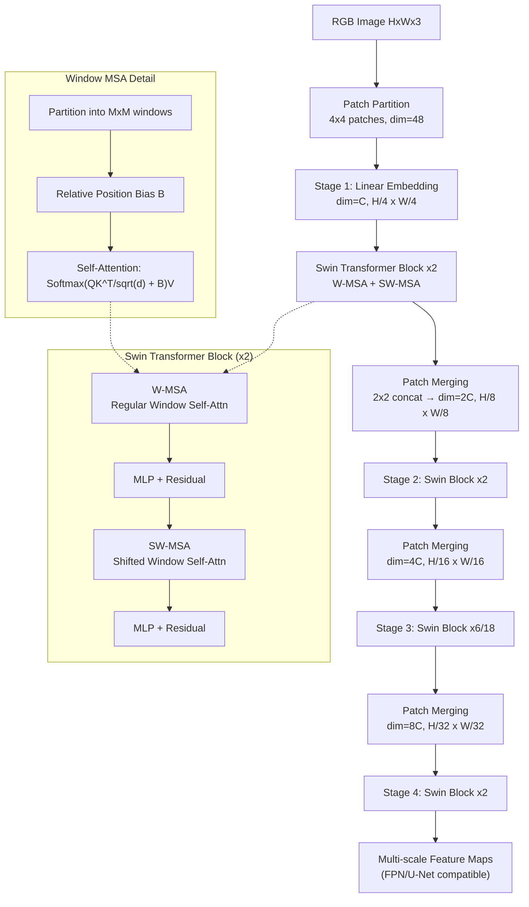

# Swin Transformer: Hierarchical Vision Transformer using Shifted Windows

> 一句话总结：通过**移位窗口自注意力和层次化特征金字塔**设计，Swin Transformer 在保持线性计算复杂度的同时赋予 ViT 多尺度建模能力，成为目标检测、语义分割等密集预测任务的通用视觉骨干，也是后续病理 MIL 方法广泛使用的位置感知层次化特征提取基础。

## 核心贡献

1. **移位窗口自注意力 (Shifted Window MSA)**：在相邻 Transformer block 之间交替使用规则窗口和偏移窗口的划分策略，实现跨窗口连接，仅引入极小的延迟开销，同时保持线性计算复杂度 O(hw)。
2. **层次化特征表示 (Hierarchical Representation)**：通过 Patch Merging 逐 stage 降采样，输出多分辨率特征图（4x/8x/16x/32x 下采样），可直接嵌入 FPN、U-Net 等密集预测架构，天然适配 WSI 的多尺度分析需求。
3. **相对位置偏置 (Relative Position Bias)**：在窗口自注意力中加入可学习的相对位置偏置矩阵 B，显著提升分类、检测、分割三项任务，且可在微调时通过双三次插值适配不同窗口尺寸。
4. **通用骨干实证**：在 ImageNet-1K 分类（87.3% top-1）、COCO 目标检测（58.7 box AP，+2.7 超越此前 SOTA）、ADE20K 语义分割（53.5 mIoU，+3.2 超越此前 SOTA）上全面超越同期的 ViT/DeiT 和 CNN 骨干。

## 📖 批读导航

```
README.md                              ← 当前文件 (总览)
sections/00-abstract.md               ← 摘要与问题动机
sections/01-introduction.md           ← 引言：CNN→Transformer 的领域差异与设计动机
sections/02-method.md                 ← 方法：层次化架构 + 移位窗口 + 高效批计算
sections/03-experiments.md            ← 实验：分类/检测/分割 + 消融
sections/04-discussion.md             ← 讨论：对 WSI/MIL 的启示与局限
```

## 关键数字

| 指标 | 数值 | 说明 |
|------|------|------|
| ImageNet-1K top-1 (Swin-L, 22K pretrain) | 87.3% | 384^2 输入 |
| COCO test-dev box AP (Swin-L, HTC++) | 58.7 | +2.7 超此前 SOTA (Copy-paste) |
| COCO test-dev mask AP (Swin-L, HTC++) | 51.1 | +2.6 超此前 SOTA (DetectoRS) |
| ADE20K val mIoU (Swin-L, 22K pretrain) | 53.5 | +3.2 超此前 SOTA (SETR) |
| Swin-T params / FLOPs | 29M / 4.5G | 类似 ResNet-50/DeiT-S |
| Swin-B params / FLOPs | 88M / 15.4G | 类似 ViT-B/DeiT-B |
| 窗口大小 M | 7 (默认) | 每窗口 49 个 patch |
| 移位窗口 vs 无移位 (ImageNet) | +1.1% top-1 | 跨窗口连接的关键收益 |
| 移位窗口 vs 无移位 (COCO) | +2.8 box AP / +2.2 mask AP | 密集预测任务收益更大 |
| 移位窗口 vs 滑动窗口延迟 | 4.1x 加速 (Swin-T) | 硬件访存友好 |
| 相对位置偏置收益 (ImageNet) | +1.2% top-1 | vs 无位置编码 |
| 复杂度 | O(hw) 线性 | vs ViT 的 O((hw)^2) 二次 |

## 数据流 Mermaid



> 💡 **Hao 批注 - WSI 视角**：Swin 的层次化设计对病理 WSI 分析意义重大：Stage 1-4 的 4x→32x 下采样天然对应 WSIs 中细胞级（~0.25μm/px）到组织区域级（~2μm/px）的多尺度语义。CKMIL 等 MIL 方法引用 Swin 正是利用其窗口注意力的位置感知性——WSI 的 patch 位置信息对诊断（如 Gleason 分级需要看腺体空间分布）至关重要，而 ViT 的全局注意力反而会丢失这种局部结构化先验。

## 优缺点

### 优点
- **线性复杂度 O(hw)**：窗口内自注意力使高分辨率图像（如 WSI 的数千 patch）可计算，这是 ViT 的二次复杂度无法支撑的。
- **层次化多尺度输出**：天然对接 FPN/U-Net 等密集预测架构，无需像 ViT 那样额外反卷积上采样，在 MIL 中可直接提取多尺度 patch 特征。
- **移位窗口机制**：以极低延迟代价（<20%）实现跨窗口信息交互，比滑动窗口快 4x，且建模能力相当。
- **相对位置偏置**：在检测和分割上显著优于绝对位置编码，表明视觉任务中平移等变性/局部归纳偏置仍有价值，这对 WSI 中组织空间关系的建模直接相关。
- **即插即用**：可直接替换 ResNet 骨干，在四种检测框架（Mask R-CNN, ATSS, RepPointsV2, Sparse RCNN）上一致提升 +3.4~4.2 box AP。

### 缺点
- **窗口大小固定**：M=7 是经验选择，对小目标（如 WSI 中的单个有丝分裂细胞）可能窗口太大导致背景噪声过多，对大面积组织区域又可能不够。
- **无全局注意力**：移位窗口提供的是局部跨窗口连接，不是真正的全局感受野，对需要全局上下文的任务（如 WSI 中远处转移的关联）可能力不从心。
- **Patch Merging 粗糙**：简单的 2x2 拼接+线性投影可能丢失细粒度空间信息（如细胞核纹理细节），在病理图像分析中这可能影响对核异型性的刻画。
- **320x320+ 输入才有收益**：小分辨率下窗口数量太少（如 224^2→56^2 patches, M=7→仅 64 窗口），移位窗口的跨窗口连接价值有限。

## 阅读 Q&A

**Q1**: Swin 的移位窗口为什么比滑动窗口快那么多（4x）？
**A1**: 因为窗口划分后同一窗口内所有 query patch 共享同一组 key/value，硬件访存模式友好（连续内存）；而滑动窗口每个像素的邻域 key 集合不同，导致频繁的随机访存。Swin 的巧思在于用"交替划分"实现了类似滑动窗口的跨位置交互，但保持了批计算效率。

**Q2**: 相对位置偏置矩阵 B 的维度为什么是 (2M-1)x(2M-1) 而不是 M^2 x M^2？
**A2**: 因为窗口内任意两个 patch 之间的相对位移在 x 和 y 轴上各自独立且范围为 [-(M-1), M-1]，每个轴只有 2M-1 种可能，所以 B 可以参数化为小型查找表 [2M-1, 2M-1]，最终 B 的值从中按坐标偏移索引取出。这比全矩阵 M^2 x M^2 节省了大量参数。

**Q3**: Swin 对 WSI MIL 的核心价值是什么？
**A3**: 三点：(1) 层次化特征使 MIL 可以在不同分辨率尺度上聚合 patch 特征（如 Cell→Tissue→Slide）；(2) 窗口注意力的局部归纳偏置保留了 patch 之间的空间关系，这对需要组织空间上下文的病理任务（如 Gleason 分级）至关重要；(3) 线性复杂度使在高分辨率 WSI（数千~数万 patch）上提取特征成为可能。

**Q4**: 为什么 Swin 在密集预测任务（检测/分割）上的相对收益远大于分类？
**A4**: 因为分类只需要一个全局表示（最后一层 pooling 后的特征向量），ViT 的全局注意力也可以做到；而检测和分割需要多尺度特征图，Swin 的层次化金字塔天然提供这一点，ViT 则需额外反卷积上采样且仍受限于二次复杂度。

**Q5**: 移位窗口的 cyclic shift + masking 技巧是如何工作的？
**A5**: 移位后窗口数量从 ceil(h/M)*ceil(w/M) 增加到 [ceil(h/M)+1]*[ceil(w/M)+1]，naive padding 会增加计算量。cyclic shift 将特征图循环左移 (M/2, M/2) 像素，使非对齐的窗口重新拼成 MxM 的规则批次，但拼接后的窗口内可能包含来自特征图远端的不相邻子窗口——这时用 attention mask 限制自注意力只在原子窗口内计算，既保持批计算效率又保证语义正确性。

---

> **论文标签**: #VisionTransformer #HierarchicalArchitecture #ShiftedWindow #GeneralPurposeBackbone #LinearComplexity
> **与 CKMIL 主题关联**: 作为层次化视觉 Transformer 标杆，Swin 的窗口注意力机制和相对位置偏置直接启发了大量病理 MIL 工作（如 CKMIL 的位置编码策略、TransMIL 的多尺度特征聚合等），是理解"MIL 中如何注入空间归纳偏置"的必读前置。
