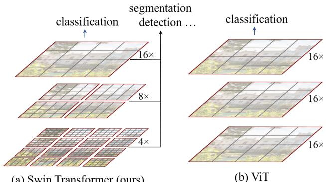

[← 返回 README](../README.md)

# 00 Abstract

> 📄 **原文**

This paper presents a new vision Transformer, called Swin Transformer, that capably serves as a general-purpose backbone for computer vision. Challenges in adapting Transformer from language to vision arise from differences between the two domains, such as large variations in the scale of visual entities and the high resolution of pixels in images compared to words in text. To address these differences, we propose a hierarchical Transformer whose representation is computed with Shifted windows. The shifted windowing scheme brings greater efficiency by limiting self-attention computation to non-overlapping local windows while also allowing for cross-window connection. This hierarchical architecture has the flexibility to model at various scales and has linear computational complexity with respect to image size. These qualities of Swin Transformer make it compatible with a broad range of vision tasks, including image classification (87.3 top-1 accuracy on ImageNet-1K) and dense prediction tasks such as object detection (58.7 box AP and 51.1 mask AP on COCO test-dev) and semantic segmentation (53.5 mIoU on ADE20K val). Its performance surpasses the previous state-of-the-art by a large margin of +2.7 box AP and +2.6 mask AP on COCO, and +3.2 mIoU on ADE20K, demonstrating the potential of Transformer-based models as vision backbones. The hierarchical design and the shifted window approach also prove beneficial for all-MLP architectures.

> 💡 **Hao 批注 - 问题定义**: Swin Transformer 要解决的核心矛盾是：NLP 中成功的 Transformer 架构在 CV 中"水土不服"——视觉实体的尺度变化巨大（从细胞到组织区域），像素分辨率远高于文本 token 数量（WSI 可达 10^5 级 patch）。标准 ViT 的全局自注意力在 WSI 场景下是计算灾难（二次复杂度）。Swin 的两大创新——层次化特征金字塔和移位窗口注意力——正好分别回应这两个挑战，使其天然适合病理全切片分析。

> 💡 **Hao 批注 - 历史定位**: 本文发表于 ICCV 2021，是 Vision Transformer 从"分类专用"走向"通用骨干"的转折点。在此之前 ViT (ICLR 2021) 和 DeiT 只在分类上有效，在检测/分割上表现不佳；Swin 首次使 Transformer 骨干在密集预测任务上显著超越 CNN。这一突破对后续病理 MIL 研究影响深远——大多数 2022-2024 的 MIL 方法都采用 Swin 或其变体作为特征提取骨干。

> 💡 **Hao 批注 - 图1解读**: 左(a) Swin 的关键设计：(1) 灰色 patch 在深层逐渐合并——层次化金字塔；(2) 红色窗口内计算自注意力——线性复杂度。右(b) ViT 的对比：(1) 全程单一低分辨率特征图；(2) 全局自注意力——二次复杂度。对 WSI 而言，(a) 的层次化结构直接对应病理诊断中 multi-scale 观察（低倍镜看架构→高倍镜看细胞），这是 ViT 做不到的。
