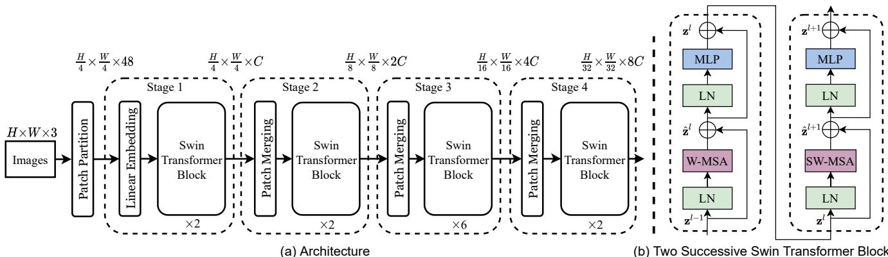
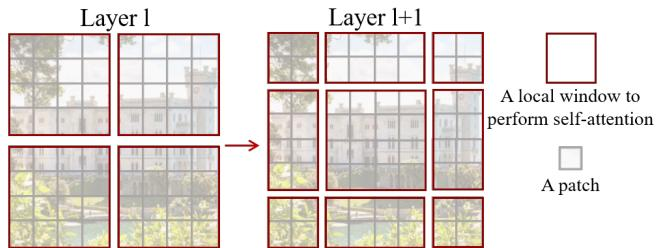
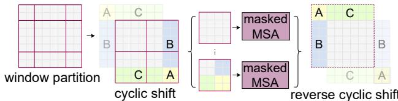
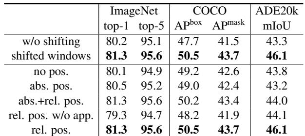

[← 返回 README](../README.md)

# 02 Method

> 📄 **原文 - 3.1 Overall Architecture**

An overview of the Swin Transformer architecture is presented in Figure 3, which illustrates the tiny version (Swin-T). It first splits an input RGB image into non-overlapping patches by a patch splitting module, like ViT. Each patch is treated as a "token" and its feature is set as a concatenation of the raw pixel RGB values. In our implementation, we use a patch size of 4x4 and thus the feature dimension of each patch is 4x4x3=48. A linear embedding layer is applied on this raw-valued feature to project it to an arbitrary dimension (denoted as C).

Several Transformer blocks with modified self-attention computation (Swin Transformer blocks) are applied on these patch tokens. The Transformer blocks maintain the number of tokens (H/4 x W/4), and together with the linear embedding are referred to as "Stage 1".

To produce a hierarchical representation, the number of tokens is reduced by patch merging layers as the network gets deeper. The first patch merging layer concatenates the features of each group of 2x2 neighboring patches, and applies a linear layer on the 4C-dimensional concatenated features. This reduces the number of tokens by a multiple of 2x2=4 (2x downsampling of resolution), and the output dimension is set to 2C. Swin Transformer blocks are applied afterwards for feature transformation, with the resolution kept at H/8 x W/8. This first block of patch merging and feature transformation is denoted as "Stage 2". The procedure is repeated twice, as "Stage 3" and "Stage 4", with output resolutions of H/16 x W/16 and H/32 x W/32, respectively. These stages jointly produce a hierarchical representation, with the same feature map resolutions as those of typical convolutional networks, e.g., VGG [52] and ResNet [30]. As a result, the proposed architecture can conveniently replace the backbone networks in existing methods for various vision tasks.

Swin Transformer block Swin Transformer is built by replacing the standard multi-head self attention (MSA) module in a Transformer block by a module based on shifted windows (described in Section 3.2), with other layers kept the same. As illustrated in Figure 3(b), a Swin Transformer block consists of a shifted window based MSA module, followed by a 2-layer MLP with GELU nonlinearity in between. A LayerNorm (LN) layer is applied before each MSA module and each MLP, and a residual connection is applied after each module.



> 💡 **Hao 批注 - Patch Merging = 层次化关键**: 这是 Swin 区别于 ViT 的核心操作。ViT 全程保持 16x16 patch 的单一分辨率，而 Swin 的 Patch Merging 将 2x2 邻域 patch 特征拼接后线性投影，实现了类似 CNN 中 pooling/stride-2 conv 的空间降采样。对 WSI 来说，这意味着：Stage 1 (H/4) 保留细粒度细胞形态信息，Stage 4 (H/32) 捕捉大范围组织架构信息——这正是病理医生"先低倍后高倍"的诊断逻辑。

> 💡 **Hao 批注 - 与 CNN 骨干的兼容性**: "same feature map resolutions as those of typical convolutional networks"——这是 Swin 能直接替换 ResNet 的技术基础。在 MIL 框架中，这意味着任何使用 ResNet 特征的方法都可以无缝切换到 Swin，获得更强的特征表示能力。

> 📄 **原文 - 3.2 Shifted Window based Self-Attention**

The standard Transformer architecture [64] and its adaptation for image classification [20] both conduct global self-attention, where the relationships between a token and all other tokens are computed. The global computation leads to quadratic complexity with respect to the number of tokens, making it unsuitable for many vision problems requiring an immense set of tokens for dense prediction or to represent a high-resolution image.

**Self-attention in non-overlapped windows** For efficient modeling, we propose to compute self-attention within local windows. The windows are arranged to evenly partition the image in a non-overlapping manner. Supposing each window contains MxM patches, the computational complexity of a global MSA module and a window based one on an image of hxw patches are:

```
Ω(MSA) = 4hwC^2 + 2(hw)^2 C         (1)
Ω(W-MSA) = 4hwC^2 + 2M^2 hw C       (2)
```

where the former is quadratic to patch number hw, and the latter is linear when M is fixed (set to 7 by default). Global self-attention computation is generally unaffordable for a large hw, while the window based self-attention is scalable.

**Shifted window partitioning in successive blocks** The window-based self-attention module lacks connections across windows, which limits its modeling power. To introduce cross-window connections while maintaining the efficient computation of non-overlapping windows, we propose a shifted window partitioning approach which alternates between two partitioning configurations in consecutive Swin Transformer blocks.

As illustrated in Figure 2, the first module uses a regular window partitioning strategy which starts from the top-left pixel, and the 8x8 feature map is evenly partitioned into 2x2 windows of size 4x4 (M=4). Then, the next module adopts a windowing configuration that is shifted from that of the preceding layer, by displacing the windows by (floor(M/2), floor(M/2)) pixels from the regularly partitioned windows.



> 💡 **Hao 批注 - 复杂度对比的关键**: 公式(1) vs (2)：全局注意力的二次项 2(hw)^2·C 被窗口注意力的 2M^2·hw·C 替代。当 M=7（固定），hw 增大时，前者呈二次增长而后者呈线性增长。以 WSI 典型场景为例：若一张 slide 有 10000 个 patch，全局自注意力的计算量是窗口注意力的 ~1428 倍（(10000^2)/(7^2*10000) ≈ 1428）。

> 💡 **Hao 批注 - 移位窗口 = 穷人的全局注意力**: 这是 Swin 最具巧思的设计。规则窗口缺乏跨窗口信息交互（每个 patch 只看到同窗口内的其他 patch），而移位操作通过交替改变窗口边界，使原本不在同一窗口的 patch 在下一层共享窗口，间接实现全局感受野的传播。对 WSI 而言，这意味着信息可以在组织区域之间逐层传递——例如腺体 A 的特征可以在层 l 影响同窗口内的腺体 B，在层 l+1（移位后）影响原本相邻窗口内的间质区域 C。

> 📄 **原文（续）**

With the shifted window partitioning approach, consecutive Swin Transformer blocks are computed as:

```
ẑ^l = W-MSA(LN(z^{l-1})) + z^{l-1}
z^l = MLP(LN(ẑ^l)) + ẑ^l
ẑ^{l+1} = SW-MSA(LN(z^l)) + z^l
z^{l+1} = MLP(LN(ẑ^{l+1})) + ẑ^{l+1}
```

where ẑ^l and z^l denote the output features of the (S)W-MSA module and the MLP module for block l, respectively; W-MSA and SW-MSA denote window based multi-head self-attention using regular and shifted window partitioning configurations, respectively.

**Efficient batch computation for shifted configuration** An issue with shifted window partitioning is that it will result in more windows, from ceil(h/M) x ceil(w/M) to (ceil(h/M)+1) x (ceil(w/M)+1) in the shifted configuration, and some of the windows will be smaller than MxM. A naive solution is to pad the smaller windows to a size of MxM and mask out the padded values when computing attention. When the number of windows in regular partitioning is small, e.g. 2x2, the increased computation with this naive solution is considerable (2x2 → 3x3, which is 2.25 times greater). Here, we propose a more efficient batch computation approach by cyclic-shifting toward the top-left direction, as illustrated in Figure 4. After this shift, a batched window may be composed of several sub-windows that are not adjacent in the feature map, so a masking mechanism is employed to limit self-attention computation to within each sub-window. With the cyclic-shift, the number of batched windows remains the same as that of regular window partitioning, and thus is also efficient.



> 💡 **Hao 批注 - Cyclic Shift 的工程巧思**: 这是实现层面的关键优化。如果不做 cyclic shift，移位后的窗口数从 2x2 变为 3x3（增加 125% 计算量），而 cyclic shift 将特征图循环平移使窗口重新对齐为规则的 MxM 批次，维持窗口数量不变。代价是需要 attention mask 来防止原本不相邻的区域之间的错误交互。这个技巧在 WSI 推理部署中同样有意义——减少不必要的计算开销。

**Relative position bias** In computing self-attention, we follow [49, 1, 32, 33] by including a relative position bias B∈R^{M^2 x M^2} to each head in computing similarity:

```
Attention(Q, K, V) = SoftMax(QK^T / √d + B) V     (4)
```

where Q,K,V∈R^{M^2 x d} are the query, key and value matrices; d is the query/key dimension, and M^2 is the number of patches in a window. Since the relative position along each axis lies in the range [-M+1, M-1], we parameterize a smaller-sized bias matrix B̂∈R^{(2M-1)x(2M-1)}, and values in B are taken from B̂.

We observe significant improvements over counterparts without this bias term or that use absolute position embedding, as shown in Table 4. Further adding absolute position embedding to the input as in [20] drops performance slightly, thus it is not adopted in our implementation.

The learnt relative position bias in pre-training can be also used to initialize a model for fine-tuning with a different window size through bi-cubic interpolation [20, 63].

> 💡 **Hao 批注 - 位置偏置与 WSI 空间信息**: 相对位置偏置是连接 Swin 与病理 MIL 的桥梁。在 WSI 中，两个 patch 之间的空间关系（如腺体 A 在腺体 B 的上方/左侧）具有诊断意义。相对位置偏置通过学习"两个 patch 在不同相对位移下的注意力调制"，隐式编码了这种空间结构先验。对 CKMIL 等方法来说，这意味着从 Swin 提取的 patch 特征已经内化了空间上下文——即使 MIL 聚合器本身是无序的，特征也已经"知道"自己来自组织的哪个相对位置。

> 📄 **原文 - 3.3 Architecture Variants**

We build our base model, called Swin-B, to have of model size and computation complexity similar to ViT-B/DeiT-B. We also introduce Swin-T, Swin-S and Swin-L, which are versions of about 0.25x, 0.5x and 2x the model size and computational complexity, respectively. Note that the complexity of Swin-T and Swin-S are similar to those of ResNet-50 (DeiT-S) and ResNet-101, respectively. The window size is set to M=7 by default. The query dimension of each head is d=32, and the expansion layer of each MLP is α=4, for all experiments. The architecture hyper-parameters of these model variants are:

- Swin-T: C=96, layer numbers = {2, 2, 6, 2}
- Swin-S: C=96, layer numbers = {2, 2, 18, 2}
- Swin-B: C=128, layer numbers = {2, 2, 18, 2}
- Swin-L: C=192, layer numbers = {2, 2, 18, 2}

where C is the channel number of the hidden layers in the first stage.



> 💡 **Hao 批注 - 变体设计的统一性**: 四个变体仅通过 C（通道数）和 Stage 3 的 block 数（6 vs 18）来缩放，且所有变体 Stage 1/2/4 的 block 数都固定为 2。这种设计极简且优雅——深层（Stage 3, H/16）承担最多的计算（6/18 层），因为这一分辨率平衡了感受野和计算量。对 WSI 应用来说，Swin-T 通常是最性价比之选：29M 参数 + 4.5G FLOPs 即可获得比 ResNet-50 更好的特征质量。
