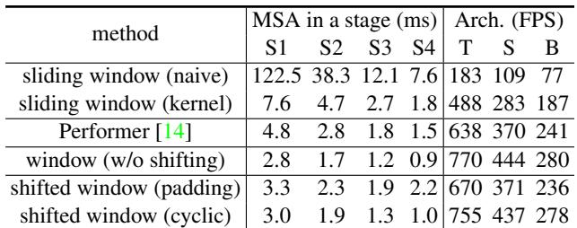
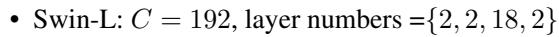
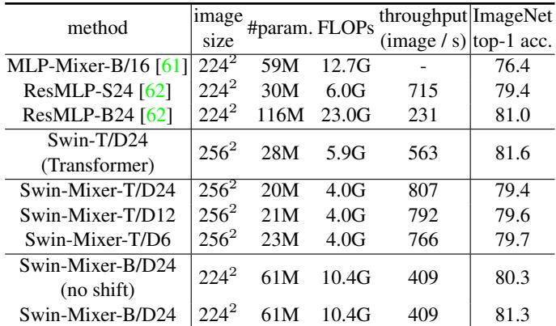
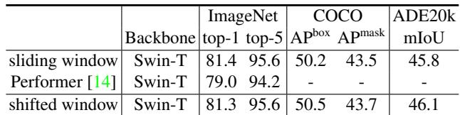
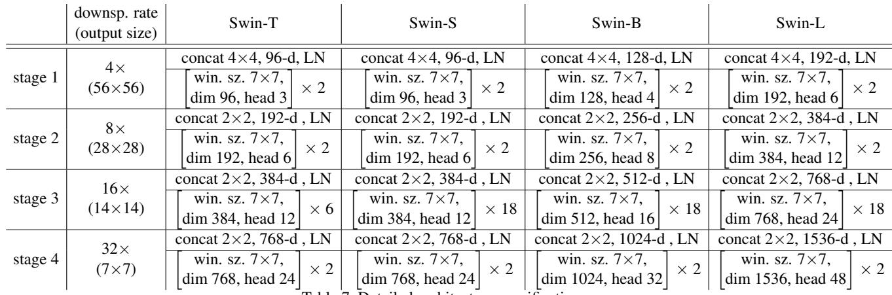
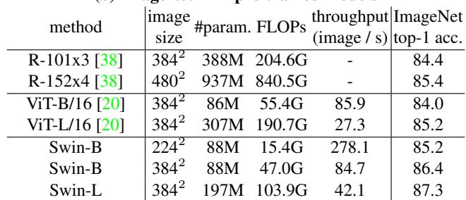
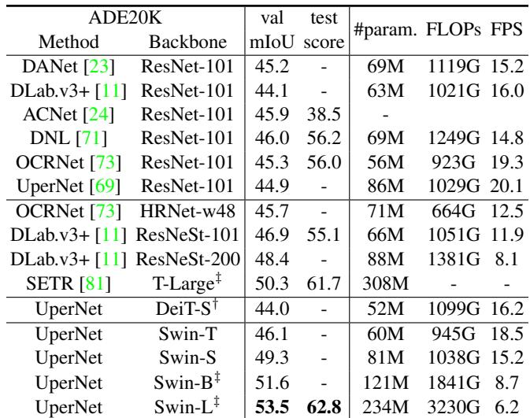

[← 返回 README](../README.md)

# 03 Experiments

> 📄 **原文 - 4.1 Image Classification on ImageNet-1K**

**Settings** For image classification, we benchmark the proposed Swin Transformer on ImageNet-1K [19], which contains 1.28M training images and 50K validation images from 1,000 classes.

- **Regular ImageNet-1K training**: AdamW optimizer, 300 epochs, cosine decay learning rate, 20 epochs warm-up, batch size 1024, initial lr 0.001, weight decay 0.05. Includes most DeiT augmentations except repeated augmentation and EMA.
- **Pre-training on ImageNet-22K**: 14.2M images, 22K classes. AdamW 90 epochs, linear decay, 5 epochs warm-up, batch size 4096, lr 0.001, weight decay 0.01. Fine-tuning: 30 epochs, batch size 1024, constant lr 10^-5, weight decay 10^-8.

**Results**: Swin-T (81.3%) beats DeiT-S (79.8%) by +1.5% at 224^2. Swin-B (84.5%) beats DeiT-B (83.1%) by +1.4% at 384^2. With ImageNet-22K pretrain: Swin-B 86.4%, Swin-L 87.3% top-1.

> 💡 **Hao 批注 - 训练细节的关键差异**: 值得注意 Swin 不需要 DeiT 的 repeated augmentation 和 EMA——这暗示 Swin 的层次化归纳偏置自带更强的训练稳定性（类似 CNN 的局部先验），而 ViT 需要更强的数据增强来补偿缺乏的归纳偏置。对 WSI 应用而言，这意味着 Swin 在小数据病理任务上可能比 ViT 更容易收敛。

> 📄 **原文 - 4.2 Object Detection on COCO**

**Settings**: COCO 2017 (118K train, 5K val, 20K test-dev). Four frameworks for ablation: Cascade Mask R-CNN, ATSS, RepPoints v2, Sparse RCNN. Multi-scale training (short side 480-800, long side ≤1333), AdamW (lr 0.0001, weight decay 0.05, batch size 16), 3x schedule (36 epochs). System-level: improved HTC++ with instaboost, stronger multi-scale training, 6x schedule (72 epochs), soft-NMS, ImageNet-22K pretrain.

**Results vs ResNe(X)t**: Swin-T brings consistent +3.4~4.2 box AP over ResNet-50 across four frameworks. Swin-B achieves 51.9 box AP / 45.0 mask AP (+3.6 box AP / +3.3 mask AP over ResNeXt101-64x4d).

**Results vs DeiT**: Swin-T +2.5 box AP / +2.3 mask AP over DeiT-S (similar model size 86M vs 80M) with higher FPS (15.3 vs 10.4). DeiT's slower speed is due to quadratic complexity.

**System-level**: Swin-L (HTC++) achieves 58.7 box AP / 51.1 mask AP on COCO test-dev (+2.7/+2.6 over previous SOTA).

> 💡 **Hao 批注 - 检测上的巨大收益**: Swin-T 在四个不同检测框架上一致提升 3.4-4.2 box AP——这说明收益来自骨干本身而非特定检测头的配合。对 WSI 中的目标检测任务（如有丝分裂检测、肿瘤区域定位），Swin 骨干应能提供类似的系统性能提升。

> 📄 **原文 - 4.3 Semantic Segmentation on ADE20K**

**Settings**: ADE20K (20K train, 2K val, 3K test), 150 categories. Base framework UperNet in mmseg. AdamW (lr 6x10^-5, weight decay 0.01, linear decay, 1500 iter warmup). 8 GPUs, 2 images/GPU, 160K iterations. Multi-scale test with [0.5-1.75]x training resolution.

**Results**: Swin-S +5.3 mIoU over DeiT-S (49.3 vs 44.0) with similar compute. Swin-L (22K pretrain) 53.5 mIoU on val (+3.2 over previous best SETR at 50.3).

> 📄 **原文 - 4.4 Ablation Study**

**Shifted windows** (Table 4): Swin-T with shifted windows vs single window partitioning: +1.1% ImageNet top-1, +2.8 box AP/+2.2 mask AP on COCO, +2.8 mIoU on ADE20K. Dense prediction tasks benefit more from cross-window connections.

**Relative position bias** (Table 4): vs no position encoding: +1.2%/+0.8% top-1, +1.3/+1.5 box AP, +2.3/+2.9 mIoU. Absolute position embedding harms detection (-0.2 AP) and segmentation (-0.6 mIoU) despite slight classification gain (+0.4%). Adding absolute + relative is worse than relative alone.

> 💡 **Hao 批注 - 消融实验的核心发现**: 两个关键结论对 WSI MIL 有直接指导意义：(1) 移位窗口在密集预测任务上收益更大（+2.8 mIoU vs +1.1% top-1）——WSI 的 patch 级特征提取本质上是密集预测的变体（每个 patch 都需要高质量的特征表示），因此移位窗口的价值可能高于直觉预期。(2) 绝对位置嵌入损害检测/分割——WSI 中 patch 的绝对坐标意义有限（切片方向、组织大小不一），相对位置关系才是稳定的诊断线索。这解释了为什么后续 MIL 工作倾向于使用相对位置编码或 Swin 的预训练特征。

**Different self-attention methods** (Table 5): Shifted window (cyclic) implementation is 13%/18%/18% faster (Swin-T/S/B) than naive padding. Compared with sliding window: 40.8x/20.2x/9.3x/7.6x faster across stages. Compared with Performer: slightly faster with +2.3% top-1 accuracy.

