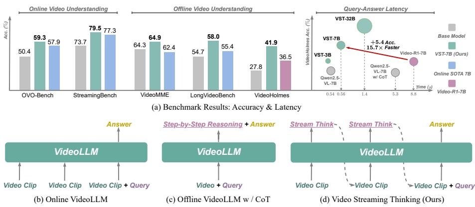

[← 返回 README](../README.md)

# 01 - Introduction

📌 **Preview**: 介绍 online video understanding 的核心挑战（时间因果性、实时性、有限上下文窗口），指出现有方法的不足（仅重感知、缺乏推理），提出 VST 的"thinking while watching"机制，并给出三项核心贡献。

---

## 1 Introduction

Online video understanding enables Video Large Language Models (VideoLLMs) to interpret streaming visual inputs and respond in real time, making it particularly valuable for embodied intelligence and interactive AI assistants [3, 7]. Unlike offline methods that benefit from post-hoc global access to the entire video [1, 22, 44], the core challenges of online video understanding lie in strict temporal causality, real-time processing, and a finite context window.

*Figure 1: Benchmark results and paradigm comparison. (a) VST-7B delivers strong performance on online and offline video understanding benchmarks while maintaining low QA latency. (b) Existing streaming VideoLLMs focus on efficient streaming processing, but lack explicit analytical reasoning. (c) VideoLLM with CoT performs heavy post-query step-by-step reasoning to improve performance, but incurs high QA latency. (d) Our Video Streaming Thinking introduces proactive pre-query reasoning, interleaving it with video consumption to achieve both strong performance and efficient responsiveness.*

> 💡 **Figure 1 批读**: 这张图是整篇论文的"一张图看懂"。四个子图展示了从传统流式方法 (b) 到 CoT 方法 (c) 再到 VST (d) 的范式演变。(a) 的雷达图展示了 VST-7B 在多个 benchmark 上全面优于 baselines，同时 QA latency 远低于 CoT 方法。核心创新在于 (d)：将推理从"查询后"(reactive) 变为"查询前"(proactive)，推理与视频消费交织进行。

Several prior methods have been proposed to address the challenges of online video understanding. As shown in Fig. 1(b), they primarily improve context-window efficiency by explicitly managing visual tokens for compression [35, 48, 51] or by retrieving from the KV cache [6, 28, 47]. However, these methods primarily focus on streaming perception and treat the management of visual features as a form of memory, with limited involvement of the LLM itself and no explicit reasoning or analytical deliberation. To fill this missing piece, one promising direction inspired by offline video understanding is to apply test-time scaling via Chain-of-Thought (CoT) to elicit stronger reasoning ability [4, 8, 11, 12, 23, 52, 58], as shown in Fig. 1(c). Nevertheless, directly performing step-by-step reasoning after the user query can significantly increase QA response latency, making it difficult to meet strict real-time requirements in online scenarios.

> 💡 **问题动机 批读**: 这段精准地定义了"missing piece"——现有流式方法（Flash-VStream, StreamForest, TimeChat-Online 等）都在做"记忆管理"（压缩/检索 visual tokens），但缺乏显式的推理过程。本质上，这些方法把流式理解当作一个被动感知问题，而作者认为它应该是一个主动推理问题。

In this paper, we introduce the **Video Streaming Thinking (VST)** to resolve the trade-off between explicit reasoning and real-time responsiveness, shifting the LLM backend from passive waiting to active, intermittent reasoning during video consumption. This design is inspired by insights from human cognition. Findings on neural coupling [16, 36] suggest that the logical flow in the brain synchronizes closely with the influx of external information, fostering the perception of current signals and their synthesis into a coherent understanding. Similarly, as illustrated in Fig. 1(d), our method continuously processes incoming video clips and produces intermediate thoughts in real time. This eliminates the need to defer heavy computation until the query arrives, which is a common limitation of offline VideoLLMs with CoT [4, 8, 40]. This *thinking while watching* mechanism maintains a coherent internal state over the stream, ensuring that the final response is grounded in a deeply processed understanding of the historical context. By frontloading and amortizing the reasoning cost ahead of query arrival, VST preserves the low QA latency required in streaming scenarios.

> 💡 **机制拆解 批读**: "thinking while watching" 机制有两个关键收益：1) **Latency Amortization**：将 CoT 计算从 query 后移到 query 前，分摊到视频播放的等待间隙中；2) **Coherent State**：通过持续更新 internal state/memory，使得最终回答建立在深度理解的历史上下文之上，而非对长上下文的暴力检索。

We instantiate this paradigm with a dedicated post-training pipeline that combines supervised fine-tuning (VST-SFT) and reinforcement learning (VST-RL). Concretely, we cast streaming thinking as a multi-turn conversation, where the model incrementally writes textual thoughts to an external memory while observing incoming video clips under a constrained visual context window. In the VST-SFT stage, we align the model with the desired streaming reasoning protocol by learning from off-policy demonstrations that strictly respect temporal causality, thereby bootstrapping its basic thinking-while-watching capability. Building upon this initialization, the VST-RL stage performs end-to-end reinforcement learning with verifiable rewards, encouraging the model to make intermediate reasoning steps that improve downstream question answering under realistic online conditions.

Due to the scarcity of existing data for video streaming thinking, we develop an automated synthesis pipeline to support our training, particularly the VST-SFT stage that requires high-quality reasoning demonstrations. Specifically, we model entities and their temporal relationships within long videos as knowledge graphs. By sampling paths from these graphs to form evidence chains, we prompt an offline VideoLLM to generate complex QA pairs and their corresponding intermediate CoTs. This design enforces multi-hop reasoning across diverse visual evidence while ensuring strict alignment between the generated thoughts and the video context. Ultimately, we synthesize a large-scale dataset comprising **100K** high-quality streaming reasoning samples.

We conducted extensive evaluations across multiple online and offline video understanding benchmarks (see Fig. 1(a)). The results show that our method achieves state-of-the-art performance compared to existing online VideoLLMs, while remaining competitive on offline video understanding benchmarks. Notably, VST performs particularly well on long-form videos that require comprehensive plot comprehension and multi-step reasoning. Moreover, compared to Video-R1, our method achieves higher accuracy while significantly reducing QA latency, demonstrating that VST is a viable test-time scaling approach that meets the requirements of streaming scenarios.

In summary, our main contributions are as follows:

- We propose the **VST paradigm** to interleave active explicit CoT generation with continuous video streams, enabling amortized test-time scaling with real-time responsiveness.

- A **knowledge-graph-based data synthesis pipeline** and a dedicated **post-training recipe** (VST-SFT and VST-RL) are introduced to adapt an offline VideoLLM to streaming settings with strong streaming reasoning capabilities.

- Extensive evaluations across multiple online and offline video understanding benchmarks demonstrate **state-of-the-art performance**. In addition, compared to offline CoT VideoLLM, our method provides significantly lower QA latency.

> 💡 **贡献批读**: 三项贡献恰好对应了"想法-方法-实验"的标准三段式结构。值得注意的是，第一项贡献（VST paradigm）是概念性的架构创新；第二项是工程化的训练框架；第三项是充分的实验验证。这种递进结构使得 idea 的可信度很高。

---

## Annotations

> 💡 **Q&A 批注记录**:
> - Q: 为什么 VST 的 "thinking while watching" 必须通过训练来实现，而不能通过 prompt engineering？
> - A: 因为 streaming setting 下的因果约束（temporal causality）与 offline 模型的设计存在根本冲突。offline VideoLLM 训练时可以看到整个视频的未来帧，而 streaming 场景只能看到"过去"。仅靠 prompt 无法消除这种信息泄漏。作者通过 VST-SFT 中的 streaming attention mask 来强制因果约束，确保模型学习到真正的流式推理能力。此外，RL 阶段需要模型在 multi-turn video interaction 中自我探索，这也是仅靠 prompt 无法完成的。
>
> - Q: 为什么选 human cognition 中的 neural coupling 作为 motivation？
> - A: Neural coupling [16, 36] 发现大脑在处理自然视觉信息时，不同个体之间的皮层活动高度同步，表明人脑的信息处理与外界信息流在时间上是耦合的。作者借这个认知科学发现来论证 "thinking while watching" 的合理性——自然智能体不会等到所有信息都看完才开始思考，而是在信息流入的过程中持续推理。这为 VST 的设计提供了认知科学的理论依据。

🔖 **Summary**: VST 通过引入主动的、查询前的 CoT 推理，解决了流式视频理解中的核心权衡。这通过两阶段训练流程（SFT + RL）和基于知识图谱的数据合成 pipeline（产出 100K 样本）来实现，在在线基准测试中达到 SOTA 且 QA 延迟极低。
