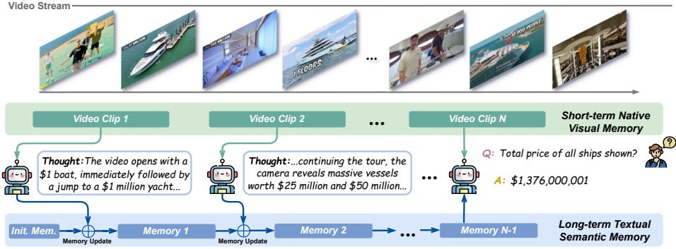
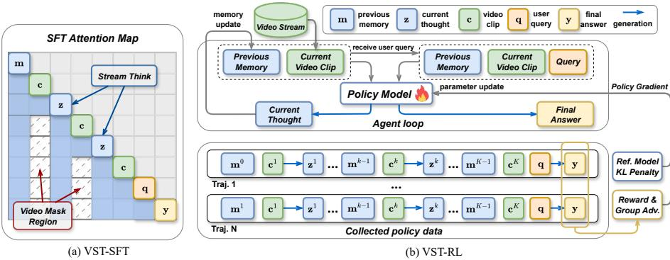
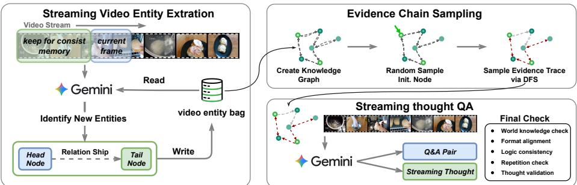

[← 返回 README](../README.md)

# 03 - Methodology

📌 **Preview**: 涵盖 VST 的三大核心技术——(1) VST 范式：多轮视频对话中的流式思考与双记忆系统；(2) 两阶段训练：VST-SFT 的因果注意力掩码 + VST-RL 的 GRPO 强化学习；(3) 基于知识图谱的数据合成 pipeline。

---

## 2 Method

*Figure 2: Illustration of the Video Streaming Thinking pipeline. The model employs a streaming thought mechanism to compress visual dynamics into a long-term textual memory. Combined with the short-term visual buffer, this enables efficient reasoning over indefinite video streams with fixed memory budgets.*

> 💡 **Figure 2 批读**: 这张图是 VST pipeline 的核心可视化。三个关键组件清晰可见：1) **Short-term Visual Buffer**：保存最近 L 帧的原始 visual tokens，提供即时的视觉感知；2) **Streaming Thought**：每个 video clip 到来时 LLM 生成的中间推理文本；3) **Long-term Textual Memory**：累积的 streaming thoughts，随 clip 推进持续更新（FIFO 淘汰）。最终回答时，模型同时基于 Long-term Memory + Short-term Buffer + 当前 clip + Query 来生成答案。这个双记忆架构（visual buffer + textual memory）是 VST 在固定 memory budget 下处理无限长视频流的关键。

### 2.1 The Video Streaming Thinking (VST) Paradigm

We formulate VST as a multi-round video conversation task operating within a constrained context window, as illustrated in Fig. 2. Unlike previous online VideoLLMs, our model leverages streaming intervals before a user query to proactively reason about the content via autoregressive textual generation. This process synthesizes key visual details and event dynamics into a dual-memory system: maintaining a short-term native video memory for the current visual context, while accumulating a long-term textual semantic memory of past events.

> 💡 **机制拆解 批读**: **Dual-Memory System 的设计逻辑**：
> - **Short-term Visual Buffer**：保存最近 L 帧的原始 visual tokens，编码当前"发生了什么"
> - **Long-term Textual Memory**：保存所有历史 streaming thoughts 的文本压缩，编码"之前发生了什么、为什么"
> - 为什么不全部用 visual memory？因为 visual tokens 太"重"（token 数量大），不适合长期保存；而文本 thoughts 是高度压缩的语义表示，token-efficient。
> - 为什么不全部用 textual memory？因为文本 thoughts 丢失了细粒度的视觉细节，需要 visual buffer 来补充当前感知。

Formally, given a video stream, let **vi** denote the visual features for the i-th frame. We accumulate these incoming features into discrete clips **ck** = {**vi**}i = τk-1+1τk, where the boundary τk is set when the accumulated visual tokens reach the preset capacity L. At each interval k, conditioned on the current clip **ck** and the accumulated memory **mk-1**, the LLM generates a streaming thought **zk** by sampling from the distribution **zk** ~ p(**z** | **ck**, **mk-1**). Here, **zk** summarizes the essential semantics of the current video segment, preserving the continuity of the overall thought process. For the long-term textual memory, we employ a memory update function **mk** = Update(**mk-1**, **zk**), which adopts a simple first-in-first-out strategy to evict the earliest memory entries.

This iterative reasoning process continues until step K, when a user query q is received. Upon this trigger, the LLM generates the final response y based on the accumulated previous thoughts and the latest visual context. Consequently, the joint probability is decomposed as:

$$
p(\mathbf{y} \mid \mathbf{q}, \mathcal{V}) = \underbrace{p(\mathbf{y} \mid \mathbf{q}, \mathbf{c}^K, \mathbf{m}^K)}_{\text{Direct Answer}} \prod_{k=1}^{K-1} \underbrace{p(\mathbf{z}^k \mid \mathbf{c}^k, \mathbf{m}^{k-1})}_{\text{Streaming Thinking}}.\tag{1}
$$

> 💡 **公式批读 (Eq.1)**: 这是 VST 的核心数学形式化。整个联合概率分解为两个部分：
> - **Streaming Thinking**（乘法连乘部分）：每一步 K-1 之前的思考都只依赖于当前 clip 和历史 memory，满足 temporal causality
> - **Direct Answer**（第一个因子）：最终回答条件于最后的 clip、完整的 memory 和用户 query
> - 这个分解的优雅之处在于：它将原本 query 后的"一口气推理"拆解为 K-1 个 query 前的"小步推理" + 最后一步直接回答。每一步的推理成本被均摊到了视频播放的整个时长中。

This formulation yields two distinct advantages:
1. It amortizes the computational cost of Chain-of-Thought (CoT) generation over the pre-query phase. This strategy effectively achieves test-time scaling to boost performance without incurring additional latency at the moment of user interaction.
2. The sequential generation of thoughts naturally aligns with the temporal causality inherent in streaming videos. This structure facilitates the adaptation of offline models to online scenarios by mirroring the progressive nature of the video stream.

### 2.2 Training Method for VST

To instantiate the VST paradigm introduced in Sec. 2.1, we develop a two-stage post-training pipeline that combines supervised fine-tuning (VST-SFT) and reinforcement learning (VST-RL), progressively endowing an offline VideoLLM with streaming thinking capabilities. The VST-SFT stage adapts the offline model to the temporal causality of streaming video, while learning reasoning capabilities from off-policy expert data. Subsequently, VST-RL transitions the model from off-policy imitation to on-policy RL, and refines these learned capabilities for further end-to-end improvement.

*Figure 3: Overview of the training pipeline. (a) VST-SFT applies a streaming attention mask to enforce temporal causality, restricting attention to the current visual buffer and history textual context. (b) VST-RL performs on-policy optimization via an agentic loop, improving the quality of streaming thoughts through verifiable rewards computed solely from the final answer.*

> 💡 **Figure 3 批读**: 两阶段训练的可视化对比：
> - **(a) VST-SFT**：核心是 **streaming attention mask**，强制模型只能看到有限大小的 visual token 滑动窗口（图中灰色方块），而语言 tokens（包括 history thoughts）完全可见。这种 mask 设计直接模拟了推理时的 visual buffer 约束，确保训练和推理一致。
> - **(b) VST-RL**：采用 **agentic loop** 进行 rollout——policy model 与流式环境交互，生成完整轨迹（streaming thoughts + final answer），然后**仅根据 final answer 的正确性**计算 reward，advantage 分配给轨迹中所有 token。这是典型的"结果导向"RL——只要最终答案对，过程中的思考就有价值。

#### Stage 1: VST-SFT

We initiate the training pipeline with SFT to instill the streaming thought mechanism into the offline VideoLLM. For a training instance, we explicitly formulate the sequence as:

$$
\mathcal{S} = \Big( \mathbf{m}^0, (\mathbf{c}^1, \mathbf{z}^1), \ldots, (\mathbf{c}^{K-1}, \mathbf{z}^{K-1}), \mathbf{c}^K, \mathbf{q}, \mathbf{y} \Big).\tag{2}
$$

Here, **m0** denotes the initial memory, and (**ck**, **zk**) represent the interleaved video clips and streaming thoughts. The sequence concludes with the final clip **cK**, user query q, and ground truth response y.

To align with the streaming inference architecture, we apply a **streaming video attention mask**. As depicted in Fig. 3(a), this mask restricts the model's attention to a fixed-size window of recent visual tokens, mirroring the short-term visual buffer used during inference. Specifically, let M be the additive attention mask. Let Iv(j) ∈ {0, 1} indicate whether the j-th token is a visual token, and let L denote the visual buffer size. Therefore, the attention mask can be written as:

$$
M_{i,j} = \begin{cases}
0, & j \leq i \text{ and } \left( \mathbb{I}_v(j) = 0 \text{ or } \sum_{t=j+1}^{i} \mathbb{I}_v(t) < L \right) \\
-\infty, & \text{otherwise}
\end{cases}\tag{3}
$$

> 💡 **公式批读 (Eq.3)**: Streaming Attention Mask 的逻辑解析：
> - 对于 visual token (Iv(j) = 1)：只有当 j 到 i 之间的 visual token 数量 < L 时才可见（即滑动窗口内）
> - 对于 text token (Iv(j) = 0)：只要满足 causal constraint (j ≤ i)，全部可见
> - 这个设计的关键在于：**文本记忆是长期无损的，但视觉记忆是短期有损的**。这反映了 VST 的核心假设——语义层面的历史理解比像素级的历史细节更重要。

In this way, the model can only access a sliding window of the latest L visual tokens, while all non-visual tokens remain fully visible under the causal constraint. Furthermore, to accommodate context length constraints while handling long-form videos, we implement a temporal segmentation strategy. The original sequence S is sliced into consecutive segments {**sn**}n=1M, defined as:

$$
\mathbf{s}_n = \begin{cases}
\Big( \mathbf{m}^{n-1}, \{(\mathbf{c}^k, \mathbf{z}^k)\}_{k=T_{n-1}+1}^{T_n} \Big), & n < M \\
\Big( \mathbf{m}^{n-1}, \{(\mathbf{c}^k, \mathbf{z}^k)\}_{k=T_{n-1}+1}^{K-1}, \mathbf{c}^K, \mathbf{q}, \mathbf{y} \Big), & n = M
\end{cases}\tag{4}
$$

where Tn denotes the cut-off index for the n-th segment. The memory state is updated recursively across segments following **mn** = Update(**mn-1**, {**zk**}k=T_{n-1}+1Tn). During SFT, we apply the standard next-token prediction loss exclusively to the streaming thoughts {**zk**}k=1K-1 and the final response **y**, treating visual tokens and historical memory as conditioning inputs.

#### Stage 2: VST-RL

Building upon the supervised foundation, we introduce VST-RL to transition the model from off-policy imitation to on-policy self-improvement. The RL training process consists of two main phases: trajectory rollout and policy gradient optimization.

As shown in the upper part of Fig. 3(b), the rollout phase operates as an agentic loop. The policy model interacts with the streaming environment to generate a trajectory τ following the predefined joint probability in Eq. (1), where the streaming thoughts **ẑk** and the final response **ŷ** are sequentially sampled from the sampling policy πθ'. After collecting a group of N trajectories {τi}i=1N, we employ a **GRPO** [12, 27, 49, 50] strategy to optimize the policy model. We compute the reward **ri** solely based on the final answer **yi** via verifiable reward functions. To encourage the model to generate useful streaming thoughts, the calculated advantage is assigned to all generated tokens within the entire trajectory τi. The policy gradient objective is calculated as:

$$
\mathcal{I}_{\mathrm{RL}}(\theta) = \mathbb{E}_{q \sim \mathcal{D}, \{\mathcal{T}_i\}_{i=1}^N \sim \pi_{\theta'}(\cdot | q)} \left[ \frac{1}{\sum_{i=1}^{N} |\mathcal{T}_i|} \sum_{i=1}^{N} \sum_{t=1}^{|\mathcal{T}_i|} \left( \mathcal{L}_{i,t}^{\mathrm{clip}}(\theta) - \beta D_{\mathrm{KL}}(\pi_{\theta} || \pi_{\mathrm{ref}}) \right) \right]\tag{5}
$$

$$
\mathcal{L}_{i,t}^{\mathrm{clip}}(\theta) = \min\left[ \gamma_t(\theta) \hat{A}_i, \mathrm{clip}\left( \gamma_t(\theta), 1 - \epsilon_{\mathrm{low}}, 1 + \epsilon_{\mathrm{high}} \right) \hat{A}_i \right].\tag{6}
$$

Where |τi| denotes the total number of generated tokens in trajectory τi, γt(θ) represents the probability ratio between πθ and the sampling policy πθ' at step t, Âi = ri - mean(R) is the group relative advantage, and εlow, εhigh are the clipping hyperparameters following DAPO [50].

> 💡 **公式批读 (Eq.5-6)**: VST-RL 的 GRPO 目标函数设计要点：
> - **Reward 仅来自 final answer**：这是一个关键设计——不显式 reward 中间思考的质量，而是让 RL 自然发现"哪些思考能帮助最终回答正确"。这避免了 reward hacking（模型可能学会写漂亮的空话而非有用的推理）。
> - **Advantage 分配给全部 token**：与标准的 token-level PPO 不同，VST-RL 将同一个 trajectory 的 advantage 分配给该轨迹中的所有 token（包括 streaming thoughts 和 final answer）。这意味着中间的思考步骤也可以获得优化信号。
> - **DAPO 的 asymmetric clipping**：使用不同的 clip 上下界（εlow ≠ εhigh），避免 GRPO 中常见的 entropy collapse 问题。
> - **KL penalty**：β DKL(πθ || πref) 约束 policy 不要偏离参考模型太远，保证训练的稳定性。

### 2.3 Data Synthesis Pipeline for VST

We generate a set of video streaming thought data to support VST training, motivated by the fact that most existing chain-of-thought (CoT) datasets target offline VideoLLMs with a global, hindsight view of the entire video, making it difficult to avoid information leakage under causal streaming constraints. To this end, we introduce an automated data generation pipeline grounded in knowledge graphs. As illustrated in Fig. 4, the pipeline produces high-quality training examples with explicit reasoning paths through streaming video entity extraction, evidence chain sampling, and streaming thought QA synthesis.

*Figure 4: Stream-Thought QA data curation pipeline. We incrementally extract video entities and relations to build a knowledge graph, sample multi-hop evidence chains, and use Gemini to generate streaming QA pairs with grounded streaming thoughts, followed by automatic filtering.*

> 💡 **Figure 4 批读**: Data pipeline 的三个阶段：
> 1. **Streaming Video Entity Extraction**：使用 PySceneDetect 分场景，滑动窗口提取 (head, relation, tail) 三元组，维护 entity bank
> 2. **Evidence Chain Sampling**：从 knowledge graph 中 DFS 采样 evidence chains，确保不同 chain 之间 entity 重叠 < 10%
> 3. **Stream Thought QA Synthesis**：基于 sampled evidence chain，Gemini 生成 intermediate CoT + QA pair，经过 5 重过滤（world-knowledge check, format alignment, logical consistency, repetition check, thought validation）
>
> **关键设计**：knowledge graph 的构建是"流式"的（随着 clip 推进逐步添加实体和关系），这保证了生成的 QA 严格满足 temporal causality——QA 中涉及的信息不会"穿越"。

#### Streaming Video Entity Extraction

To build a temporally consistent knowledge graph, we maintain an entity bank and extract triples from a sliding window over the video stream. We segment the video into N scene clips with PySceneDetect. For each incoming clip, an offline VideoLLM (e.g., Gemini 3.0 flash) updates the entity bank by adding newly observed entities and relations as (head, relation, tail). When the window exceeds size W, we drop the oldest clip and retain the most recent W-1 overlapping clips to preserve temporal continuity. The entity bank thus serves as a lightweight memory for consistent entity tracking and timeline-aligned graph construction.

#### Evidence Chain Sampling

After processing the whole video, the complete entity bank is refined using an LLM to filter out noise entities, such as duplicates and subtitles. Subsequently, NetworkX [13] is used to construct the knowledge graph, which represents the logical relationships between events in the video. To mine long-term causal dependencies, an initial node is randomly selected, and a depth-first search (DFS) is used to extract evidence chains. Each node in these chains contains detailed information about the head and tail entities, their relationship, timestamps, and scene descriptions, facilitating comprehensive reasoning over the video content. For each video, we sample multiple evidence chains, enforcing that the entity overlap between any two chains is below 10% to promote diversity.

#### Stream Thought QA Synthesis

The final phase leverages Gemini 3.0 flash as a data synthesizer. Conditioned on the video knowledge graph, the model first generates a streaming CoT rationale to actively reason over video events and dynamic content. Subsequently, aligned with a sampled evidence chain {**zk**}k=1K, it synthesizes a query q and the final answer y, necessitating multi-evidence reasoning that integrates the CoT with visual context. To ensure data fidelity, we apply a strict post-generation filtering rubric, including: world-knowledge check, format alignment, logical consistency, repetition check, and thought validation.

#### Curation of VST Training Set

Following the above procedure, we generate **100K** streaming-thought examples with videos from LLaVA-Vid [56] and Video-Marathon [25]. In addition, our full supervised fine-tuning corpus for VST-SFT includes 50K open-ended QA instances randomly sampled from LLaVA-Vid. For VST-RL, we train on 11K sampled questions, including multiple-choice questions from LLaVA-Vid, Video-Marathon, and Onethinker [9], as well as counting questions from RepCount [17].

> 💡 **数据规模批读**: VST 训练数据的构成：
> - VST-SFT: 100K streaming-thought examples + 50K LLaVA-Vid QA = **150K total**
> - VST-RL: **11K** questions（多种来源混合，确保多样性）
> - 对比 Video-R1：Video-R1 约使用 15K RL 训练样本，VST 的 RL 数据规模类似，但前序 SFT 阶段有更丰富的 reasoning 先验。

---

## Annotations

> 💡 **消融前置解读 批读**: VST-SFT 和 VST-RL 的分工（从后续消融实验可知）：
> - **VST-SFT 主要负责 Backward Memory**（历史信息的回溯检索能力），因为 SFT 阶段学习的主要是"何时写什么到 memory"
> - **VST-RL 主要负责 Forward Prediction**（基于历史的预测能力），因为 RL 的 reward 信号鼓励模型做出对未来问答有帮助的推理
> - 两者结合实现互补，达到最优的 online 理解性能。

> 💡 **Q&A 批注记录**:
> - Q: VST-SFT 中的 streaming attention mask 和推理时有什么差异？
> - A: 完全一致。训练时的 visual buffer size L 与推理时相同（均为 8,192 visual tokens）。这是 VST 设计的关键原则——训练和推理的 attention pattern 必须严格对齐，否则会出现 train-test mismatch。具体而言，Eq.(3) 中的 L 参数在训练和推理时保持不变。
>
> - Q: 为什么 VST-RL 不直接 reward 中间 streaming thoughts 的质量？
> - A: 这是一个重要的设计选择。主要原因是：1) 中间 thoughts 的质量难以自动评估（不像最终答案有 ground truth）；2) 如果 reward 中间 thoughts，模型可能学会生成"看起来好但实际无用"的推理文本（reward hacking）；3) 通过将 advantage 分配给所有 token 但 reward 仅基于 final answer，RL 天然会学习到"对最终答案有帮助的思考模式"，这比人工设计中间 reward 更可靠。
>
> - Q: 为什么 data synthesis 要使用 knowledge graph 而非直接让 LLM 看视频生成 QA？
> - A: 如果让 Gemini 直接看整段视频再生成 QA 和 CoT，生成的 CoT 可能隐含 future information leakage（例如在时间点 t 的 thinking 中提及 t+1 时刻才发生的事件）。通过先构建 knowledge graph（entity bank 随 clip 逐步更新），再基于 graph 采样 evidence chains 生成 QA，确保了生成的 streaming CoT 严格满足 temporal causality——每步思考只能基于该时间点之前已知的实体和关系。

🔖 **Summary**: VST 的方法论由三个紧密集成的组件构成：(1) 双记忆范式（短期视觉缓冲 + 长期文本记忆），在固定 memory budget 下实现流式推理；(2) 两阶段训练流程，VST-SFT 通过流式注意力掩码强制时序因果约束，VST-RL 通过 GRPO 进行端到端优化；(3) 基于知识图谱的数据合成 pipeline，产出 100K 具有严格因果约束的流式思维样本。
